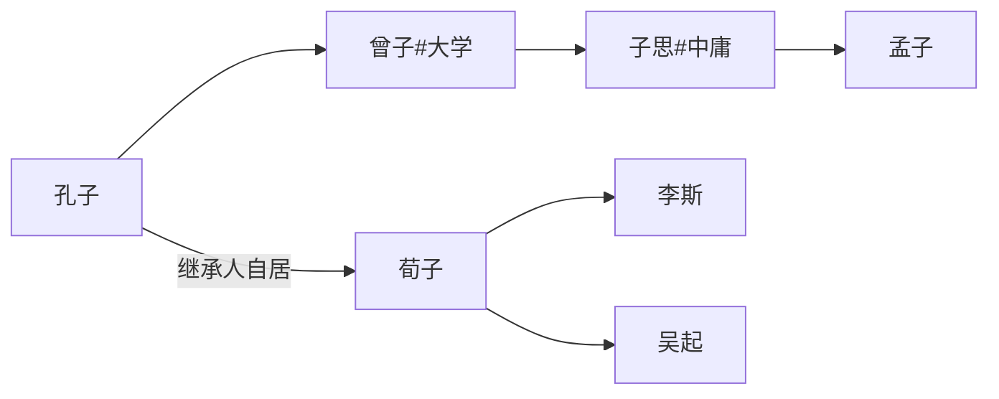
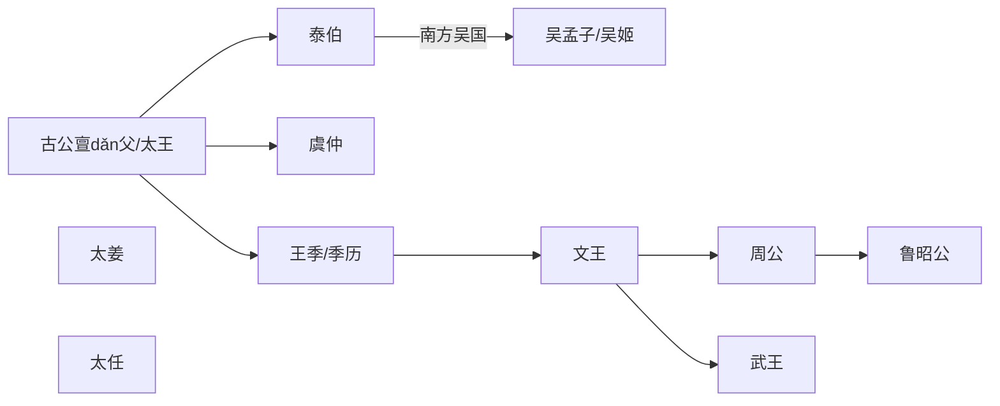

# 论语别裁 - 南怀瑾

> 东汉·史学家·班固《(前)汉书·艺文志》“二十四史之一”
> “孔子既卒，门人又相与辑其言行而论(lún)纂(zuǎn)之，谓之《论语》。”

论纂，编纂，搜集材料编书。

孔安国。西汉经学家。

郑玄。字康成。东汉末年儒家学者、经学大师。《论语注》

何晏。三国时代。《论语集解》

包咸。字子良，东汉大臣、经学家。

皇侃。488~545。南朝梁儒家学者，经学家。对何晏《集解》的批注——《皇疏》，批注的批注，叫疏。

李贽(zhì)。明代官员。福建泉州人，号卓吾。

憨山大师。明朝

蕅益大师。智旭，明代(明末清初)僧人，师从憨山大师。被奉为净土宗(莲宗)第九祖。《四书解》

刘宝楠。清朝大儒，扬州学派杰出代表。

江谦。民国人。私淑蕅益大师。

李叔同。弘一法师。

印光大师。净土宗第十三祖。

李炳南。名艳，字炳南，号雪庐。师从印光大师。

净公上人

钟茂森。定弘法师。

私淑，是指没有得到某人的亲身教授，而又敬仰他的学问并尊之为师、受其影响。

经学家，专门指称阐释、注解、研究与宣传儒家经书（或迳(jìng)称“经学”）的学者。

## 前言

1976 《论语》讲录

言亡虑绝，事过无痕。

至于孔子学说与《论语》本书的价值，无论在任何时代、任何地区，对它的原文本意，只要不故加曲解，始终具有不可毁、不可赞的不朽价值，后起之秀，如笃学之，慎思之，明辨之，融会有得而见之于行事之间，必可得到自证。

> 宋·陈同甫/陈亮
> 今之儒者，自以为正心诚意之学者，皆风痹不知痛痒之人也。举一世安于君父之仇，而方低头拱手 以谈性命，不知何者谓之性命。
> 《论语》一书，无非下学之事也。学者求其上达之说而不得，则取其言之若微妙者玩索之，意生见长，又从而为之辞：曰此精也，彼特其粗耳。此所以终身读之，卒堕于榛莽之中，而犹自谓其有得也。夫道之在天下，无本末，无内外。圣人之言，乌有举其一而遗其一者乎！举其一而遗其一，是圣人犹与道为二也。然则《论语》之书，若之何而读之，曰：用明于心，汲汲于下学，而求其心之所同然者，功深力到，则他日之上达，无非今日今日之下学也。于是而读《论语》之收，必知通体而好之矣。

孔子学说的可贵，万古常新，颠扑不破

## 学而

### 三言四语

三四教授：教三民主义、四书五经的教授。（非常轻视的意思）

开会讨论“中国文学的再革命”

“革命”一辞，出于我国最古老著作之一的《易经》

中国文学自1919“五四运动”以来，由旧的文学作品改成白话文后，几十（一百多）年来，中国的教育普及了，知识普遍了，对世界知识的吸引力增加了。对于国家的进步有贡献。

但对于中国文化，却从此一刀斩断了。中国文化库存里堆积的东西太多，几千年来的文化都藉着古文保留着。至于接受白话文学教育的人们看不懂古文，当然就打不开这个仓库，因此从中国文化的立场看，就些一刀拦腰斩断了。

### 语文的变与不变

语言约三十年一变，百年前的英文、法文书籍，除非专家，否则是莫辨雌雄。

当时提倡“五四运动”的部分人士，求进心是对的，在学问修养上，还有商量的必要，于是文学革命就出了问题。

出恭 --> 解手 --> 上一号

如果古文、四六体、作诗、填词，都能露一手，然后发现这种文学有毛病，这才有资格谈革命。现在连“命”都还没有，还“革”个什么呢？也就没有文学革命的资格。

### 四书五经的假面目

四书五经的孔孟思想被讲解错了。从唐宋以后，乃至远从汉唐以来

以全部《论语》来讲，本身就有一贯的系统，完全是对的。不需要以新的观念来割裂它。问题出在过去被一般人解释错误了。需要将唐宋以后的注解推开。

以经解经，就是仅读原文，把原文读熟了，它本身的语句思想，在后面的语句中就有清晰的解释。

《论语》前后篇章贯而通之

### 被忽视的道家

自“五四运动”以来，有一个口号“打倒孔家店”

秦汉以前，主要的儒、墨、道三家。中国文化在政治上历代引用的是道家思想。

中国历史上，每逢变乱的时候，拨乱反下，都属道家思想之功；天下太平了，则用孔孟儒家的思想。

孔孟思想，本来与道家不分家。分家是在秦汉以后的事。

唐代，中国文化是儒、释、道三家。

### 三家店卖的是什么

佛学像百货店，里面百货杂陈，样样俱全，有钱有时间，就可去逛逛。可去可不去，但社会需要它。

道家像药店，生病了非去不可。道家包括了兵家、纵横家的思想，乃至天文、地理、医药等等无所不包。

儒家的孔孟思想则是粮食食，是天天要吃的。

研究中国固有文化不是开倒车，而是以最新的观念去理解它。

四书五经，在无宪法观念的时代，严格说来就是一种宪法思想，也就是政治哲学思想的中心，法律思想的中心。

### 冤枉的一打

孔孟开山，后面有曾子、子思、荀子等等。

孔子思想未被“五四运动”打倒。

世界各国对孔子也开始研究。弘扬了孔子思想

### 再论《论语》

宋朝大儒朱熹先生注解的版本。问题太大，不完全是对的。

南宋前，四书并不用其注解。明朝以后，朱家皇帝下令以四书考选功名，且必须采用朱熹的注解。

> 《易经·系传》
> 书不尽言，言不尽意。

人类的语言不能表达全部想要表达的思想。

把语言变成文字，文字变成书，对思想而言，是更隔了一层。

《论语》二十篇连起来，是一整篇文章，是不可以分开的

### 学而有何乐

《学而》，包括了孔门当年教学的目的，态度，宗旨，方法等等。

> 子曰：学而时习之，不亦说乎？有朋自远方来，不亦乐乎？人不知而不愠，不亦君子乎？

学问在儒家的思想上，不是文学。学问不是文学，文章好是文学好，知识渊博。

“学而时习之”，重点在时间的“时”，见习的“习”。

学问在儒家的思想上，不是文学。学问不是文学，文章好是这个人的文学好；知识渊博，是这个人的知识渊博；至于学问，哪怕不认识一个字，也可能有学问——作人好，做事对，绝对的好，绝对的对，这就是学问。

这不是我个人别出心裁的解释，我们把整部《论语》研究完了，就知道孔子讲究作人做事，如何完成作一个人。

### 真人和假人

道家所谓“真人”：学问道德到了家的人，发挥了“人”的最高成就。

学问不是文字，也不是知识，学问是从人生经验上来，作人做事上去体会的。

这个修养不只是在书本上念，随时随地的生活都是我们的书本，都是我们的教育。

> 观过而知仁

看见人家犯了错误，自己便反省，不要犯这个错误，这就是学问。

开始做反省时也不容易，但慢慢有了进步，自有会心的兴趣，就会“不亦说乎”而高兴了。

悦者，会心的微笑，有得于心。

所讲的是学问的宗旨，随时注重“时”和“习”，要随时随地学习，不是我们来读四书就叫做学问，不念四书就不叫做学问。

### 寂寞的享受

> 君子有所为，有所不为
>
> 仁之所至，义所当然

孔子看到，即使一个安定的社会，文化教育没有完成，是不能解决其他问题的。基本上解决问题是要靠思想的纯正，亦即过去所谓之”德性“。

因此他一生宁可穷苦，从事教育。所以做学问要不怕寂寞、不怕凄凉。要有这个精神，这个态度，才可以谈做学问。

虽然做学问可能一辈子都没有人了解，但孔子说只要有学问，自然有知己。

人生得一知己，死而无憾。

> 有朋自远方来，不亦说乐

不要怕没有人知道，慢慢就有人知道，这人在远方，这个远不一定是空间地区的远。

孔子的学问，是五百年以后，到汉武帝的时候才兴起来。

董仲舒弘扬孔学，司马迁撰《史记》，赞扬孔子。

### 谁来了解你

> 人不知而不愠，不亦君子乎

人能够真正做到了为学问而学问，就不怨天、不尤人，就反问自己。是自己的学问、修养、做法种种的问题。

自己痛切反省，自己内心里并不蕴藏怨天尤人的偏差。

现在的观念：如此绝对健康的心理，才是君子。君子才够得上做学问，够得上学习人生之道。

讲究人生哲学的开始。

> 宋·范仲淹《岳阳楼记》
> 先天下之忧而忧，后天下之乐而乐。

连贯三句话的意义来说明读书作学问的修养，自始至终，无非要先能自得其乐，然后才能“后天下之乐而乐”

> 明·陈继儒，字促醇，号眉公
> 如何是独乐(yuè)乐(lè)？曰：无事此静坐，一日是两日。
> 如何是与人乐乐？曰：与君一席话，胜读十年书。
> 如何是众乐乐？曰：此中空洞原无物，何止容卿数百人。
>
> 宋·苏轼《司命宫杨道士息轩》
> 无事此静坐，一日似两日。若活七十年，便是百四十。黄金几时成，白发日夜出。
> 开眼三千秋，速如驹过隙。是故东坡老，贵汝一念息。时来登此轩，目送过海席。
> 家山归未能，题诗寄屋壁。
>
> 唐宋八大家：韩愈、柳宗元、欧阳修、苏洵、苏轼、苏辙、王安石、曾巩

### 爱与罪

> 有子曰：其为人也孝悌，而好犯上者鲜矣；不好犯上而好作乱者，未之有也。君子务本，本立而道生；**孝悌也者，其为人之本与**？
>
> 知我者《春秋》，罪我者《春秋》

自从民主时代以来，大家都骂孔子帮助专制皇帝，因为专制皇帝的思想和制度，用了孔子“尊君”这一部分思想精神，后来我们打倒他，也就认为他是这样的。

中国人谈孝字，“父慈子孝”是相对的，父亲对儿子付出了慈爱，儿子回过头来爱父亲就是孝。“兄友弟恭”，哥哥对弟弟好，弟弟自然爱哥哥。

### 孝道是这样一个东西

中国道家过去叫人为“倮(luǒ)虫” ——不带毛的光光的虫。

”倮虫“与其他生物一样，人之所以与其他生物不同，就是加上了人文文化。

### 秃头的十字架

西方人常自称为十字架下的文化——爱下一代。

谈自然科学，他们可以把我们当学生，谈到人文文化，他们作我们的学生还不够。

外国人没有把“孝道”在文化上培养起来的心理建设。

中国的五伦有君臣、父子、夫妇、兄弟、朋友。

朋友在五伦的思想上也占一席。有时候许多话，许多心情和苦痛，上不可以对父母，下不可以对妻儿讲，只有找朋友讲。

《大学》思想包含有社会思想在内，其实”齐家“即是社会思想。过去的中国文化是大家庭制度，有宗族、有祠堂，所谓五世同堂，聚族而居。

### 谁能忘情

有人是反对温情主义的

中国文化中的“感情力量”是巨大的，尤其是宗族的力量最大。所以由“友道”形成的这套结合，我名之为“特殊社会”，就是后世所讲的帮会。

中国知识分子与特殊社会一结合，社会就会乱。

“君子务本”。文学好，知识渊博，那是枝节的，学问之道在自己作人的根本上，人生的建立，内心的修养。

“本立而道生”。学问的根本，在培养这个孝悌，孝悌不是教条。换句话说，培养人性光辉的爱，"至爱"、“至情”的这一面，所谓“孝悌也者，其为仁之本与。”

### 花言巧语

> 子曰：巧言令色鲜矣仁。

作学问要踏实，不能“巧言令色”。

### 三面镜子

> 曾子曰：吾日三省吾身，为人谋而不忠乎？与朋友交而不信乎？传不习乎？

曾子著《大学》，孔子的孙子子思著《中庸》

《大学》原是《礼记》里的一篇，到唐宋时，独立出来，变成了四书之一。

《大学》《中庸》思想应该认为是孔子思想的演变。

孔子，春秋时期，温文儒雅、修养极高

孟子，战国时期，有点侠气

古代所谓的“忠”是指对事对人无不尽心的态度——对任何一件事要尽心地做。

严格地说，这些学问不是文学，要以作人做事体会出来，才知道它难，这就是学问。

学问不只讲个人修养，扩而充之就是社会问题、政治问题。

> 子曰：道千乘之国，敬事而信，节用而爱人，使民以时。

秦汉以上，到汉代初期的“国”字，不是现在的国家观念，那个时期的“国”字、“邦”字都是地方政治单位的名称。

这些话不但是孔子教育门人做学问的道理，同时也是孔子当时针对社会人情的弊病而指点的。

### 可爱的小学生

所谓做学问，是要从人生的经验中去体会，并不是死读书。

假使一个人文章写得好，只能说他文学好；这个人知识渊博，只能说他“见闻广博”，不一定能说他有学问。

**一个人即使没有读过书，可是他作人做事完全对了，就是有学问。**

> 子曰：弟子入则孝，出则弟，谨而信，泛爱众，而亲仁。行为余力，则以学文。

中国的文化，师生之间有如父子，过去有“一日从师，终身若父“的情形，而老师对于学生，也负了一辈子的责任。

人文世界的三道：君道，臣道，师道。

过去文化中，三道是合一的，所谓作之君、作之亲、作之师。换句话说，那时的教育、行政、司法和教化集于一身。

“巧言令色”、“币重言甘”是靠不住的。这就是现在中国文化的怪现象，是文化道德的普遍事实。

### 吕端大事不糊涂

谨慎与拘谨是两回事，有些人作人很拘谨，过分了就是小器。

> 诸葛一生唯谨慎，吕端大事不糊涂

吕端，宋朝名宰相。

谨慎不可流于小器。

广泛的爱人，那就是“君道”、“师道”的综合，爱天下人就如爱自己一样。

### 饮食男女

> 子夏曰：贤贤易色，事父母能竭其力，事君能致其身，与朋友交言而有信，虽曰未学，吾必谓之学矣。

学问的目的，不是文学、不是知识，是作人做事。

领导历史、领导国家社会的，到底还是学问思想。

> 《礼记》
> 饮食男女，人之大欲存焉。

看到一个人，学问好，修养好，本事很大，的确很行，看到他就肃然起敬，态度也自然随之而转。这是很明白，很平实的，是人的普通心理，不管一个如何坏的人，看到一个好人，总会不自觉地对这好从比较友善，这是**人之常情**。

> 百善孝为先，原心不原迹，原迹贫家无孝子。
> 万恶淫为首，论迹不论心，论迹世上少完人。

### 没有朋友的上帝

> 子曰：君子不重则不威，学则不固，主忠信，无友不如己者，过则勿惮改。

重，自重，自尊心，每个人要自重。

一个人没有自信也不自己重视自己，不自尊，“学则不固”，这个学问是不稳固的，这个知识对你没有用，因此我们必须建立起自己的人格，自己的信心来。

我们既然要自尊，同时要尊重每一个人的自尊心。

> 不因其人而废其言，不因其言而废其人。

不要看不起任何一个人，人与人相交，各有各的长处，他这一点不对，另一点会是对的。

过错一经发现后，就要勇于改过，才是真学问、真道德。

### 种瓜者

> 曾子曰：慎终追远，民德归厚矣。

终，结果。远，远因。

欲慎其终者，先追其远，每件事的结果，都是由那远因来的。

佛学有言：“**菩萨畏因，凡夫畏果。**”

与其要好的结果，不如有好的开始。

> 好的开始是成功的一半
> Well begun is half done

大家认识了这个道理，则“民德归厚矣”。社会道德的风气，自然就归于厚道严谨。这是“学问”的道理。

### 孔子的素描

> 子禽问于子贡曰：夫子至于是邦也，必闻其政，求之与？抑与之与？子贡曰：夫子温、良、恭、俭、让以得之。夫子之求之也，其诸异乎人之求之与！

启发式的答复，不作正面解答，要受教的人自己去思考判断。

温，温和。良，善良。恭，恭敬。俭，不浪费。让，谦让友好的。

### 五字串通五经

《礼记》。“大同”思想来自《礼运》篇。

> 《经解》
> 其为人也，温柔敦厚，诗教也。（《诗经》）
> 疏通知远，书教也。（《书经》，即《尚书》，中国第一部历史。懂得过去而知道领导未来）
> 广博易良，乐教也。（《乐经》，养成伟大的胸襟，由坏变好，平易而善良）
> 絜(jié)静精微，易教也。（《易经》，哲学的、宗教的圣洁。融合了哲学、科学、宗教三种精神。）
> 恭俭庄敬，礼教也。（《礼记》，人格的修养，人品的熏陶）
> 属(zhǔ)辞比事，《春秋》教也。（《春秋》，把握不变的原则，知识渊博，知道某一件事情发生过，其善恶、处理方法皆明）

### 善知识与恶知识

> 故《诗》之失，愚。（老是搞文学变成书呆子）
> 《书》之失，诬。（书有各人的主观、成见，需读历史的反面文章）
> 《乐》之失，奢。（只讲艺术，社会风气奢靡）
> 《易》之失，贼。（察见渊鱼者不祥，智料隐匿者有殃）
> 《礼》之失，烦。（过分讲礼，生厌）
> 《春秋》之失，乱。

所谓敦厚，对别人的缺点，容易包涵，容易原谅，对别人的过错，能慢慢的感化他，可是他并不是一个迂夫子，那么才是“深于诗者也”，这样才算是诗的教育。

孔子的目的就是我国古代的“**淑世主义**”

孔子这种千秋事业是要集中国文化、思想、精神之大成，认清楚自己的任务，牺牲现实的荣华，才能够做到。

如果认为他对政治有野心、有要求的话，恐怕他所要求的，也不是一般人所能了解的。

### 老鼠生儿的孝道

> 子曰：父在观其志，父没观其行，三年无改于父之道，可谓孝矣。

古人的文字“志”为“意志”之意，它包括了思想、态度。

当父母在面前的时候，要言行一致。父母不在面前，都要言行一致，诚诚恳恳。

### 无所适从的礼俗

> 有子曰：礼之用，和为贵，先王之道，斯为美，小大由之；有所不行，知和而和，不以礼节之，亦不可行也。

文化表现在形态上，常有四样大类：“衣、冠、文、物”

礼，中和作用，说大点就是和平。这也就是礼的思想。

人和人之间会有偏差，事与事之间彼此有矛盾，中和这个矛盾，调整这个偏差，就靠礼。

礼的作用，“和为贵”，就是调整均衡。

“知和而和”，对一件事，了解了它的中和之道，而去中和，去调整它。但过分的调整就错了（矫枉过正，过正了即是歪），“不以礼节之，亦不可行也。”所以礼义的基本精神，是调节一件事物，中和一件事物，但是有一定的限度，超过了这个限度，又要重新把它调整。

### 上帝的外婆是谁

《礼记》包括了哲学、政治、军事、经济、卫生、医学等各方面的学问。当然，是原则。

我们的礼节礼貌，只是礼的一种表现而已。

所谓形而下的，是宇宙万有一切学问，都包括在内。在西方哲学，就是“知识论”、“人生的价值论”。

形而上的，在中国人叫作“道”，在儒家思想叫“天”，“天道”也就是“本体论”。

由宗教而哲学，而科学，是今日西方文化发展的步骤。

中国人真的没有哲学吗？有！所有哲学是“人生哲学”。只讲作人伦理的道德，讲作人应该怎样。

”礼“不光是礼貌、礼节，而且包括了形而上的哲学，和形而下人生上的一切运用。

### 《三国演义》的幕后功劳

> 有子曰：信近于义，言可复也；恭近于礼，远耻辱也；因不失其亲，亦可宗也。

“言可复也”，守信的人，不可讲空话，讲了的话要”兑现”。

“因不失其亲，亦可宗也。” 因，动机。助人的心行，由近而远，渐渐扩及他人。

宗，宗仰，推崇景仰。

> 子曰：君子食无求饱，居无求安，敏于事而慎于言，就有道而正焉，可谓好学也已。

学问的道理，并不是只读死书，而是注重现实人生中的作人处世。

不求物质生活的享受，而重视精神生命的升华。

从书本上修正作人做事道理，这个样子就叫作好学。

### 多才多艺的子贡

四民：士、农、工、商

> 子贡曰：贫而无谄，富而无骄，何如？子曰：可也，未若贫而乐，富而好礼者也。子贡曰：诗云：”如切如磋，如琢如磨。“其斯之谓与！子曰：赐也，始可与言诗已矣！告诸往而知来者。
>
> 《孟子》
> 富贵不能淫，贫贱不能移，威武不能屈。
>
> 君子，素富贵，行乎富贵，行乎富贵；素贫贱，行乎贫贱。

一个人是应该清高的，但有人是苟求清高，或者为了标榜自己清高，因此只好忍痛牺牲。那就大可不必，这就不平凡，不平凡不是真涵养的精神。

要安贫乐道，要平实，仅是做到不骄傲，不算好，还要进一步做到好礼，尊重别人和爱人。

做玉器的四个步骤：
切：用锯子弄开石头
磋：用锉子把石头部分锉去
琢：雕琢成形
磨：磨光
以此譬喻教育。

### 诗的人生

中国文化在文学的境界上的演变发展的程序，大体情形，是所谓汉文、唐诗、宋词、元曲、明小说，到了清朝，我认为是对联，尤其像中兴名将曾国藩、左宗棠这班人把对联发展到了最高点。

我们中国人过去读历史，主张要学以致用，它的精神就是”告诸往而知来者“，懂了过去就要知道未来，这也就是诗的精神。

> 子曰：不患人之不己知，患不知人也。

不要怕人家不了解你，最重要的是你是否了解别人。

## 为政

### 孔子不谈政治

《学而》讲个人作学问的内存修养，《为政》则是讲学问的外用。

孔子很少提到完整观念的”政治“，孔子只说“为政”。

站在学术的立场，态度要非常严谨。我们常说一句话：“在法律面前，人人平等，要服从真理。”作学问的立场，就是“在学术面前，态度要非常严谨，服从真理。”

孔子只讲“为政”，不谈政治；“政治”如国父所说的：“管理众人的事。”

孔子所提的“为政”是教化，教化是文化的名词，不能看成是教育。

教是教育，化是感化，过去叫风化。为政的意义包括了教化。

### 大政治家的风范

> 子曰：为政以德，譬（pì）如北辰，居其所，而众星共之。

春秋战国时期，“道德”两个字，是很少连起来用的，道是道，德是德。

魏晋南北朝以后，到唐宋之间，才把两个字连起来，变成一个名词为“道德”。

过去“德”是表示好行为的成果和作用。古时人解释”德者得也“。

### 星辰知多少

过去我们把天体分成二十八宿和三垣——紫微、少微、太微。

每天太阳从西方落下去的时候，东方天上是哪一个星座出来，这星座就是”宿“。

过去做大将的，要上通天文，下通地理，中通人事，无所不通，才能带兵。

“为政以德”，内心有道，表现在外的行为就无懈可击。

譬如北辰，有中心的思想，中心的作风，以道德的感化，你在那里本身不要动，只要发号施令，下面的人就像满天无数的星座，都会跟着你的方向动。

### 刘备上了曹操的当

> 万众一心
>
> 运用之妙，存乎一心

所谓“无为而治”是制其机先，看起来是没有事。

对任何一个方法，开始先透析它的流弊，毛病出在哪里，先找出病源，把它疏通了，再不会出毛病，然后才能无为而不无所不为。

> 为大将者无赫赫之功
>
> 不战而屈人之兵

古人对中国历史研究的方法，有一句话叫“经史合参”。

什么叫经呢？就是常道，就是永恒不变的大原则，在任何时代，任何地区，这个原则是不会变动的。但不是我们能规定它不准变动，而是它本身必然如此，所以称为“经”。

而”史“是记载这个原则之下的时代的变动、社会的变迁。我们要懂得经，必须要懂得史。拿历史每个时代、每个社会来配合。这样研究经史，才有意义。

“春分”，“秋分”两个节气，就是在经纬度上，太阳刚刚走到黄道中间的时刻，白昼黑夜一样长，气候不冷不热很温和，所以称历史为春秋。这就是中国的历史学家，认为在这一个时代当中，社会、政治的好或不好，放在这个像春分秋分一样平衡的天平上来批判。

### 从台风了解人生

> 《易经·系传》
> 臣弑其君，子弑其父，非一朝一夕之故，其所由来者，渐矣。
>
> 庄子
> 飓风起于萍末

大风暴是从一个小风波来的。

天下事的形成不是偶然的，几乎没有偶然。

《易经》告诉我们，天下的事，没有突变的，只有我们智慧不及的时候，才会看到某件事是突变的，其实早有一个前因潜伏在那里。

孔子面对春秋战国当时社会的动乱，非常担忧，因此他说为政，权力是没有用的，唯“德”而已。

### 圣人也势利吗？

儒家思想为什么对于尧、舜、禹、汤、文、武、周公这样推崇？

第一，有道德思想，没有德业的成果，只能说他有道，不见得有德。有道德的思想，又有德业的成果，道与德配合，才叫“道德”。

历史上，道家、儒家都提到尧、舜、禹、汤、文、武、周公，是因为那时谈到“为政”，讲究“德”字，到秦汉以后，只叫事功，所谓“三王之治在道德，五霸之志在事功。”王、霸之不同在于此，等而下之，连霸业都谈不上，连事功都没有，光是拿偷鸡摸狗的手段窃国而已。

### 悠美的情歌

> 子曰：诗三百，一言以蔽之，曰：思无邪。

各地方、各国家、各时代，每个人内心的思想感情，有时候是不可对人说，而用文字记下来，后来又慢慢的流传开了。孔子把许多资料收集起来，因为它代表了人的思想，可以从中知道社会的趋势到了什么程序，为什么人们要发牢骚？

“其所由来者，渐矣！”总有个原因的。这个原因要找也不简单，所以孔子把诗集中起来，其中有的可以流传，有的不能流传，必须删掉，所以叫做删诗书，定礼乐。

> 《诗经》
> 关关雎鸠，在河之洲。窈窕淑女，君子好逑。

《诗经》归纳起来，有两种分类——“风、雅、颂”、“赋、比、兴”

什么叫“风”？就是地方性的，譬如说法国的文学是法国的文风，法国文风代表法国人的思想、情感，所以《诗经》有《郑风》、《鲁风》、《齐风》等等

“雅”以现代用户来讲，是合于音乐、文学的标准。

“颂”就是社会、政府公事化的文学

作品另三种形态，

一种是“赋”，就是直接的述说。

其次是“比”，因这个感触联想到那个。

> 李白《静夜思》
> 举头望明月，低头思故乡

“兴”是情绪。

> 南宋末年·文天祥《过零丁洋》
> 辛苦遭逢起一经，干戈寥落四周星。
> 山河破碎风飘絮，身世飘零雨打萍。
> 皇恐滩头说皇恐，零丁洋里叹零丁。
> 人生自古谁无死？留取丹心照汗青。

### 诗的伟大

人有人的问题，硬用思想把它切断，是不可能的。人活着就有思想，凡是思想一定有问题，没有问题就不会有思想，孔子的“思无邪”就是对此而言。

人的思想一定有问题，不经过文化的教育，不经过严正的教育，不会走上正道，所以他说整理诗三百篇的宗旨，就为了“思无邪”。

第一个点题：以现在的话来说，一切政治问题、社会问题只是思想问题。只要使得思想纯正，什么问题都解决了。

第二个点题：牵涉到人的问题。

文哲不分

> 《春江花月夜》
> 江上何人初见月？江月何年初照人？
>
> 苏轼
> 明月几时有？把酒问青天，不知天上宫阙，今夕是何年？

文史不分

中国历史学家，都是大文学家，都是哲学家，所以司马迁著的《史记》里面的八书等等，到处都是哲学，是集中国哲理之大成。

文政不分

大政治家都是大文豪。

大政治家一定要具备诗人的真挚情感。如西方人所说，一个真正做事的人，要具备出世的精神——宗教家的精神。

第三个点题：中国人为什么提倡诗和礼？儒家何以对诗的教育看得这么重要？因为人生就有痛苦，尤其是搞政治、搞社会工作的人，经常人与人之间有接触、有痛苦、有烦恼。

英雄与圣贤的分别：英雄能够征服天下，不能征服自己，圣贤不想去征服天下，而征服了自己。英雄是将自己的烦恼交给别人去挑起来，圣人自己挑尽了天下人的烦恼。

为政的人，除了领导思想不走邪路以外，对于自己的修养，更要有诗人的情操，才能温柔敦厚，才能轻松愉快的为政。

### 穷哉法治

> 子曰：道之以政，齐之以刑，民免而无耻。道之以德，齐之以礼，有耻且格。

> 老子《道德经》
> 法令滋彰，盗贼多有

中国的政治，向来是道家、儒家、法家合用的。

### 孔子的自剖

> 子曰：吾十有五而志于学，三十而立，四十而不惑，五十而知天命，六十而耳顺，七十而从心所欲，不逾矩。

孔子身世：父亲去世时，有一个半残废的哥哥和一个姐姐。

“耳顺”。心里平静不是死气沉沉，是很活泼，很明确是非善恶，对好的人觉得可爱，对坏的人，更觉得要帮助改成好人，要这样平静，这个学问是很难的。

"从心所欲，不逾矩"。人与人之间要有一个范围，自由不能超过这个范围。

不管是为政或做事，是要靠人生经验的累积。而人生经验累积成“人情世故”。

送礼只是情礼的象征。

中国文化所讲的“人情”是指人与人之间的性情。

人情这两个字，现在解释起来，包括了社会学、政治学、心理学、行为科学等等学问都在内，也就是人与人之间融洽相处的感情。

“世故”就是透彻了解事物，懂得过去、现在、未来。“故”就是事情，“世故”就是世界上这些事情，要懂得人，要懂得事，就叫做人情世故。

为政以“德”为本，再以学来培育“诗”的温柔敦厚精神，还不足以具备为政的条件。

为政的道理就是要真正能多懂得人情世故。

世界上所有的政治思想归纳起来，最简单扼要的，不外中国的四个字——“**安居乐业**”。所有政治的理想、理论，都没超过这四个字的范围；都不外是使人如何能安居，如何能乐业。同时我们在乡下也到处可以看到“**风调雨顺，国泰民安。**”这八个字，现代一般人看来，是非常陈旧的老古董。可是古今中外历史上，如果能够真正达到这八个字的境界，对任何国家、任何民族、任何时代来说，无论是什么政治理想都达到了。而这些老古董，就是透彻了人情世故所产生的政治哲学思想。

### 车上的一课

> 孟懿子问孝，子曰：无违。樊迟御，子告之曰：孟孙问孝于我，我对曰：无违。樊迟曰：何谓也？子曰：生，事之以礼；死，葬之以礼，祭之以礼。

“大夫”是官阶，不是官职（勉强比，有如现在的内阁官员之流）。我们要了解中国历代政治形态的变迁，必须读“十通”或“三通”——通志、通献、通考。里面不仅包括了中国政治制度的演变、官职的演变、一切的演变，乃至现代研究三民主义思想，国父为什么采用了五权分立制度，都与“三通”、“十通”的文化有绝对的关系。

> 孟武伯问孝。子曰：父母唯其疾之忧。

父母看到孩子生病了，那种忧愁、担心，多么深刻，你要去体会这种心境。

对父母能付出当自己孩子生病的时候，那种程度的关心，才是孝道。

### 以孝治天下

曾子著《孝经》

> 求忠臣必于孝子之门。

一个人真能爱父母、爱家庭、爱社会，也一定是忠臣。因为忠臣是一种情爱的发挥。

> 慷慨捐躯易，从容就义难。

> 何不食肉糜？--晋惠帝

中国以农立国，有一个文化精神与西方根本不同，那就是中国的宗法社会。

西汉以后，魏晋时代正式提倡以孝道治天下。

二十四孝之一。晋·王祥卧冰

### 康麻子的教孝教忠

康熙八岁当皇帝，十四岁亲政，六十九岁去世，在位六十一年。

“文景之治”, “内用黄老，外示儒术”

康熙提倡孝道，编了一本语录——《圣谕》，后来叫《圣谕宝训》或《圣谕广训》，拿到地方政治基层组织中去宣传。

由各人的孝父母，扩而充之爱天下人，就是孝的精神。

### 晚娘面孔难为人

> 子游问孝。子曰：今之孝者，是谓能养。至于犬马，皆能为养。不敬，何以别乎！

光是养而没有爱的心情，就不是真孝。孝不是形式，不等于养狗养马一样。

> 子夏问孝。子曰：色难。有事，弟子服其劳，有酒食，先生馔。曾是以为孝乎？

不敬何以为孝。

孝道第一个要敬，这是属于内心的；第二个是外形的色难，态度的。

> 子曰：吾与回言终日，不违如愚。退而省其私，亦足以发。回也，不愚。

臣道。

光接受、服从，有时候反而有问题，不一定是对的，所以有了接受、服从的修养，还要“退而省其私，亦足以发。“再加以发挥，能够扩而充之，这才是事业的好干部，为政的人才。

### 孔子也会看相

> 子曰：视其所以，观其所由，察其所安，人焉廋哉？人焉廋哉？

> 有心无相，相由心变。有相无心，相随心转。

曾国藩看相的学问——《冰鉴》
“形名之学”

> 功名看器宇
> 事业看精神
> 穷通看指甲
> 寿夭看脚踵
> 如要看条理，只在言语中

魏·刘劭《人物志》著，北魏·刘昺(bǐng)所注。专门谈论人，换句话说就是”人“的科学。

**学问、才能、品德**

> 上等人，有本事没有脾气
> 中等人，有本事也有脾气
> 末等人，没有本事而脾气却大

立身处世，就要知道，有的人有学问，往往会有脾气，就要对他容忍，用他的长处——学问，不计较他的短片——脾气。他发脾气不是对你有恶意，而是他自己的毛病，本来也就是他的短处，与你何关？

你要讲孝道，在君道上你要爱护他，尊重他。......我便问他要谈的正题是什么？先不要发脾气，只谈正题，谈完了再让你发脾气。

“视其所以”——看他的动机、目的（思想）

“观其所由”——看他的来源，整个行动的经过（行为）

“察其所安”——看他平常作人是安于什么？能不能安于现实。（涵养）

无所安，心不能安。

这是心理上的问题，一个人作学问修养，如果平常无所安顿之处，就大有问题。

有些人有工作时，精神很好；没有工作时，就心不能安，可见安其心之难。

有的安于逸乐，有的安于贫困，有的安于平淡。学问最难是平淡，安于平淡的人，什么事业都可以做。因为他不会被事业所困扰。

安于平淡的人，今天发了财，他不会觉得自己钱多了而弄得睡不着觉；如果穷了，也不会觉得穷，不会感到钱对他的威胁。所以**安心是最难**。

> 子曰：温故而知新，可以为师矣。

> 《战国策·赵策一》
> 前事不忘，后事之师也。

### 是什么东西

> 子曰：君子不器。

因为“为政”要通才，通才就要样样懂。“不器”就是并不成为某一个定型的人，一个为政的人，就要上下古今中外无所不通。

“君子不器”这个学问，就是成为了真正的通才，否则只有变成专才、专家。

“允文允武”，也便是“君子不器”的说明。

> 《诗经·鲁颂·泮水》
> 允文允武。昭假烈祖。

> 子贡问君子，子曰：先行其言，而后从之。

把实际的行动摆在言论的前面，不要光吹牛而不做。先做，用不着你说，做完了，大家都会跟从你，顺从你。

古今中外，人类的心理都是一样的，多半爱吹牛，很少见诸于事实；理想非常的高，要在行动上做出来就难。

所以，孔子说，真正的君子，是要少说空话，多做实在的事情。

> 子曰：君子周而不比，小人比而不周。

**周是包罗万象**，就是一个圆满的圆圈，各自都到的。（*没有私心，不分彼此）

一个大政治家和宗教家一样，**爱人是不能分彼此的**，我们对于人，好的固然好，爱他；但对不好的更要爱他，因为他不好，所以必须去爱他，使他好。

周全，不能比附一方。

“比”，象形两个人相同，同向一个方向；而古文“北”字——就是相背，各走极端的象形字，所以“比”就是说要人完全跟自己一样， 那就容易流于偏私了。

> 子曰：学而不思则罔，思而不学则殆。

对于人才，有三个基本的原则，便是**才、德、学**。

有些人的品德是天生的——品德往往大半出于天性——但没有才能。有品德的人，可以守成。有守成之才，没有开创之才。

才德两个字很难兼全的，但有一个东西可以补救，那就是学，用学问来培养那所缺的一面。有些人虽然天生有才有德，但还是须要学问来培养的。

讲到学问，就须两件事，一是要学，一是要问。多向人家请教，多向人家学习，接受前人的经验，加以自己从经验中得来的，便是学问。

“学而不思则罔”，**没有用处**。有些人有学问，可是没有智慧的思想，那么就是迂阔疏远，变成了不切实际的“罔”了，没有用处。不但学术界如此，别的圈子也是一样，有学识，但没有真思想，这就是不切实际的“罔”了。

“思而不学则殆”，**危险**。他们有思想，有天才，但没有经过学问的踏实锻炼，那也是非常危险的。许多人往往倚仗天才而胡作非为，自己误以为那便是创作，结果陷于自害害人。

尤其是目前的中国青年，身受古今中外思潮的交流、撞击，思想的彷徨与矛盾，情绪的郁闷与烦躁，充分显示出时代性的紊乱和不安，因此形成了青少年们的病态心理。

童稚无知，怀着一颗赤子之心，来到人间，宛如一张白纸，染之朱则赤，染之墨则黑，结果因为父母的主观观念——“望子成龙，望女成凤”，涂涂抹抹，使他们成了五光十色，烂污一片。

所以老一辈人的思想，无论是做父母的，当老师的，或者领导人的，都应该先要有一番自我教育才行。

### 异端与偏激

> 子曰：攻乎异端，斯害也已。

欧美各国讲中国学问，都称之为“汉学”。

中国文化中所称的**汉学**，是指汉儒的作学问，注重于训诂。所谓“**训诂(gǔ)**”，就是对于文字的考据，研究一个字作什么解说，为什么这样写？

诂：用当代的话解释古代的语言。训：用通俗的语言解释词义。

> 《说文》
> 诂，训故言也。

古人所谓博士学位——我们现在的博士也是这样——往往凭藉这些专深的研究，可以作一百多万字的文章，这就是训诂之学。后来发展为考据，就是对于书本上的某一句话，研究他是真的或是假的。

汉儒就是训诂之学；在中国文化上叫“汉学”，意思是汉儒作的学问。汉学自汉武帝开始，就有“五经博士”，就是四书五经等书中，通了一经的就是“博士”，所以中国有博士这个尊称，也是从汉朝开始的。所谓博士，就是专家。

至于宋儒的理学家，专门讲心性之学，他们所讲的孔孟心性之学，实际上是从哪里来的呢？一半是佛家来的，一半是拿道家的东西，换汤不换药地转到儒家来的。

宋儒们借了佛道两家的学问，来解释儒家的心性之学，一方而又批驳佛道。

以后经过宋、元、明、清四朝，都在宋儒的理学范围中转圈圈，是不是阐扬孔子的真义，很难下一定论。有一本《四朝学案》，是讲宋、元、明、清几百年来儒家心性之学的。尤其到了明朝末年，理学非常盛行，所以清兵入关的时候，很多人对明儒的理学非常愤慨，认为明儒提倡理学的结果是：“**平时静坐谈心性，临危一死报君王。**”

“异端”是走极端偏向的路线，不走中道的。不但不走中道，而且还标新立异，特别从事怪异的思想。...一般的人，大都是喜欢异端的，每个人都有爱好标新立异的天性。

### 由养士到考试

苏东坡著文章《论养士》。在中国的政治思想——政治哲学领域中，占了重要的地位。

“养士”这个名称，出在战国时代。...宾客（随员），幕府（幕僚）

苏轼指出的分类是智、辩、勇、力四种人；实际上也可说只是两种人，一种用头脑，一种用体力。

所以到秦始皇统一中国以后，焚书坑儒，不养士了，这些人就走向民间去，结果怎样呢？反了！后来到了汉朝的时候，对这种士怎么办呢？到汉武帝时代，就是中国选举制度的开始。

选举 贤、良、方、正的人，称为孝廉。

### 天下英雄入彀(gòu)中

唐太宗创办了考试制度,录取了天下才人名士以后，站在最高的台上，接受第一次录取者朝见之后，忍不住得意的微笑道：“天下英雄尽入吾彀中！”

“异端”就是走特殊思想，不走正路的，走偏道，而偏道中还想出特别花样。

所谓奇技者，就是古怪的、特殊的。异端不能乱用，还要以德业为基础，异端多半走入术的路子，术就是方法、权术。

陈平六出奇技，帮助汉高祖统一天下。“阴谋者，道家之所忌也。”

> 子曰：由！诲，汝知之乎？知之为知之，不知为不知，是知也。

一个人要平实，懂得就是懂得，不懂得就是不懂，这就是最高的智慧。

### 千里求官只为财

> 子张学干禄。子曰：多闻阙疑，慎言其余，则寡尤；多见阙殆，慎行其余，则寡悔。言寡尤，行寡悔，禄在其中矣！

古代俸和禄是两加速。“俸”等于现在的月薪；“禄”有食物配给。禄位是永远的，所以过去重在禄。“干”就是干进、干求；干禄，就是如何拿到禄位。

阙就是保留，等着请教人家，讲话要谨慎，不要讲过分的话。

“事到万难须放胆，宜于两可莫粗心。”

> 哀公问曰：何为则民服？孔子对曰：举直错诸枉，则民服。举枉错诸直，则民不服。

> 季康子问：使民敬忠以劝，如之何？子曰：临之以庄，则敬。孝慈，则忠。举善而教不能，则劝。

其实老子并不反对仁义，只是当时社会普遍流行谈的仁义，变成了虚假无实的名词，所以老子反对。

敬是尊敬人，忠是忠于事，劝是教导的意思，等于现在所说的“教育”。

### 治国难！齐家更难！

> 或谓孔子曰：子奚不为政？子曰：书云“孝乎惟孝，友于兄弟。”施于有政，是亦为政，奚其为为政？

> 人而无信，不知其可也。大车无輗(ní)，小车无軏(yuè)，其何以行之哉？

天下没有一个完整无缺的法律或完整无缺的办法。天下事一定会变，而且时时在变。

不可只顾目前，如只顾目前，事情因时间的发展改变而情况不同，就变成言而无信，结果就是朝令夕改。

> 子张问：十世可知也？子曰：殷因于夏礼，所损益可知也。周因于殷礼，所损益可知也。其或继周者，虽百世可知也。

所谓传统，就是这样在一个系统中渐变传下来的，并不是顽固得一定永远保留原来的样子，才叫传统。

孔子并不是有宗教性的神通，也不是先知，换句话说，是他要人凭借智慧，多读历史，就知道过去。既然用上述的法则，循历史的轨迹就可以知道过去，用同一法则，也就能知道未来。

以前提到过，温故而知新，也是这个道理。**历史的演变，不会突然的，都是渐变来的**。所以将来的历史，未来的时代，明天怎么样？几乎很清楚的可以了解。

### 高明之家鬼瞰其室

> 子曰：非其鬼而祭之，谄也。见义不为，无勇也。

夏朝的文化尚忠，殷朝的文化尚质，周则尚文，注重人文文化。

没有智、仁、勇就无法从政，换句话说，也不应该从政。

“看得破，忍不过。想得到，做不来。”

为政就是一种牺牲，要智、仁、勇齐备，看到该做的就去做，打算把这条命都付出去了。尽忠义，要见义勇为。

为政的基本精神——要有见义而为的大勇；要有人溺己溺，人饥己饥的胸怀。

> 《文选·扬雄》
> 高明之家，鬼瞰其室。
>
> 李善注引李奇曰：“鬼神害盈而福谦。”
>
> 刘良注：“是知高明富贵之家，鬼神窥望其室，将害其满盈之志矣。”

## 八佾

### 礼乐衣冠

八佾——“佾”与“仪”同音，如今在孔庙中拿羽毛，在祭孔典礼中所舞蹈的叫八佾之舞。

过去的观念，文化偏重于人文——人伦的道理，即是伦理的道德，政治的伦理与社会的伦理。

现在“文化”这个名词的含义，包括了政治、经济、军事、社会、教育、哲学、宗教等等归纳起来，成为文化的总体。

**第一篇《学而》，是个人求学的宗旨；第二篇《为政》，也就是为学的外用；第三篇是把个人的内圣为学，乃至于外用的为政，综合起来的文化精神，放在《八佾》篇中。**

> 孔子谓季氏：八佾舞于庭，是可忍也，孰不可忍也。

像这样的事情都忍心做了，还有什么事情不忍心去做呢？

> 三家者，以雍彻。子曰：“相维辟公，天子穆穆。”奚取于三家之堂？

孔子时代，鲁国有三家权臣，孟孙、仲孙、季孙，国君都拿他们没办法，整个政权都操在他们手上。

“彻”就是撤宴撤席，“雍”就是天子所用的国乐。“辟公”，当时的诸侯。

> 子曰：人而不仁，如礼何？人而不仁，如乐何？

一个人没有中心思想，“如礼何？”文化对他有什么用？文化是靠每一个人自觉自发，自省自悟的；文化不是法律，不能由他人来管的。所以“人而不仁，如礼何？人而不仁，如乐何？”一个人如果自己不省悟，文化与艺术对他有什么用呢？

> 林放问“礼之本”。子曰：大哉问！礼，与其奢也，宁俭。丧，与其易也，宁戚。

孔子说礼仪的过分铺张就不合理，宁可简单隆重。办丧事太轻率了也不好，宁可取悲戚的态度。

> 子曰：夷狄之有君，不如诸夏之亡也。

过去所谓夷狄，就是文化落后的边疆地区，孔子的思想是以文化为中心，凡没有文化的，称为夷狄，因为东夷、西戎、南蛮、北狄这四种族在当时是没有文化，非常野蛮。中国则称中夏、中原，是有文化的。

阴历年就是夏历，是夏朝留下来的文化。

有政权的存在而没有文化的精神，那有什么用呢？因此文化精神一定要建立。

### 泰山之旅

> 季氏旅于泰山，子谓冉有曰：女弗能救与？对曰：不能。子曰：呜呼！曾谓泰山不如林放乎？

泰山是当时文化精神的集中点，也是因为中国古代相信天道，国家政治太平了，上泰山去祭告天天地，这叫“封禅”，像后来秦始皇去泰山封禅，立了碑，回来在路上病死了。

“聪明正直，死而为神。”

### 志在春秋

所谓“权”就是政治上讲的统治，也就是霸道。春秋末期王道衰微，霸道因此起来了。

其次是“术”，也就是一般人所谓的用手段。不讲传统文化的道德和理性，就是用手段。

以手段而取天下，就是“权术”。

《春秋》是孔子著的，像是现代报纸上国内外大事的重点记载。

孔子对一件事下的定义。重点在“微言大义”。所谓“微言”是在表面上看起来不太相干的字，不太要紧的话，如果以文学的眼光来看，可以增删；但在《春秋》的精神上看，则一个字都不能易动；因为它每个字中都有大义，有很深奥的意义包含在里面。

“孔子著《春秋》，乱臣贼子惧。”

微言中有大义，这也是《春秋》难读的原因。

三传——《左传》、《公羊传》、《穀(gǔ)梁传》。这是三个人对《春秋》的演绎，其中《左传》是左丘明写的，左丘明和孔子是介于师友之间的关系。他把孔子所著《春秋》中的历史事实予以更详细的申述，名为《左传》。因为当时他已双目失明，所以是由他口述，经学生记录的。

《公羊》、《穀梁》又各成一家。我们研究《春秋》的精神， 有“三世”的说法。

所谓《春秋》三世，就是对于世界政治文化的三个分类。**衰(乱)—升平—太平**

西方柏拉图的政治思想——“理想国”。《礼记》中《礼运·大同篇》的大同思想相类似。其次是道家的思想“华胥国”，所谓黄帝的“华胥梦”。

国父思想中所揭立的三民主义最后的目标是世界大同，这也是《春秋》大义所要达成的理想。

### 秉笔直书 罪罪恶恶

又怎样从春秋《左传》看得出它的“微言大义”呢？如果读懂了《左传》上第一篇的《郑伯克段于鄢》，就大概可知《春秋》的笔法。

对兄弟是不能当敌人看待的，“克”字有敌对的涵义在内，打败了敌人就是克敌，结果他对待兄弟用对待敌人的办法——事先不肯教化，不止恶于其先，而且还故意培养罪行，最后又故作仁义。因此春秋的笔法，就在这一个“克”字的微言上，定了他千秋的罪状。

社会的变乱，并不是普通人能够引导的，都是权臣、有地位的人变坏了风气，所谓乱自上生。

### 承让  领教

> 子曰：君子无所争，必也射乎。揖(yī)让而升，下而饮，其争也君子。

> 子曰：不愤不启，不悱(fěi)不发。举一隅(yú)不以三隅反，则不复也。

> 张建云《微国学》之“修身”篇
> 学习的四种境界：
>
> 1. 熟能生巧，经过练习掌握课本上的内容，知道问题的答案。
> 2. 举一反三，具备了思考的能力，掌握了学习的方法，能够知其然，也知其所以然。
> 3. 无师自通，掌握了自学、自修的方法，无师亦可以主动学习。
> 4. 融会贯通，可以将学到的知识灵活运用于生活和工作实践，懂做事与做人的道理。

中国文化所讲的君子是无所争的，不但于人无争，于事也无所争，一切是讲礼让而得。

六艺：礼、乐、射、御、书、数。

比赛完了，不论谁输谁赢，彼此对饮一杯酒，赢了的人说：“承认！”输了的人说：“领教！”都有礼貌，即使在争，始终保持人文的礼貌。人之所以不同于生物世界中其他的动物，就是这一点人类文化的精神。

人类其所以为人，因为有思想，加上文化的精神。

不论于人于事，都应该争，但是要争得合理，所以“揖让而升，下而饮，其争也君子。”就是在争，也始终保持君子的风度。

中华文化的民主精神，一个人立身、处世，乃至一切，都要民主。我们的民主精神基于礼让；而西方民主的精神基于法治。

礼让与法治有基本上的不同，法治有加以管理的意义，礼让是个人内在自动自发的道德精神。

### 淡泊以明志

> 子夏问曰：“巧笑倩兮，美目盼兮，素以为绚兮。”何谓也？子曰：绘事后素。曰：礼后乎？子曰：起予者商也，始可与言诗已矣。

中国人作诗填词，也不是无病呻吟的，诗包括了人的思想与感情。

绘画完成以后才显出素色的可贵。

礼的比表之于外的礼仪更重要。

要懂诗，透过诗的感情以培育立身处世的胸襟，而真正了解诗背后的人生、宇宙的境界，这才是懂得诗的道理。

> 唯大英雄能本色，是真名士自风流

“绘事后素”，一个人不要迷于绚烂，不要过分了，也就是一般人所谓不必“锦上添花”，要平淡。

### 穷源溯本

> 子曰：夏礼，吾能言之，杞不足征也。殷礼，吾能言之，宋不足征也。文献不足故也。足，则吾能征之矣。

孔子说中国传统文化，是根据历史来的，而历史与文化是不可分开的。

夏朝的礼，我能说出来，（但是它的后代）杞国不足以证明我的话

杞，夏之后；宋，殷之后。征，证也。文，典籍也。献，贤也。

> 人能弘道，非道弘人。

当周武王统一了中国，所谓封建，并不是只封自己家里的人，像尧、舜、禹、汤的后代，都封了诸侯，所以周朝的封建，不是西方的封建。

任何一个民族的后代，如果不重视自己的文化历史，就是自己把自己毁灭，后代就无法考证。

> 子曰：禘(dì)自既灌而往者，吾不欲观之矣。

“禘”象征宗教的精神，祭天地祖宗之礼。

### 心香一瓣  诚则灵

禘，古代国家举办禘礼，皇帝代表全民祭祀大典，仪式非常隆重。

“斋”是内心的反省。斋是中国文化中心理的净化，用现代的话来讲，就是清理思想、排除人欲，真正的作到肃庄叫作斋戒。

> 《易经·系辞》
> 洗心退藏于密

事事要发自内心的诚恳，而不完全在于形式，一切形式，都必须配合内心的诚恳，才有意义。

> 或问禘之说。子曰：不知也。知其说者之于天下也，譬如示诸斯乎？指其掌。

春秋二季要祭祖，也就是实行“**祖宗虽远，祭祀不可不诚**”的尊敬传统的精神。

> 祭如在，祭神如神在。子曰：吾不与祭，如不祭。

祭祀祖宗和祈祷时心仪的原则，当我们祭祖宗的时候要以“如在”目前相对的诚心，犹如祖宗尚在面前一样的诚敬。

无论对生者或死者，由明里到暗时，都要由衷一贯。

### 拍灶君的马屁

> 王孙贾问曰：“与其媚于奥，宁媚于灶。”何谓也？子曰：不然。获罪于天，无所祷也。

中国绝对有宗教信仰。第一个是礼，第二个是诗。不像西方人将宗教错解成为“信我得救，不信我不得救”的狭义观念。

“奥”是古代的家神。“灶”是灶神。

中国人宗教思想的精神。一个人真的作坏人、做坏事，怎样祷告都没有用，任何菩萨都不能保佑你。

所谓自助天助，神是建立在自己的心中。换句话说，人有人格，尤其须要已处理上建立起人格，不靠外来的庇护。

> 子曰：周监于二代，郁郁乎文哉！吾从周。

### 量力而为  谦虚好学

> 子入太庙，每事问。或曰：“孰谓鄹(zōu)人之子知礼乎？入太庙，每事问。”子闻之，曰：“是礼也。”

鄹是孔子出生的地方，即邹。鄹人之子即孔子。这一段所讲的应该是正当孔子做鲁国司寇的时候，参与了代表国家、代表王室的宗庙大典。

> 子曰：射不主皮，为力不同科，古之道也。

打靶、射箭的标准，在于射中了红心没有，而不问箭能否透过牛皮。因为每个人天生的膂(lǚ)力不同。

作人做事，够不够道德的标准，只问合不合正道，并不苛求他对事功成就的程度。因为没有机会给他表现，环境不对，时代不对，他也就无从表现，这有什么办法？由此触类旁通，对人对事就可减掉些苛求了。

> 子贡欲去告朔之饩(xì)羊。子曰：赐也！尔爱其羊，我爱其礼。

传统，特别是经过长期历史的筛选留下来的这些传统，都有它的道理，不能随随便便把它给抛弃掉，用过时这么一个帽子一套，然后就把它打入地牢了，那是让孔子觉得痛心疾首。

对于传统保留下来的东西，虽然不能完全理解，但是可以存疑，慢慢的去考究，支思维到底这个意义在哪里。这就不枉古圣先贤制定这个会传统礼节的存心，这份苦心。

非常慎重的祭典之一——告朔。每个月的初一为朔，十五为望，月暗为晦。

每月的初一，主政者要代表国家，向天地祖宗，禀告所作所为，这就是所谓的“告朔”。

在社会上，或在政治上，有时绝对空洞的精神，并不足以维系一件事物，而必须配合某些实质的东西才能生效。如口惠而实不至，有时候就要失败了。

有戒才有真正的佛法，正如有礼才有真正的儒。

> 子曰：事君尽礼，人以为谄也。

如果自己毅力不坚定，见解不周到，受环境影响，只好变了。

以礼为准，人格建立在自己身上。别人尽管不了解，只看自己内心真正的诚与不诚。

诚正的建立，**久后自知**。自己的见解与人格的精神，等待时间来考验，等待时间来证明并不是他人说的那么一回事，也就心安理得了。

### 儒冠错换八卦袍的诸葛亮

> 汉·诸葛亮《诫子书》
> 夫君子之行，静以修身，俭以养德。
> 非澹[dàn,淡]泊无以明志，非宁静无以致远。
> 夫学须静也，才须学也，非学无以广才，非志无以成学。
> 慆[tāo,淫]慢则不能励精，险躁则不能冶性。
> 年与时驰，意与日去，遂成枯落，多不接世，悲守穷庐，将复何及！

> 清·吴梅村
> 饱食终何用，难全不朽名。

**文章、道德、事功，本难兼备，责人不必太苛。**

没有内容而自以为了不起是骄，有内容而看不起人为傲。

> 子曰：“如有周公之才之美，使骄且吝，其余不足观也已。”

文学的修养，只是学问的附庸。

### 孔子的换心术

>  定公问：“君使臣，臣事君，如之何？”孔子对曰：“君使臣以礼，臣事君以忠。”

五伦：父子、兄弟、夫妇、君臣、朋友

八德：孝、悌、忠、信、礼、义、廉、耻

我们中国文化讲孝道，但孝道也是相对的，“父慈子孝，兄友弟恭”，父母付出了爱心的教养，才有子女孝道的反哺，两者是对立的。忠也是一样， 就如孔子的话，上面对下面以礼，礼敬——也是爱的一种形态，等于父母爱子女的爱心。这种礼义德业的流衍，道德的风行，则下面对上面自然就敬而忠了。

所以这种君臣的上下关系是建立在道德上，不是建立在手段上。

### 追的哲学

> 子曰：关雎，乐而不淫，哀而不伤。

> 《礼记》
> “饮食男女，人之大欲存焉。”
>
> 告子
> “食色性也”

男女饮食不是“性”也，不是人先天形而上的本性，是人后天的基本欲望。

我们中国人自己对他（孔子）的封号最好——**大成至圣先师**

> 发乎情，止乎礼。
>
> 求之不德，辗转反侧

### 传统历史上的精神堡垒

> 哀公问社于宰我。宰我对曰：夏后氏以松，殷人以柏，周人以栗。曰：使发战栗。子闻之曰：成事不说，遂事不谏，既往不咎。

社，社稷的简称，有形的社稷坛，过去国家的首都建有社稷坛，就是代表国家和天人之间的象征。

孔子这番话，虽然看起来是对历史的一个宽恕，实际上透过这个宽恕，表明了孔子认为周朝的这件事是有问题的。

### 责备贤者

> 子曰：管仲之器小哉！或曰：管仲俭乎？曰：管氏有三归，官事不摄，焉得俭！然则管仲知礼乎？曰：邦君树塞门，管氏亦树塞门。邦君为两君之好有反坫(diàn)，管氏亦有反坫。管氏而知礼，孰不知礼。

要真正处理好公事，制度与编制的紧缩很重要，法令也不可繁琐，这是孔子对管仲两方面的批评，也是我们后人应该警惕的地方。

### 敲响了的活礼乐

> 子语鲁大师乐曰：乐其可知也。始作，翕(xī)如也。从之，纯如也，皦(jiǎo)如也，绎如也。以成。

音响开始的时候，好像含苞待放的花蕾，轻轻地舒展，慢慢地发声。跟着下来，由小而大，但是很纯正。后来到了高潮，激昂慷慨，或非常庄严肃穆，最后这个乐曲奏完了，但还是余音缭绕，后面好像还有幽幽未尽之意。

> 仪封人请见。曰：君子之至于斯也，吾未尝不得见也。从者见之。出曰：二三子，何患于丧乎？天下之无道也久矣，天将以夫子为木铎(duó)。

> 子谓韶：尽美矣，又尽善也。谓武：尽美矣，未尽善也。

韶，舜乐。

### 衰世的通病

> 子曰：居上不宽，为礼不敬，临丧不误用，吾何以观之哉？

什么是(尖)刻？所谓“察察之明”，为人太过精明，做问下的就不容易发挥他的才能。

要求别人过严，别人没这个本事；天下无全才，不必求之太严，希望别人都是圣人、全才。

## 里仁

### 那“仁”却在灯火阑珊处

讲到体用，我们要顺便提一下，拿中国唐代以后佛学原理来说，万物只有三个理则——**体、相、用**。如这茶杯，玻璃为“体”，“相”就是它的形状，“用”就是它的功用，即是可以盛液体的东西。抽象的思想，也是一样。

譬如我们现在讲的，以孔子的《论语》思想为“体”，“相”就是二十篇《论语》，我们来研究、解释。“用”是了解孔子以后，才知反对孔子错在何处，又该怎样云弘扬中国文化，其“用”就在此。

### 月是故乡明

> 子曰：里仁为美，择不处仁，焉得知？

我们真正学问安顿的处所，要以仁为标准，达到仁的境界，也就是学问到了真善美的境界。

我们学问、修养，没有达到处在仁的境界，不算是智慧的成就，就是第一原则。

> 子曰：不仁者，不可以久处约，不可以长处乐；仁者安仁，知者利仁。

如真有智慧、修养到达仁的境界，无论处于贫富之际，得意失意之间，就都会乐天知命，安之若素的。

### 照临万类的仁道

“仁者安仁”相当于仁的体，“知者利仁”相当于仁的用。

> 《易·系辞》
> “显诸仁，藏诸用。鼓万物而不与圣人同忧，盛德大业至矣哉！”
>
> 《孟子·尽心》
> “君子所性，虽大行不加焉；虽穷居不损焉，分定故也。君子所性，仁、义、礼、智根于心。其生色也，睟(suì)然见于面，盎于背，施于四体，四体不言而喻。”

> 子曰：唯仁者，能好人，能恶人。

这是仁的体用并讲。孔子说真正有“仁”的修养的人，真能喜爱别人，也真能够讨厌别人。

> 子曰：苟志于仁矣，无恶也。

一个真正有志于仁的人，看天下没有一个人是可恶的，对好的爱护他，对坏的也要怜悯他、慈悲他、感化他。

> 《弟子归》
> “扬人恶，即是恶。疾之甚，祸且作。”

> 子曰：富与贵，是人之所欲也，不以其道得之，不处也。贫与贱，是人之所恶也。不以其道得之，不去也。君子去仁，恶乎成名？君子无终食之间违仁，造次必于是，颠沛必于是。

得意的时候，要依仗仁而成功，失败了，也要依靠“仁”而安稳。

### 兼收并蓄见仁心

> 子曰：我未见好仁者，恶不仁者。好仁者，无以尚之，恶不仁者，其为仁矣，不使不仁者加乎其身，有能一日用其力于仁矣乎？我未见力不足者，盖有之矣，我未之见也！

好仁者。惭者，自不作罪。

恶不仁者。愧者，不教他作。

> 子曰：人之过也，各于其党。观过，斯知仁矣。

### 了知生死不相关

> 子曰：朝闻道，夕死可矣！

孔门学问的四大原则：“志于道，据于德，依于仁，游于艺。“

道是仁之体，仁是道之用。

人生就是怕不闻道。

### 富贵不淫贫贱乐

> 子曰：士志于道，而耻恶衣恶食者，未足与议也。

一个人的意志，会被物质环境引诱、转移的话，无法和他谈学问、谈道。

> 子曰：君子之于天下也，无适也，无莫也，义之与比。

义就是仁的用，只问应不应该做，为道德应该做的就做了，不应该做就不做，以义作比对。

> 子曰：君子怀德，小人怀土。君子怀刑，小人怀惠。

有道德作基础，才能补救法律之不足，因此君子是怀畏刑法，小人只是怀思福惠——处处讲利害，只要有好处就干了。

> 放于利而行，多怨。

一个人基于利害而作人做事，最后招来的是怨怼；对于朋友，若是以利害相交，要当心，这种利害的结合，不会有好结果，最后还是怨恨以终。

### 敝屣(xǐ)功名尊道义

> 子曰：能以礼让为国乎，何有？不能以礼让为国乎，如礼何？

古代的诸侯立国的大原则，是要谦让就位，最后又功成不居，所以老子就说：“功成，名遂，身退，天之道也。”这是上古文化的传统思想，后来儒道两家都奉为圭臬(niè)。

而中国几千年来历史的事实，每当拨乱反正的时候，都是道家的人物，用道家的思想来完成大业的。等到天下太平了，才由儒家的人物出来大讲治平之道。

“道、德、仁、义、礼”，自高到低的五种治国境界

> 子曰：不患无位，患所以立。不患莫己知，求为可知也。

立德、立功、立言——古人认为三不朽的事业，这是很难的成就。

这个“立”，是自己真实的本领，自己站得起来的立。不怕没有禄位，也可以说是不求人爵的位子，只管天爵的修养。

同时也不要怕没有知己，不要怕没有人了解，只要能够充实自己，别人自然能知道你。

### 孔子四字禅

> 子曰：参乎！吾道一以贯之。曾子曰：唯。子出，门人问曰：何谓也？曾子曰：夫子之道，忠恕而已矣！

“俱胝(zhī)祖师”，一指禅

> 《弟子规》
> “称尊长，勿呼名。对尊长，勿见能。”
>
> 《中庸》
> “忠恕违道不远。”

入世道。出世道。

**尽己**之谓忠，**己所不欲勿施于人**之谓恕。

### 吉光片羽  稍纵即逝

> “色斯举矣。翔而后集。曰：山梁雌雉，时哉时哉！子路共之，三嗅而作。”

得时，得位。时，时机。位，环境。

真理就在你自己内心里，内心随时随地都能安静、安详、平淡，这个境界就差不多了。

你永远保持修养上的这个境界，久而久之即可随心所欲不逾矩了。

### 仁义值千金

> 子曰：君子喻于义，小人喻于利。

仁学，也就是心学。“吾道一以贯之”的**心性之学**。

黑格尔辩证法：正、反、合。

印度“因明学”：宗、因、喻、合。

与君子谈事情，他们只问道德上该不该做；跟小人谈事情，他只是想到有没有利可图。

> 子曰：见贤思齐焉，见不贤而内自省也。

### 孝子仁人不二门

> 子曰：事父母几谏，见志不从，又敬不违，劳而不怨。

> 《弟子规》
> “亲有过，谏使更。怡吾色，柔吾声。谏不入，悦复谏。号泣随，挞无怨。”

> 子曰：父母在，不远游，游必有方。

父母老了没人照应，子女远游时必须有个安顿的方法，这是孝子之道。

> 子曰：三年无改于父之道，可谓孝矣。

离开了父母，不在父母面前三年，对父母的爱心、孝心深系于怀，这就是孝子。

> 子曰：父母之年，不可不知也，一则以喜，一则以惧。

### 仁者之言

> 子曰：古者言之不出，耻躬之不逮也。

轻诺则寡信。

> 子曰：以约失之者，鲜矣。

个人行为道德能自我约束、自我管理，失败的事情就少了。

> 子曰：君子欲讷于言，而敏于行。

先做后说，不要光吹而不做。

> 子曰：德不孤，必有邻。

“里”字，就是自“自处其中”的意思，脚根站得稳的地方就叫“里”。

“里仁”，是我们作人的立足点处于仁道。所以自己有道德的涵养，能体用兼备，自然会影响近身的人。

一般一往往以现前利益的眼光，批判道德为无用之修养。

**为道德而活着，有时候你会感到寂寞、冷清。**

如果寂寞能当成一种享受，那就可以讲道德了。如果视寂寞为痛苦而不是享受，就难讲真学问真道德了。

> 子游曰：事君数(shuò)，斯辱矣。朋友数，斯疏矣。

虽然行仁之道，义所当然，但是要讲究方法。

不数，正是纳忠尽谊之法。

## 公冶长(cháng)

### 孔子选女婿

“近水知鱼性，在山识鸟音。”

> 子谓公冶长，可妻也，虽在缧(léi)绁(xiè)之中，非其罪也。以其子妻(qì)之。

缧绁，捆绑犯人的黑绳索。借指监狱。

孔子认为公冶长坐牢，不是罪有应得，因此孔子把自己的女儿嫁给他。

“将以大明衰世用刑之枉滥，劝将来实守正之人也”

> 子谓南容，邦有道不废，邦无道免于刑戮。以其兄之子妻之。

不但有用世的才具，也擅于自处之道。

一个人如何做到治平之世，才具不被埋没；混乱之际，不会遭遇生命危险，实在颇为不易。

“白圭之玷(diàn)，尚可磨也。斯言之玷，不可为也。”

> 蕅益大师 - 点睛注
> 曰非其罪，曰免于刑戮，**只论立身，不论遇境。**今人还知此意否？

> 子谓子贱，君子哉若人，鲁无君子者，斯焉取斯？

文化精神教育的目的，是在于培养承先启后的继起人才。

注意奖励后起之秀，导之使他发扬光大。

### 高高山顶立

> 子贡问曰：赐也如何？子曰：女器也。曰：何器也？曰：瑚(hú)琏(liǎn)也。

瑚琏，古代宗庙盛放黍稷的祭器。比喻治国的才能。

孔子说倔形成了高、贵、清的风格。对低下的事情不屑去做，就成了这“瑚琏”的典型了。

真正谦虚，就做到**君子不器**。

### 深深海底行

> 或曰：雍也，仁而不佞。子曰：焉用佞，御人以口给，屡憎于人。不知其仁，焉用佞？

佞，口才也。不佞，口才不好，态度也不很随和的样子。

口给，口谐辞给。

说话刻薄别人的人，常常被别人讨厌，有时言语给人的伤害，比杀人一刀还痛苦。

假如一个人没有做到仁的修养，光是利嘴有什么用吗？

### 立己易  立人难

> 子使漆雕开仕。对曰：吾斯之未能信。子说。

漆雕开对做官这件事没有自信，由此可见他为学之诚，行道之笃。

蕅益大师：“唯其信有斯事，所以愈觉未能信也。今之硬作主宰，错下承当者，皆未具信根故耳。”

### 孔子要出国

> 子曰：道不行，乘桴(fú)浮于海。从我者，其由与？子路闻之喜。子曰：由也，好勇过我，无所取材。

孔子晚年感觉到，文化衰颓的振兴以及社会风气的挽回，有如海上仙山，可望而不可即。

### 孔门弟子画像

> 孟武伯问：子路仁乎？子曰：不知也。又问。子曰：由也，千乘之国，可使治其赋也；不知其仁也。求也何如？子曰：求也，千室之邑，百乘之家，可使为之宰也；不知其仁也。赤也何如？子曰：赤也，束带立于朝，可使与宾客言也；不知其仁也。

孔子对于“仁”的要求，严格到这个程度，几乎没有一个学生可以达到这个标准。

学问真正能够达到“仁”的标准，只有一个颜回，但是不幸短命死矣。后来才传道给曾参，前面讲过：“参乎！吾道一以贯之。”

### 吾爱吾师

> 子谓子贡曰：女与回也孰愈？对曰：赐也何敢望回，回也闻一以知十，赐也闻一以知二。子曰：弗如也，吾与女弗如也。

### 手倦抛书午梦长

> 宰予昼寝。子曰：朽木不可雕也，粪土之墙不可杇(wū)也。于予与何诛！

不是说他坏，而他的底子太弱了。

对于宰予，何必要求太过呢？

> 子曰：始吾于人也，听其言而信其行。今吾于人也，听其言而观其行。于予与改是。

一个人即使有才具、有学问，但没有良好的体能、没有充沛精力，也免谈事业。

### 人到无求品自高

> 子曰：吾未见刚者。或对曰：申枨(chéng)。子曰：枨也欲，焉得刚？

“有求皆苦(佛)，无欲则刚(儒)。”

不要有求人的心，一切随缘，随缘才得自在。

### 推己及人难又难

> 子贡曰：我不欲人之加诸我也，吾亦欲无加诸人。子曰：赐也，非尔所及也。

人活在世界上是互助的，我们的幸福享受，一定有赖于人，甚至妨碍了别人。不过，如能常生警觉，想到妨碍了别人时，尽量少妨碍一点，已经是最好的道德了。

老子也认为绝对无私是不可能的，做到“清心寡欲”、“少私寡欲”，已经很了不起。所以替自己想时也能替别人想，就是很了不起的公德。

### 孔门文武事功的二子

> 子贡曰：夫子之文章，可得而闻也。夫子之言性与天道，不可得而闻也。

古人的所谓文章，包括美好的言语、思想、行为、举动、待人、处世等表之于外的都叫作文章；事理成了一个章法，蕴含艺术的气氛，就叫文章。

朱熹：“文章，德之见乎外者，威仪文辞皆是也。”

“盖圣门教不躐(liè)等，子贡至是始得闻之，而叹其美也。”

“既云夫子之言性与天道，即非不言。**不可得而闻者，闻而未信，信而未解，解而未行，行而未证之差也。**”

> 子路有闻，未之能行，唯恐有闻。

道理明白了，行为要配合得上，此即所谓**“履践”**的工夫。他因为怕做不到事理合一之境，等于是自欺，所以他最怕老师的教诲。

### 盖棺成定论

> 子贡问曰：孔文子何以谓之文也？子曰：敏而好学，不耻下问，是以谓之文也。

卫国的大夫孔圉(yǔ)，死后谥作文。

一个人能够敏而好学，再加上不耻下问的谦德，才符合“文”这个字的内涵。

专看别人的缺点，那叫刻薄；专看别人的优点，这是厚道。

### 名臣的典范

> 子谓子产，有君子之道四焉：其行己也恭，其事上也敬，其养民也惠，其使民也义。

义者，宜也。

> 子曰：晏平仲善与人交，久而敬之。

清·林春溥《四书拾遗》
“交际之间，其人实有可敬，而我不知敬，则失人。其人本无可敬，而我误敬之，则失己。”

### 玩物丧志

> 子曰：臧文仲居蔡，山节藻棁(zhuō)，何如其知也？

>  老子
> “天地不仁，以万物为刍狗。”

天地看万物和那个先看的草狗一样，并没有对人特别好，对其他的万物特别差。人之所以对成物差，是因为人的主观，人的自私的观念；这是老子的本意。

“蔡”，大龟——玳(dài)瑁(mào)。

### 进退揖让之间

> 子张问曰：令尹子文三仕为令尹，无喜色。三已之，无愠色。旧令尹之政，必以告新令尹。何如？子曰：忠矣。曰：仕矣乎？曰：未知，焉得仁？

### 濯足沧浪哪得清

> 崔子弑其君，陈文子有马十乘，弃而违之。至于他邦，则曰：犹吾大夫崔子也。违之。之一邦。则又曰：犹吾大夫崔子也。违之。何如？子曰：清矣。曰：仁矣乎？曰：未知，焉得仁？

严格说来普通一般的清高，也不过只是自私心的发展，不能做到“见危授命”，不能做到“见义勇为”，所以古人的诗说：“**仗义每从屠狗辈，负心多是读书人。**”

屠狗辈就是古时杀猪杀狗的贫贱从业者，他们有时候很有侠义精神。虽说是没有知识的人，但有时候这些人讲义气，讲了一句话，真的去做了；而知识越高的人，批评是批评，高调很会唱，真有困难时找他，不行。

“水太清则无鱼，人太清则无福。”

**仁人必定是具足智、仁、勇。**他首先要有智慧，他把问题看清楚了，然后还要懂得解决的方法，这才有智慧。

他为什么能够有智慧？因为他有仁心，仁慈之心，他真正全心全意为国家为人民着想，他没有自己。当一个没有自己、无我的时候，他智慧自然就生起来了。**因为智慧是本有，不是觉得来的。**

乱世，光是有清的品格救不了这个乱世。救世不够，这个只能是自己求解脱，这属于小乘人。大乘是仁人，小乘只是清人。

> 《礼记·学记》
> “建国君民，教学为先。”

**伦理、道德、因果的教育。**

> 《礼记·中庸》
> “知仁勇三者，天下之达德也。”
> “好学近乎知，力行近乎仁，知耻近乎勇。”
>
> 《论语·子罕篇》
> “智者不惑，仁者不忧，勇者不惧。”

智：内在格致。（解）

仁：外在修齐。（行）

仁者。他有智慧，在自己**不染浊于名闻利养、五欲六尘**这些污浊的环境，但是他又不离开这个环境，能跟大众**和光同尘**。

为了帮助大众觉悟。所以他能影响大众，大众不会影响他；他会度人，人家度不了他，他已经是成就了的人。

“大隐于世”

“忠一主，洁一身，谓之忠，谓之清可矣。”
不能对全天下，所以“未得为仁”。

> 《弟子规》
> “凡是人，皆须爱。天同覆，地同载。”

### 想得太过了

> 季文子三思而后行。子闻之曰：再，斯可矣！

谨慎是要谨慎，过分谨慎就变成了小器。

愚痴。所以做事犹豫不决。通过学习圣贤教诲有智慧了，有智慧的人决断事情很快。

“思不得其道，虽百思无益。得其道，则再思可矣。”

> 《尚书·大禹谟》
> “人心惟危，道心惟微，惟精惟一，允执厥(jué)中。”

### 难得糊涂

> 子曰：宁武子，邦有道则知，邦无道则愚。其知可及也，其愚不可及也。

也许是人类心理的通病，能干了会有人妒忌的。为什么妒忌？只能说是人类天生的劣根性，我们必须以学问、道德来消磨它。

“人不知，而不愠，是其不可及之故。”

> 清·郑板桥
> “聪明难，糊涂亦难，由聪明而转入糊涂更难。放一着，退一步，当下心安，非图后来福报也。”

### 不如归去

> 子在陈曰：归与！归与！吾党之小子狂简，斐然成章，不知所以裁之。

要做到事理合一，非有几十年亲身艰苦的经历，是不会了解的。

学问之道，最难的是如何中肯仲裁。

狂简者，志在大道而忽其小事。

蕅益大师：“木铎(duó)之任，菩萨之心。”

> 子曰：伯夷、叔齐，**不念旧恶，怨是用希**。

用，以也。是用，即是以。怨，是以希少，希为人所怨恨也。

能够不怀恨别人，宽恕了别人，所以和别人之间的仇怨就没有了，而坏人渐渐也会被他们所感化。

圣人立教，是在他的长远角度上着眼，不是看现时，而是看流弊，所以孔子盛赞这两位。

“仁者无敌。”不是说仁者他的力量很强大，他无敌于天下，而是他心中没有敌对。

“天下本无事，庸人自扰之。”

过去心不可得，未来心也不可得，只有当下这一念。你当下这一念，你就安住于当下就好了，这没有烦恼。

明·方外史(方建元)：“**如明镜照物，妍媸皆现，而不留陈影。**此与不迁怒，同一工夫。”

> 子曰：孰谓微生高直？或乞醯(xī)焉，乞诸其邻而与之。

醯，醋。酰(xiān)的旧称。

> 子曰：巧言、令色、足恭，左丘明耻之，丘亦耻之。匿怨而友其人，左丘明耻之，丘亦耻之。

“足恭之意，欲前不进也。”

> 唐·韩愈《送李愿归盘谷序》
> “足将进而趑(zī)趄(jū)”

### 一乐也的对话

> 颜渊、季路侍。子曰：盍各言尔志。子路曰：愿车马，衣轻裘，与朋友共，敝之而无憾。颜渊曰：愿无伐善，无施劳。子路曰：愿闻子之志！子曰：老者安之，朋友信之，少者怀之。

《皇疏》
“有善而自称，曰伐善也。”
“少者怀己，己必有慈惠故也。”

《孔注》“不以事置施于人也。”

蕅益大师：“子路忘物，颜子忘善，圣人忘己。”

> 子曰：已矣乎！吾未见能见其过，而内自讼者也。

讼，犹责也。

知道自己过，这叫**开悟**。开了悟之后，得悟后起修，起修就是自责，自责就是忏悔。忏悔当中最重要的是改过自新，后不再造，像颜回能不贰过，这就是真正的自责。不是在那里拼命的责备自己，非常懊恼，甚至萎靡不振。更有甚者，一死了之，那完了，那你不叫自责，你是自寻短见。

真正的自责，是以后不再造同样的过失，那叫真忏悔。

清·陆陇其《松阳讲义》
“天下有一种人，全不知道自己差了，将差处都认作是处。此是不能见其过。”
“有一种人，明知自己差了，却只管因循牵制，甘于自弃，或只在口头说过，此是不能内自讼。”

清·李毓秀《弟子规》
“勿自暴，勿自弃，圣与贤，可驯致。”

明知有过而不肯去改，就叫自欺。
老讲自己过错，他不改，他没真正往心里去，一边说着自己有什么过失什么过失，那边还继续犯，这也是自弃，这是自欺欺人。

> 子曰：十室之邑，必有忠信如丘者焉，不如丘之好学也。

任何人都有道德的基本因素，只是因为没有学养，不知道把这种道德心理的基本因素培养出来。要使这种心理上善良的本质见之于行为，就必须加上学问的陶冶。

## 雍也

### 闲置帝王才

> 子曰：雍也，可使南面。
>
> 仲弓问子桑伯子。子曰：可也，简。仲弓曰：**居敬而行简**，以临其民，不亦可乎？居简而行简，无乃大简乎？子曰：雍之言然。

《公冶长》代表修德之体；《雍也》代表进业之用。

无乃：岂不是。大简：太简。

东汉经学家·包咸《论语注》“可使南面者，言任诸侯，可使治国政也。”

《周易·说卦传》“南面而听天下，向明而治。”

朱子：“南面者，人君听治之位，言仲弓宽洪简重，有人君之度也。”

雪公：“凡从政者，皆可以南面称之。”

曾国藩：“**一念不生是谓诚**。”

> 《尚书》
> “惟精惟一，允执厥中。”

体是空的，相是假的，但是我们用，要用中。
**体空，相假，用中。**

“临如日月之照临使观感而自化。”
圣人无心，如同日月照耀万物一样，无心以临民，这就是居敬而行简的真实义。

> 哀公问：弟子孰为好学？孔子对曰：有颜回者好学，**不迁怒，不贰过**，不幸短命死矣。今也则亡，未闻好学者也。

三国·何晏《论语集解》“迁，移也。”

前念刚有烦恼，后念立刻把它觉照，把它放下，这叫不迁怒。

实际上这个怒，我们再深化一点讲是指什么？任何的烦恼。

见思烦恼：执着。
尘沙烦恼：分别。
无明烦恼：妄想。

断三种烦恼，得“无生法忍”。

《弟子规》
“无心非，名为错。有心非，名为恶。”
“圣人训，首**孝弟**，次**谨信**，泛**爱众**，而**亲仁**，有余力，则**学文**”（孔门弟子应具备的七科）

“人非圣贤，孰能无过？过而能改，善莫大焉。”

蕅益大师：“无怒无过，本觉之体。不迁不贰，始觉之功。此方是真正好学。”

### 当皇帝的能受气

德国宰相俾斯麦和国王威廉一世

朱元璋与马皇后

孔子说只有颜回才能做到“不迁怒，不贰过”这六个字，人们真能做到如此，不是圣人，也算是个贤人了。

韩愈：“穷极则呼天，痛极则呼父母。”

司马迁《史记》对《离骚》的评论：“夫天者，人之始也；父母者，人之本也。人穷则反本，故劳苦倦极，未尝不呼天也；疾痛惨澹，未尝不呼父母也。”

古时平民文学中的一首诗：“作天难作四月天，蚕要温和麦要寒。行人望晴农望雨，采桑娘子望阴天。”

### 周富济贫

> 子华使于齐，冉子为其母请粟。子曰：“与之釜。”请益。曰：“与之庾(yǔ)。”冉子与之粟五秉。子曰：“赤之适齐也，乘肥马，衣轻裘。吾闻之也：君子周急不继富。”

子华名公西赤。釜：六斗四升为一釜。庾：二斗四升曰庾。秉：十六斛。斛：十斗。

“求人须求大丈夫，济人须济急时无。”

孔子对于账务并非悭(qiān)吝。

> 原思为之宰，与之粟九百。辞。子曰：“毋！以与尔邻里乡党乎！”

孔子作之君、作之亲、作之师的风范。除了是长官的身份之外，还身兼父母、师长之责，随时以生活中的事例来教育学生，这也就是后世儒家所该效法其教化精神的重点之处。

《弟子规》“凡取与，贵分晓。”

### 天生我才必有用

> 子谓仲弓，曰：“梨牛之子，骍(xīng)且角，虽欲勿用，山川其舍诸？”

山川在往古和春秋时代，有时代表神祇(qí)。在这里，孔子是说天地之神，也一定启示人们，不会把有用的才具，平白地投闲置散的。

《弟子规》“亲爱我，孝何难。亲憎我，孝方贤。”

“选才不论其父之良寙(yǔ)，但论其人之贤不贤，喻如耕地之牛，能生骍且角之子，此子当可以牺牛。”

> 子曰：回也，其心三月不违仁。其余，则日月至焉而已矣。

### 各用千秋

> 季康子问：“仲由可使从政也与？”子曰：“由也果，于从政乎何有？”曰：“赐也，可使从政也与？”曰：“赐也达，于从政乎何有？”曰：“求也，可使从政也与？”曰：“求也艺，于从政乎何有？”

季康子：鲁国的大夫、权臣。

通达的达人。两边都做得通，表面看来，就称为达者。

### 爵禄不能移——闵子骞

> 季氏使闵子骞为费宰。闵子骞曰：善为我辞焉，如有复我者，则吾必在汶(wèn)上矣。

朱熹：“处乱世，遇恶人当政，刚则必取祸，柔则必取辱。”

> 伯牛有疾，子问之。自牖(yǒu)执其手曰：亡之，命矣夫！斯人也，而有斯疾也！斯人也，而有斯疾也！

《礼记·中庸》“君子居易以俟命，小人行险以侥幸。”

清·乾隆·周安士：“人人知因果，天下大治之道也。人人不知因果，天下大乱之道也。”

### 李斯的老鼠哲学

李斯的哲学——老鼠哲学。“鼠目寸光”，只搞老鼠哲学注重现实，不知仁义道德为何物的结果，自秦始皇身死沙丘之后，李斯也自家难保。

春秋战国三四百年动乱下来，民穷财尽，不止经济上贫困，人才也都完了。

真正人才的培养，总要百多年来的安定社会才行。

溥儒的画。满清以孤儿寡妇率领了两三百万人入关，三百年来称帝，在宫庭里就培养了这样一个艺术家。

李后主的词。“车如流水马如龙，花月正春风。”一个万乘之尊，玩掉了一个国家，才写出这样的词。

文化的重行建立，是在汉文帝、汉武帝的时候，其中有近百年空档，几乎可以说没有文化，所以汉文，汉武对于文化整建的功勋，的确是可圈可点的。

### 不在愁中即病中

> 子曰：贤哉回也！一箪食，一瓢饮，在陋巷。人不堪其忧。回也不改其乐。贤哉回也！

“贫而乐者，即如颜子，乐有所得，**非乐贫也，乃乐道也。**”

“安贫乐道”，贫穷和富贵本身不是我们所乐的寄托。

放下不是让我们什么事都不干了，有家财都扔掉，也不是这个意思。心上不执着，富也可以，贫也可以，那是你前生因果决定的。

《大学》“仁者以财发身”

蕅益大师：“乐不在箪瓢陋巷，亦不离箪瓢陋巷。箪瓢陋巷，就是他真乐处。”

**心随境转，不是真乐。乐不在境，亦不离境。**

心不在境，亦不离境，这个心是我们整个宇宙的本体。

不能在境界以外找真心，真心跟境界和合为一。但是你不能说境界本身就代表了心，但是心又在境界当中。

在境界上你能够离开境界，不受境界的染污，不受境界的影响，叫**即相离相**。

天台，空假中三观。在境界中，你看到那个心，这叫空观，心是空的体。那么相是假的，就是假观。用是用中，用就是乐，颜子得到大乐，他这是用。

“惟仁者可久处约。约处，就是安处利处。若云箪瓢陋巷非可乐，则**离境谈心，何啻(chì)万里。**”

### 学问的鸿沟

> 冉求曰：“非不说子之道，力不足也。”子曰：“力不足者，中道而废。今女画。”

画：划定界限，停止前进。

“志于道，据于德，依于仁，游于艺。”

> 子谓子夏曰：女为君子儒，无为小人儒。

人情练达，深通世故。

“世事洞明皆学问，人情练达即文章。”

子夏擅长于文学。

孔门四科：德行、言语、政事、文学。

蕅益大师：“从性天生文章，便是君子儒。从文章着脚，便是小人儒。**即下学而上达，便是君子儒。滞于下学，便是小人儒。**若离下学而空谈上达，不是君子儒，亦不是小人儒，便是今时狂学者。”

狂学者：搞儒学的。

### 知人之明

> 子游为武城宰。子曰：女得人焉尔乎？曰：有澹台灭明者，行不由径。非公事，未尝至于偃之室也。

“吾以言取人，失之宰予；以貌取人，失之子羽。”

### 功成身退

> 子曰：孟之反不伐，奔而殿，将入门，策其马曰：非敢后也，马不进也！

有功而不骄矜，不宣扬叫不伐。“矜”是自以为高明；“伐”则为有功有才，而自我夸耀。

《朱子集注》“伐，夸功也。奔，败走也。”

### 圣人也有牢骚吗？

> 子曰：不有祝鮀(tuó)之佞，而有宋朝之美，难乎免于今之世矣！

而：及，与。

我们念古书，并不是要退回去作古代的人，主要的是要懂得如何作今天的人。

> 子曰：谁能出不由户，何莫由斯道也？

清·印光大师《传心法印》“敦伦尽分，闲邪存诚。”

五伦：君臣，父子，夫妇，兄弟，朋友

十义：父慈子孝，兄良弟悌，夫义妇听，长惠幼顺，君仁臣忠。

《清静经》“大道无名，长养万物，吾不知其名，强名曰道。”

### 百无一用是书生

> 子曰：质胜文则野，文胜质则史。文质彬彬，然后君子。

后天文化的熏陶与人性本有的敦厚、原始的朴素气质互相均衡了，那才是君子之人。

### 人性的基本问题

### 还是老虎可爱

如果质胜文，缺乏文化的修养就不美。倘使文胜质便很可能成为书呆子。学识太好的人，也很可能令人头大。谈学问头头是道，谈作人做事，样样都糟，而且主观特别的强。所以文与质两个重点要平稳。

> 子曰：人之生也直，罔之生也幸而免。

罔，曲，诬罔不直的人。

> 《尚书·洪范篇》
>
> 五福：“一曰寿，二曰富，三曰康宁，四曰攸好德，五曰考终命。”
>
> 六极：“一曰凶、短、折，二曰疾，三曰忧，四曰贫，五曰恶，六曰弱。”
>
> 死时，未龇(chèn)曰凶，未冠曰短，未婚曰折

### 楼上黄金楼上人

> 子曰：知之者不如好之者，好之者不如乐之者。

包咸批注：“学问，知之者不如好之者笃，好之者不如乐之者深。”

知：信解。好：行。乐：证。

> 《朱子集注》
> “尹氏曰：知之者，知有此道也。好之者，好而未得也。乐之者，有所得而乐之也。”

尹氏，尹彦明，宋朝程颐的弟子。

老子：“为学日益，为道日损。损之又损，以至于无为，无为而无不为。”

> 子曰：中人以上，可以语上也。中人以下，不可以语上也。

根性，一般讲智慧、悟性，浅显的来讲就是接受的程度，一般有上中下三根。

上学：性与天道

下学：所见人事、因果。

蕅益大师：“不可语上，须以上作下说，为实施权也。可以语上，方知语语皆上，开权显实也。”

实：真实法，自性之法，自性之理。权：权巧方便。

### 我误聪明

苏东坡：“人人都说聪明好，我被聪明误一生。但愿生儿愚且蠢，无灾无难到公卿。”

### 政治与宗教

> 樊迟问知。子曰：务民之义，敬鬼神而远之，可谓知矣。问仁。曰：仁者先难而后获，可谓仁矣。

“天道远，人道迩。”

政治、教育、经济、军事、社会都是人道的事，不要以鬼神为主，所以敬鬼神而远之，是敬而远之，不是不信。

迷信，就是迷糊不知道而相信。

一个老成谋国的人，要注意这个“难”，先难而后获，这就是用仁之道。

《孝经》“为之宗庙，以鬼享之。春秋祭祀，以时思之。”

《雪公讲要》
“以礼敬而远之，是敬而不侮慢。”
“政治的要务，即以人伦十义化导民众，教民敬鬼神以报德，然而不必凡事皆求鬼神。”

“慎终追远，民德归厚。”
孝，德之本。
孝道要落实，祭祀是很好的方法。它不是迷信，确实培养我们的孝思，是孝道的教育。

### 不在山水之间

> 子曰：知者乐水；仁者乐山；知者动；仁者静。知者乐；仁者寿。

知者的快乐，就像水一样，悠然安详，永远是活泼泼的。
仁者之乐，像山一样，崇高、伟大、宁静。

包咸：“日进故动。”

孔安国：“无欲故静。”

《朱子集注》
“知者达于整理而周流无滞，有似于水，故乐水。仁者安于义理而厚重不迁，有似于山，故乐山。”

“动静以体言，乐寿以效言。”

“动而不括故乐，静而有常故寿。”
括：括结而有障碍。不括：没有障碍。

中，不偏。庸，恒常。

### 变了形的文化样品

> 子曰：齐一变，至于鲁；鲁不变，至于道。

周公的后代被封在鲁，保存了周代文化的精神，形成了后世儒家的文化。
姜太公帮助了武王统一天下，他的后代封于齐，发展出后世道家学术的精神。
楚的文化则为老、庄一系所形成的南方文化成分较多。
墨子则代表宋国的文化，宋为殷商的后代，所以在墨子的学术思想中，保留有浓厚的夏商文化的色彩。

我们现在要尽到自己的任务，把我们所知道的，尽量交给后一代。他们去整理，他们去发扬，那是他们的事，不要担心。

每个时代有每个时代的历史，每代历史有每代历史的精神。

明·吴因之：“齐固要脱胎换骨，鲁也要涤胃洗肠。”

> 子曰：觚(gū)不觚，觚哉！觚哉！

酒器。觚，两升；觯(zhì)，三升；角(jué)，四升。

江谦：“因缘和合，假名为觚。”

《尚书》“惟精惟一，允执厥中。”惟精是讲假观，惟一是空观。老子所谓的“抱元守一”，这个一就是空。守住这个空，就是时刻遇到任何的相，你都能够了知一切法空，这叫惟一。“允执厥中”这是用中。

“波罗蜜”是梵文，翻译成中文的意思就是度彼岸。

六波罗蜜，所谓施，布施是第一条，第二是持戒，第三是忍辱，第四是精进，第五是禅定，第六是般若。

般若意思是智慧，是能观察宇宙人生真相，空假中三观的智慧。

大乘菩萨一心三观，既不被假相所迷，这是空观；又不偏于这个空里头，他发大愿，入世度众生，他不偏空，他有假观；他用中，度众生就是用中，所以他自在。

### 君子可欺以其方

> 宰我问曰：仁者，虽告之曰：“井有仁焉。”其从之也？子曰：何为其然也？君子可逝也，不可陷也。可欺也，不可罔也。

“逝，谓使之往救。陷，谓陷之于井。欺，谓诳之以理之所有。罔，谓昧之以理之所无。”

> 子曰：君子博学于文，约之以礼，亦可以弗畔矣夫！

礼并不是教我们行礼，而是《礼记》所包涵的文化精神。

蕅益大师：“学于文，乃就闻也以开觉路，不同贫数他宝。约以礼，乃依解而起思修，所谓克己复礼，不同无闻暗证，所以弗畔。”

### 冲冠一“路”为红颜

> 子见南子，子路不说。夫子矢之曰：予所否者，天厌之！天厌之！

矢字之注，有誓、陈、指、直等义。 

> 子曰：中庸之为德也，其至矣乎！民鲜久矣！

唐末·司空图《河湟有感》
“一自萧关起战尘，河隍隔断异乡音。汉人学得胡儿语，却向城头骂汉人。”

两方面有不同的意见，如果有最高的领导德业的人，使它能够中和，各保留其对的一面，各舍弃其不对的一面，那就对了。一般的人，很少能够善于运用中和之道，大家走的多半都是偏锋。

不要忘记了自己的本分，自己要很清楚自己，不要为这些毁誉所动摇，要问自己真正的作为。

《朱子集注》“程之曰：不偏之谓中，不易之谓庸。中者天下之正道，庸者天下之定理。自世教衰，民不兴于行，少有此德久矣。”

蕅益大师《中庸直指》“中者，性体。庸者，性用。从体起用，全用在体量，则竖穷横遍。具，乃彻果该因。”

### 此事古难全

> 子贡曰：如有博施于民，而能济众，何如？可谓仁乎？子曰：何事于仁，必也圣乎！尧舜其犹病诸！**夫仁者，己欲立而立人，己欲达而达人。**能近取譬，可谓仁之方也已。

孔门学问中仁的应用，是推己及人，想自己利益的时候，也替别人的利益着想；扩而充之，想到天下人的利益。仁的中和就是这样开始走的。

“祸福无门，惟人自召。善恶之报，如影随形。”

六道：

- (善)天神
- (善)人间
- (善)修罗
- (恶)地狱：瞋
- (恶)饿鬼：贪
- (恶)畜生：痴

众缘和合而生的现象，这叫众生。

“由近及远以行仁”

放下妄想、分别、执着。
毋意、毋必、毋固、毋我。

“看破(观)”，便可以“放下(止)”

“一切法无所有，毕竟空，不可得。”

佛境界太高，众生境太广。观心最易，能近取譬。

## 述而

### 一肩挑尽古今愁

> 子曰：述而不作，信而好古，窃比于我老彭。

我们的文化到了今日这个地步，不是偶然的，是几十年来大家疑古，随便抛弃了传统，抛弃了前人的经验，轻视前人的学问，结果变成这个样子，所以信而好古，是保持历史人生的经验，孔子对此，持以非常慎重的态度，实在了不起。

雍正：“理同出于一原，道并行而不悖。”

没有妄想分别执着了，这叫无作，佛家讲的“无作三昧”。

江谦：“十方三世佛，所说无异法，诸佛与圣人，皆述而不作。何况于凡夫？愚人不知此，纷纷而妄作，厌故而喜新，不知妄语罪，死堕拔舌狱，可不戒哉！”

> 子曰：默而识之，学而不厌，诲人不倦，何有于我哉？

“君子谋道不谋食，忧道不忧贫。”

他所学的跟他的生活完全脱节，没用！没用当然就厌。所以学以致用重要，学习传统文化你学了要用，天天我们都有生活，都有待人处事接物，我们要用。

能用的就不是记问之学。

“记问之学，不足以为人师。”

断恶修善 --> 破迷开悟。

**慈悲**。慈指给予众生安乐；悲指拔除众生的痛苦。

三转法轮：示转、劝转、作证转。

蕅益大师：“全心在道而忘其我，故曰何有于我哉”

“同体大悲，无缘大慈。”

### 梦中忧乐

> 子曰：德之不修，学之不讲，闻义不能徙，不善不能改，是吾忧也。

《雪公讲要》“心初动时，觉之，犹未失其明。不觉，妄动，则昧矣。昧则转为凶德。故须修之，使复其明。此即《礼记·大学》所云明明德。”

念头一动，在佛法里讲叫无明，**无明就是动相**。

“性相近，习相远。”我们的本性都是一样的，本性纯善，具足智慧、德能、相好。但是现在动了，这一动就落入习气了，“习相远”，习气每个人厚薄不一样，本性的迷失程度不一样。

“才动即觉，觉之即无。”

念头一起，立刻觉察，觉察到了，这叫开悟了。悟后起修。修就是把不善的念头放下。

> 子之燕居，申申如也，夭夭如也。

申申如也，正直自然，衣冠整洁。
夭夭如也，和蔼之貌，斯文舒和。

燕(yàn)居，闲居。

《弟子规》“房室清，墙壁净，几案洁，笔砚正。”

> 子曰：甚矣！吾衰也。久矣，吾不复梦见周公。

“知其不可为而为之”，一生行仁，以仁为己任，死而后已。

孔子学《周易》，史称“韦编三绝”

### 道德仁艺

> 子曰：志于道，据于德，依于仁，游于艺。

立场虽要高远，但必须从人道起步。

如无高远思想就未免太人气，太现实的人生只有令自己厌烦。
没有相当的德行为根据，人生是无根的，最后不能成熟。
如果没有仁的内存修养，在心理上就没得安顿的地方。
没有“游于艺”，知识学问不渊博，人生就枯燥了。

### 孔子的学费问题

> 子曰：自行束脩(xiū)以上，吾未尝无诲焉！

自行束修，自行检点约束。

只闻来学，未闻往教。

《易经》“童蒙求我，匪我求童蒙。”

**诚于中而形于外**，表现在外面的一定就是有完备的礼节，礼仪上肯定不能缺，缺了礼说明恭敬心不足。

### 刺激和诱导的教育法

> 子曰：不愤不启，不悱(fěi)不发，举一隅(yú)不以三隅反，则不复也。

所谓“愤”，就是激愤的心情。对于不知道的事，非知道不可，也是激愤心理的一种。

“启”就是发，在启发之前，先使他发愤，然后再进一步启发他。

“悱”就是内心有怀疑、不同意。多怀疑就自然会去研究，“发”就是研究。

愤，想不通。悱，说不出。

郑康成《论语注》
“孔子与人言，必待其人心愤愤，口悱悱，乃后启发为之说也。如此则识思之深也。说则举一隅以语之，其人不思其类，则不复重教之也。”

**启发式教学**，而非填鸭式，满堂灌。教起来不费劲，学的人也不会感到压力。

江谦补注：“启之，发之，复之，是教诲，不启，不发，不复，亦是教诲，故孟子曰：教亦多术矣。予不屑之教诲也者，是亦教诲之而已矣。”

老师有这个智慧，有这个慈悲心，不起心不动念，都已经在教学。有悟性的人他就能看透、看明白，没悟性的那也强求不得，以后**等待机缘**。

### 千古艰难唯一死

> 子食于有丧者之侧，未尝饱也。子于是曰哭，则不歌。

《皇疏》“孔子助葬时也，为应执事，故必食也。必有哀色，故不饱也。”

夫子以礼调身，以乐调心。

《孝经》“三日而食，教民无以死伤生，毁不灭性。”

学礼重在学心。搞形式，难免是造作。

《中庸》“不诚无物”

> 子谓颜渊曰：用之则行，舍之则藏。唯我与尔有是夫！

苏东坡：“万人如海一身藏”

> 子路曰：子行三军，则谁与？子曰：暴虎冯河，死而不悔者，吾不与也。必也**临事而惧，好谋而成**者也。

命运是怎么决定的？性格决定的。性格是习性。要想命运好，必须要断恶习性，增长善的习性，断恶修善，断贪瞋痴的烦恼，这是真正的修学。

蕅益大师：“临事而惧，从戒慎恐惧心法中来。好谋而成，从好问好察，用中于民而来。不但可与行军，即使可与用行舍藏。否则白刃可蹈，中庸不可能矣。”

### 男儿到此是英雄

> 子曰：富而可求也，虽执鞭之士，吾亦为之；如不可求，从吾所好。

小富由勤，大富由命。

美人卖笑千金易，壮士穷途一饭难。

因为富贵只是生活的形态，不是人生的目的，我还是从我所好，走我自己的路。

> 子之所慎：齐、战、疾。

《礼记·曲礼》“毋不敬，俨若思，安定辞。安民哉！”

齐即斋戒。

圣人所谓与天地合其德，与日月合其明，与鬼神合其吉凶，这个合就是感通。

凡人为欲所奴役，所以没有办法回归本性本善、本性本觉，所以，斋戒祭祀它也是儒家修行的一种方法，它是一种善巧方便，还是帮助人去开显自己本性的德能、智慧。

在佛法里面讲的斋，它的定义就是**过午不食**，中午，日中的那一刻一过就不能够再吃任何东西了，只能喝水。

八戒：一戒杀生，二戒偷盗，三戒淫，四戒妄语，五戒饮酒，六戒着香华，七戒坐卧高广大床，八戒非时食(即过午不食)。

《大学》“有所忿懥(zhì)则不得其正，有所恐惧则不得其正，有所好乐则不得其正，有所忧患则不得其正。”

忿懥就是愤怒、瞋恚(huì)，就不正了；有好乐，好乐是贪，你就不正了；**恐惧、忧患，那是愚痴，你不明因果，你才会有恐惧，你才会患得患失**，这是贪瞋痴。心里有此三毒烦恼，心就不得其正，心不正，身就容易感染疾病。

江谦先生注：“斋是祸福关，战是存亡关，疾是生死关。圣人所为慎者，愿众生**修福而免祸，弭(mǐ)战而损疾**也。”

减少最重要是预防，中医跟西医不同之处在于中医是治未病，不是治已病。《黄帝内经》讲的圣人“**不治已乱，治未乱**”。

《尚书》“作善，降之百福；作不善，降之百殃。”

《医道》“白饭青蔬，养生妙法”

> 子在齐闻韶，三月不知肉味。曰：不图为乐之至于斯也！

佛法修行：舍识用根。识是妄想、分别、执着。听得清清楚楚而不分别、执着。

### 南面王不易也

> 冉有曰：夫子为卫君乎？子贡曰：诺，吾将问之。入曰：伯夷叔齐何人也？曰：古之贤人也。曰：怨乎？曰：求仁而得仁，又何怨？出曰：夫子不为也。

可与立，(不)可与权。

蕅益大师：“求仁得仁，则世间宗嗣又其最小者矣，何足介意。”

> 子曰：饭疏食饮水，曲肱而枕之，乐亦在其中矣。不义而富且贵，于我如浮云。

人生的大乐，自己有自己的乐趣，并不需要靠物质，不需要虚伪的荣耀。

人生一切都是浮云，聚散不定，看通了这点，自然不受物质环境、虚荣的惑乱，可以建立自己的精神人格了。

释迦牟尼成道之后，在定中讲了一部《大方广佛华严经》。

“不读《华严》，不知佛家之富贵。”

“万般将不去，唯有业随身。”

蕅益大师： “乐在其中，则心境一如。”

乐不在境界中，但是又不能离开境界，乐在心中，心境一如。一如是不二，心境不二。因为境界就是心所变现的，有如是心就是有如是境。“境缘无好丑，好丑在于心。”

> 子曰：加我数年，五十以学《易》，可以无大过矣。

读圣贤书没有别的，就是帮助认识自己的过失，然后能够改。

蕅益大师：“**今有穷年读易，而过终不寡者，其可称学易乎？**”

江谦：“**日月为易，象阴阳也。**日月光明遍照，喻性量之竖穷横遍。阴阳即性体之寂而常照，照而常寂。故易学之圆满空间，无过于佛。”

空假双照，不落两边，既不偏空，又不住有。不执着，又很努力

照是观照。观是不起心动念，照是突然明白。

> 子所雅言，诗、书、执礼，皆雅言也。

蕅益大师：“今人不知诗书礼，所以开口便俗。”

> 叶公问孔子于子路，子路不对。子曰：子奚不曰：“其为人也，**发愤忘食，乐以忘忧，不知老之将至**。云尔！”

王阳明：发愤忘食，是圣人之志如此，真无有已时。乐以忘忧，是圣人之道如此，真无有戚时。

### 进步和退步

> 子曰：我非生而知之者，好古，敏以求之者也。

任何天才，不加上力学是没有用的。聪明的人往往不肯力学，作学问不踏实，不能“敏以求之”，因此学问都是虚的。

作学问、作人、做事的基本原则，要“好古，敏以求之者也。”

我们执着了所知，一执着就是障碍，这就叫**所知障**。本来是无所不知，现在有障碍了，有所知，这是你执着你现前的所知，就有所不知。无知，你才能无所不知；无为，才能无所不为。

**用心如镜，照见，不要用妄想、用分别、用执着。**凡夫，事物没有来，去想、去预计、去推测，都是妄想分别。事物来了，还陷在原来的妄想当中，所以对事物的观察又不能细致，不能照见；事物离开了，又留下很深刻的印象，成为业习种子，这全部障碍了我们的真知、我们的智慧。

### 聪明人的玩具

> 子不语怪、力、乱、神。

不是说他不认这些事情的存在，而是因为常人达不到的事情，无益于教化，所以他才不讲，隐恶扬善。

太上曰：祸福无门，惟人自召；善恶之报，如影随行。

### 谦虚和自信

> 子曰：三人行，必有我师焉。择其善者而从之，其不善者而改之。

“人之初，性本善；性相近，习相远。”

本性是一样的，没有善恶的分别，纯善无恶，但是我们后天所养成的习性有大差别。**善恶、贤愚，是从习性上讲，不是讲本性。**

圣人无常师。

> 子曰：天生德于予，桓魋其如予何？

> 子曰：二三子以我为隐乎？吾无隐乎尔。吾无行而不与二三子者，是丘也。

圣人作、止、语、默无非教也。

其不诚之心亦无隐藏。

> 子以四教：文、行、忠、信。

文、行、忠、信并不是四科。文包括了文学，乃至一切学问的完成。行，狭义的是行为、品德；广义的是事业的成果。忠、信，是内心的修养，是人格的造就。

“文以发其蒙，行以积其德，忠(尽己之谓忠)以立其节，信以全其终。”

“十室之邑，必有忠信如丘者焉，不如丘之好学也。”

《弟子规》“不力行，但学文，长浮华，成何人？但力行，不学文，任己见，昧理真。”

四科：德行，言语，政事，学文。

### 时衰鬼弄人

> 子曰：圣人，吾不得而见之矣！得见君子者，斯可矣。子曰：善人，吾不得而见之矣！得见有恒者，斯可矣。亡而为有，虚而为盈，约而为泰，难乎有恒矣！

我们从社会上可以看到，凡是过分傲慢的人，他的下意识中，一定有很重的自卑感。要原谅他的傲慢。

《华严经》“信为道元功德母，长养一切诸善根。”

马鸣菩萨《大乘起信论》“本觉本有，不觉本无。”

念头本来就是虚妄的，**那些所做的恶业，过去了，那就是了不可得**。当然它将来会有种子现形的时候，会产生果报，但是我们现在不要去想它，当下放下，不理会恶业，也不去重复那些恶念，这叫真忏悔，不让恶念再起来，心只理会到善这一边去。

> 子钓而不纲，弋(yì)不射宿。

劝君莫打三春鸟，子在巢中望母归。

这种教育，看起来好像是一件小事，但是扩而充之，就是仁爱心。**爱心的扩充，是仁。**

**现同恶业，曲示善机。**

佛教徒称**一切行为、言语、思想为业**，包括善恶两方面，一般专指恶业。由此引申指罪孽，又用作詈(lì)骂之辞。

《列子·鲍氏之子》
齐田氏祖于庭，食客千人，中坐有献鱼雁者。田氏视之，乃叹曰：“天之于民厚矣！殖五谷，生鱼鸟，以为之用。”众客和之如响。鲍氏之子年十二，预于次，进曰：“不如君言。**天地万物与我并生类也。类无贵贱，徒以大小智力而相制，迭相食，非相为而生之。**人取可食者而食之，岂天本为人生之？且蚊蚋(ruì)噆(zǎn)肤，虎狼食肉，非天本为蚊蚋生人、虎狼生肉者哉。”

人生到了这个世界上来，那真的就是业力受身。你来这个世界不得不造业，肯定要造业，造业尽量不要造恶业，尽量造轻一点的业，不要造重业。吃植物是不是造业？也是造业。

我们要养活这个色身修道用的，你不知它就死了，你没成道业就死了，那还要轮回，轮回下辈子造业更重，不如现在少造点业，出轮回。这真正是委曲婉转的设善巧方便，是这么个道理。

《戒经》
清净比丘，不踏生草。

三净肉，没有看见、听说或怀疑为了自己而杀死的动物之肉类。

### 虚字文章实事知

> 子曰：盖有不知而作之者，我无是也。多闻，择其善者而从之。多见而识之，知之次也。

中国讲领导学，真正的领导者便是善于用人，而不一定自己懂得多。作为一个领导者，最好的办法，是自己即使懂了，宁可说不懂。以能问于不能，这是最聪明的办法。

第一等人是天才，既然不是天才，就要学问来弥补。自己不是天才，又不肯求学问，就是“不知而作”的。多听人家的，多看、多经验、多跟人家学，这就是“知之次也”。

“述而不作”，圣人的心是空的，像一个钟一样，自己不会响。大叩则大鸣，小叩则小鸣，不叩则不鸣。

“知之次也”，学习圣贤教育不能离开见闻，就是不能离开老师，不能离开经典，但是又不能死在之下，你要真正去力行、去领悟，而不是着了文字的相。

“芝兰生于深林，不以无人而不芳；君子修道立德，不谓穷困而改节。**为之者人也，生死者命也。**”

四大烦恼常相随。一个是我见，有“我”这个见。随着我见就有贪，嗔，痴。嫉妒属于瞋恚这一分。

阿罗汉果叫**正觉果位**，正觉是他的知见是正的，没有丝毫偏邪。我们没证得阿罗汉果，那个知见都不完全正，都难免是邪知邪见，所以不足信。

**知之次者，若为淑世牗(yǒu，劝导，诱导)民，述之可也。**

蕅益大师：“知便不作，作便不知。”

李卓吾：“甘心为次，所以为上。”

> 互乡难与言，童子见，门人惑。子曰：与其进也，不与其退也。唯何甚？人洁己以进，与其洁也，不保其往也！

有教无类

诲人不倦

### 孔子的行谊

> 子曰：仁远乎哉？我欲仁，斯仁至矣！

仁义并不是摸不着、看不到、很高远的。只要在观念上引发仁慈心，去爱别人，有一点爱心存在，就是仁爱的道理，就可达于仁道，不要去向往驰求。

明·焦竑(hóng)：“此孔氏顿门也”

大乘佛法中，一切法由心想生，唯心所现、唯识所变。
念的本体就是自性，佛法叫识，识跟性是一不是二。

“法外无心，心外无法。”

《楞严经》
当处出生，随处灭尽

不生不灭，当体而空。真的相是有生灭，但生灭太快，无法想象，不可执持。

《中庸》
人一能之，己百之。

愚不可及。大智若愚。学愚就是学老实，老实人没妄想，你教他做什么就做什么，不打折扣，那个人是上根人。

顿指悟道而言，渐指修道而言。
悟后起修，顿悟之后，必须渐修。

顿悟如眼，张眼即见远处；渐修如足，须一步一步而行。

念头本空，当体而空，你不去想它就没了。**念头就是这样，你愈理会它，它愈加的深重**，不去理会，由它去，我当下就念仁，念仁则得仁。

《楞严经·大势至菩萨念佛圆通章》
“若众生心忆佛念佛，现前当来必定现佛。”
“都摄六根，净念相继。”
“不假方便”
“斯为第一”

佛常常用莲花来代表**因果同时**。莲花开花的时候，它里面已经结莲子了。花代表因，莲子是果。“犹所云念佛心即是佛”

《华严经·如来出现品》
是故如来于明星出时，初成正觉，叹曰：奇哉，一切众生皆有如来智慧德性，但以颠倒妄想，不自证得。若离妄想，则无师智(根本智，自性本有的)、道种智(后得智，待人处事接物当中自然生起，也是自性本有的)，自得现前。明星日也。**众生佛性，蔽于妄想，如日在云，云开而日光遍照矣。**

只要众生远离妄想，这个妄想包括妄想、分别、执着，离开妄想了，分别执着当然也离开了，**分别执着就是更重的妄想**。

### 同姓不婚的优学生

> 陈司败问：昭公知礼乎？孔子曰：知礼。孔子退。揖巫马期而进之曰：吾闻君子不党，君子亦党乎？君取于吴为同姓，谓之吴孟子。君而知礼，孰不知礼？巫马期以告。子曰：丘也幸，苟有过，人必知之。

按照《周礼》，同姓，姓氏相同的不能够结婚。

孔安国《论语集解》
讳国恶，礼也。

圣人看的是流弊，不一定是要现行。现行不好，流弊好，可以；现行好的，流弊不好，那绝对也不能做。

江谦补注 
善则称君，过则称己(礼记·坊记)。圣人从容中道之妙，于此可见一斑。

**隐恶扬善，过归于己**，这是感化人的第一妙法。

### 生活的艺术

> 子与人歌而善，必使反之，而后和之。

**人生如果没有一点文学修养的境界(精神修养上有所缺乏)，是很痛苦的(心情落寞)。**尤其是从事社会工作、政治工作的人，精神上相当寂寞。后世的人，没有这种修养，多半走上宗教的路子。但纯粹的宗教，那种拘束也令人不好受的。所以只有文学、艺术与音乐的境界比较适合。

《朱子集注》 
必使复歌者，欲得其详而取其善也。而后和之者，喜得其详而与其善也。此见圣人气象从容，诚意恳至，而其谦逊审密，不掩人善又如此。盖一事之微，而众善之集，有不可胜既者焉，读者宜详味之。

> 子曰：文，莫吾犹人也。躬行君子，则吾未之有得。

莫，勉强，还算。

《金刚经》  
佛言：“须菩提，实无有法，如来得阿耨(nòu)多罗三藐三菩提。须菩提，若有法，如来得阿耨多罗三藐三菩提者，然灯佛即不与我授记：汝于来世，当得作佛，号释迦牟尼。”

阿耨多罗三藐三菩提，古印度梵文，无上正等正觉。

佛法果位(学位)

阿罗汉：正觉，放下执着，小乘圆满爵士舞，出三界六道，不再轮回；
菩萨：正等正觉，放下执着，分别；
佛：无上正等正觉，放下执着，分别，一切妄想，得佛果位。

### 凡圣之分

> 子曰：若圣与仁，则吾岂敢。抑为之不厌，诲人不倦，则可谓云尔已矣！公西华曰：正唯弟子不能学也！

普通人都把一时的成就看成事业。但了不起的人，进入了圣贤境界的人，所努力的则是千秋、永恒的事业。

夫子讲自己不是圣人、不是仁人、不是君子，那是他心里真的没有这样的念头，那个谦德才是真的。所以，谦德要离四相。

### 祈祷是求救的信号

> 子疾病，子路请祷。子曰：有诸？子路对曰：有之。诔(lěi)曰“祷尔于上下神祇。”子曰：丘之祷久矣！

孔子的意思，所谓祷告是一种诚敬的心情，所谓天人合一，出于诚与敬的精神，作学问修养，随时随地都应该诚敬。

天命，实际上就是因果。这个因果不一定是这一世，还有前一世，生生世世。这一生虽然是言行纯善，但是过去生中可能有造作不善，不善的因在这一生遇到缘成熟，就会结恶果。

夫子讲天命，佛家讲前定，“一饮一啄，莫非前定”，都是前生所造的业注定的。

业障。事是正在造作，业是造作之后的后果。**这个后果如果不善，就产生了障碍。**障你的智慧，障你的福德，障你开悟，障你见性，障你成佛，这都叫业障。

《十善业道经》  
昼夜常念思惟观察善法，令诸善法，念念增长，不容毫分不善间杂。

常念：心上真有。思惟：想着。观察：做着。身口意所造的全是善法。

### 要愁哪得工夫

> 子曰：奢则不孙，俭则固，与其不孙也，宁固。

《集解》  
奢则僭上，俭则不及礼耳。

辛弃疾《西江月·遣兴》  
醉里且贪欢笑，要愁那得工夫。近来始觉古人书，信著全无是处。

### 光风霁月

> 子曰：君子坦荡荡，小人长戚戚。

李二曲·李颙(yóng)《四书反身录》  
君子不为名牵，不为利役，便俯仰无愧，便坦荡自得。小人不为名牵，便为利役，未得患得，既得患失，便是长戚戚。

《礼记·中庸》  
君子居易以俟命，小人行险以侥幸。

> 子温而厉，威而不猛，恭而安。

一个人真有圣贤存养功夫，他气质自然流露出来。

## 泰伯

### 薄帝王而不为

立德立功，称为功德。

> 子曰：泰伯其可谓至德也已矣。三以天下让，民无得而称焉。

蕅益大师  
三让，究竟让也。以天下让，以天下之故而行让也。此时文王已生，纣亦初生。泰伯预知文王之德，必能善服事殷，救纣之失。故让国与之，令扶商之天下。是故文王之至德，人皆知之。泰伯之至德，又在文王之先，而人罔克知也。至于文王既没，纣终不悛(quān，悔改)，至使武王伐纣，则非泰伯之所料矣。

### 贵为天子而友布衣

> 恭而无礼则劳，慎而无礼则葸(xǐ，胆怯)，勇而无礼则乱，直而无礼则绞。君子笃于亲，则民兴于仁。故旧不遗，则民不偷。

偷：淡薄。绞：说话尖刻，出口伤人。

真正的恭敬，听命就是恭敬，不能够按着自己的意思，我要怎么恭敬对方，让别人一定要接受自己的恭敬，那你是控制对方，这个就是反而失礼。

《礼记·檀公篇》  
丘闻之，亲者毋失其为亲，故者毋失其为故也。

《孝经》  
教民亲爱，莫善于孝；教民礼顺，莫善于悌。

至德要道，以顺天下，民用和睦，上下无怨。

### 无愧平生事大难

> 曾子有疾，召门弟子曰：启予足，启予手。诗云：“战战兢兢，如临深渊，如履薄冰。”而今而后，吾知免夫！小子。

《孝经》  
身体发肤，受之父母，不敢毁伤，孝之始也。

言传身教。**三转法轮，劝转、示转、证转。**

《易经·系辞传》  
精气为物，游魂为变

### 冯道的故事

《天道》  
穷达皆由命，何劳发叹声。**但知行好事，莫要问前程**。
冬去冰须泮(pàn，融化，分开)，春来草自生。请君观此理，天道甚分明。

> 曾子有疾，孟敬子问之。曾子言曰：鸟之将死，其鸣也哀。人之将死，其言也善。君子所贵乎道者三：动容貌，斯远暴慢矣。正颜色，斯近信矣。出辞气，斯远鄙倍矣。笾(biān)豆之事，则有司存。

学问好、德行高以后，不论从政或者做别的事，都能得心应手。这是一个基本问题，而不是技术问题，有关技术问题可以去问那些专家。

《礼记·曲礼篇》  
毋不敬，俨若思，安定辞。

蕅益大师  
三个斯字，皆是诚于中、形于外，不假勉强。

修君子之道，只要在因地上下真功夫就行，至于结果是自然的，水到渠成。

### 学问深时意气平

> 曾子曰：以能问于不能，以多问于寡，有若无，实若虚，犯而不校。昔者吾友，尝从事于斯矣。

三国·蜀·诸葛亮《教与军师长史参军掾(yuàn)属》  
夫参署者，集众思，广忠益也。

虞舜，好察迩言。虽然浅近的话，但往往能给我们深远的启发。

一日克己复礼，天下归仁焉。

引颜子曰：“人不善我，我亦善之”，即不校之意。

看到境界有一丝毫不善的，证明我的内心也有一丝毫不善，这相对的，对应起来的。**境界就是你的心所变现的，心境一如，心境不二**。

外面的人事物是境界，他不埋怨，只会反求诸己，是我自己德修得不够，感召这样的境界。回头认真修德行善，让我的心更善、更纯，那境界也就纯善了。

《十善业道经》  诸恶永断，善法圆满，纯净纯善的修行法门  
昼夜常念思惟观察善法，令诸善法念念增长，不容毫分不善间杂。

思惟是思想善，观察是行为善。

蕅益大师  
在颜子分中，直是无能、无多、本无、本虚，本不见有犯者、犯事、及受犯者。但就曾子说他，便云以能问于不能等耳。若见有能，便更无问于不能之事。乃至若见有犯，纵使不报，亦非不校矣。

《大学》  
心诚求之，虽不中，不远矣。

### 临大节而不可夺

> 曾子曰：可以托六尺之孤，可以寄百里之命，临大节而不可夺也。君子人与？君子人也。

有才有德，故是君子。

北宋·张载《横渠语录》  
为天地立心，为生民立命，继往圣绝学，为万世开太平。

《大方广佛华严经》  
信为道元功德母，长养一切诸善根。

你委托人，和对方受托，双方都要互相的考察，双方都需要有德行，都要有善心，都要有共同的志向，这个托付才能够成功，才没有障碍。

好事多磨，障碍肯定会有。而障碍往往都是从自身上先起来的，自己内心中没有障碍，外面什么障碍都障不了，就怕自己起了疑惑心，**疑惑是最大的障碍。“信为道元功德母”，信心破除疑虑**。

### 怎样才算知识分子

> 曾子曰：士不可以不弘毅，任重而道远。仁以为己任，不亦重乎！死而后已，不亦远乎！

圣贤的学问是师道，师道有它的尊严，“**只闻来学，未闻往教**”。

蕅益大师  
弘毅二字甚妙，横广竖深，横竖皆不思议。但死而后已四字，甚陋。故知曾子只是世间学问，不曾传得孔子出世心法。孔子独叹颜回好学，良不诬也。

孔颜师徒二人皆证得不生不灭境界。

闻道后便知生死的只是这个身体，真正的自性是如如不动，本自清净，本不生灭，本自具足，本不动摇，能生万法。

江谦  
横遍十方谓之弘，竖穷三际谓之毅，上求佛道，下化众生，谓之重。死而不已，谓之远。

### 文章自己的好

> 子曰：兴于诗，立于礼，成于乐。

《礼记·曲礼篇》  
道德仁义，非礼不成。

《礼记·乐记》  
乐者天地之和也，礼者天地之序也。

圣贤的性德人人本具，现在不能通到自性，中间有妄想、分别、执着的障碍，要去突破它唯有用至诚，至诚感而遂通。

《沙弥学戒仪轨颂注》  
事师如事佛

### 愚民政策

> 子曰：民可使由之，不可使知之。

雪公  
大道是寂然不动，感而遂通。不能以言语说使人知，但可使人先行而后知。

《道德经》  
道可道，非常道。

如人饮水，冷暖自知。

《孟子·尽心篇》  
孟子曰：行之而不着焉，习矣而不察焉，终身由之，而不知其道者，众也。

蕅益大师  
若但赞一乘，众生没在苦，故不可使知之。**机缘若熟，方可开权显实**。不可二字，正是观机之妙。

《法华经》  
唯有一乘法，无二亦无三，除佛方便说。

蕅益大师《阿弥陀经要解》  
诸佛所行境界，唯佛与佛能究尽，非九界自力所能信解也。

### 社会动乱之源

> 子曰：好勇疾贫，乱也。人而不仁，疾之已甚，乱也。

**隐而不说，隐恶扬善**，我们所说的、我们所赞叹的是善的，对于那些恶的不要说、不要理会，慢慢的社会风气就往善的方向转化了；如果我们见到恶的批评，大张旗鼓的去批斗，善的反而不提倡，这个社会一定会大乱。

《大戴礼·曾子立事篇》  
君子恶人之为不善，而弗疾也。

仁者爱人，爱人就不会憎恶人。否则说明爱心不够、慈悲心不足。

清·乾隆·周安士  
孔子成春秋，而乱臣贼子惧。何惧乎？惧身后之恶名也。然此犹盛世之事也。若后世之乱贼，并不畏此虚名矣。岂惟乱贼，即号为识字者，亦毫不知有春秋矣。
惟示以人命无常，死后受报。不忠不孝之人，化作畜生饿鬼。乃知用尽奸心诡计，付之一空。他生万苦千愁，皆我自造。回思虎斗龙争、图王创霸之谋，不觉冰消瓦解。
嗟乎！自有佛法以来，不知令多少乱臣贼子寒心，多少巨慝(tè)豪强丧胆，使民日迁善而不知。谁之为者？余于如来之大教见之矣。

万般带不去，唯有业随身。

### 知人于微

> 子曰：如有周公之才之美，使骄且吝，其余不足观也已。

以骄吝故，得愚顿报。

有私心，有所保留，叫吝。看不起人，叫骄。

### 求学的目的为什么

> 子曰：三年学，不至于谷，不易得也。

在生时那么可怜，死后影响千秋万代，没有究竟的范围，也没有时间的界限，这就是真正的学问。

俸，薪俸，即现在的薪水。
禄，即现在的实物配给。

放下：名闻利养，五欲六尘，自私自利，贪嗔痴慢。

名闻利养，名誉、声望、利益、供养。名声远闻，以利养身。

智慧的人要远离名闻利养，实在不能远离，心里面要提高高度警觉，不能为之所动。

### 入山唯恐不深的隐士

> 子曰：笃信好学，守死善道。危邦不入，乱邦不居。天下有道则见，无道则隐。邦有道，贫且贱焉，耻也！邦无道，富且贵焉，耻也。

华严宗四祖·清凉大师·批注《华严经》  
在圣贤求学的过程中，有四个阶段，所谓信、解、行、证。

修道的过程，重在养自己的戒定慧，养自己的清净心。如果环境不清净，我们要养道就不容易，所以以于初学者而言，必须要有选择环境。

《弟子规》  
斗闹场，绝勿近

蕅益大师  
信得人人可为圣贤，名笃信。立地要成圣贤，名好学。假使铁轮顶上旋，定慧圆明终不失，名守死善道。危邦不入四句，正是守死善道脚注，正从笃信好学得来。邦有道节，正是反显其失。

不用刻意，自度和度他本来不二。**当下安住现前的因缘就好**了，何必再节外生枝、徒劳幻想？...把现前的这个因缘舍弃掉，再别求什么因缘去自度，错了，全是大妄想。

有缘马上做，没缘马上放下。做的时候，心还是清净的；不做的时候，心也是清净的，这是无住生心。生心也是无住，无住还要生心，无住、生心是不二的，同时的。

### 秀才未必知天下事

> 子曰：不在其位，不谋其政

不在那个位置上，不能真知道它的内容。

若真修道人，不见世间过。

蕅益大师  
约事，即是素位而行，不愿乎外。约观，即是随境炼心，不发不观。

静则一念不生，动则万善相随。

### 文艺复兴运动

> 子曰：师挚之始，关雎之乱，洋洋乎，盈耳哉！

乱，合奏乐，乐曲的终了。

乐以养心，礼以治身。

> 子曰：狂而不直，侗(tóng)而不愿，悾(kōng)悾而不信，吾不知之矣！

侗，无知，幼稚。悾悾，诚恳。

一个人只要有真诚，能够救，再多的毛病缺点，还能救。倘若真诚都没有了，这就是“吾不知之矣”，就没办法了。

> 子曰：学如不及，犹恐失之。

学如逆水行舟，不进则退。

假如有所成就，而始终好学不倦，这才叫学问。

开始学我们要发愤，学有所得还不能够自满，要常常温故而知新。

学而不厌

### 三代之治

> 子曰：巍巍乎！舜、禹之有天下也，而不与焉。

与，求。参与，相关。

三国·何晏《论语集解》  
美舜禹也。言己不与求天下而得之。巍巍，高大之称。

蕅益大师  
无天下者，亦非巍巍，巢许是也。有天下者，亦非巍巍，寻常贤君也。有天下而不与，方为不可思议。

不起心、不动念，与天地感通，跟众生感通。自己不起心、不动念就是合，这就是感应之理。

> 子曰：大哉！尧之为君也，巍巍乎！唯天为大，唯尧则之。荡荡乎！民无能名焉。巍巍乎！其有成功也。焕乎！其有文章。

三国曹魏·王弼(bì)  
夫名所名者，生于善有所章，而惠有所存，善恶相须，而名分形焉。若夫大爱无私，惠将安在，至美无偏，名将何生。故则天成化，道同自然。不私其子，而君其臣。凶者自罚，善者自功。功成而不立其誉，罚加而不立其刑。百姓日用而不知所以然，夫又何可名也。

觉悟了，知道眼前境界都是假的，但是该做的事还得做。表演出来是为了度众生。

江谦  
有而不与，民无能名，空观也。菩萨发大悲愿，普度众生，皆从假观出。若偏于空观，则罗汉而已。

事上有，理是无的；相上是有，性上是空的，这是假观。

### 民主乎！专制乎？

现在美国式的民主，是真正的专制，是资本家在专制，是假民主，真专制。

真正研究中国过去的专制政治，是假专制，真民主。

> 舜有臣五人，而天下治。武王曰：予有乱臣十人。孔子曰：才难，不其然乎？唐虞之际，于斯为盛，有妇人焉，九人而已。三分天下有其二，以服事殷。周之德，其可谓至德也已矣！

领袖固然重要，干部更重要。干部难得，领袖也难当。

《易经》  
二人周心，其利断金。

舜的五位臣子：禹是夏朝祖先；后稷是周朝祖先；子契是商朝祖先；皋陶(yáo)是大理官，即司法长官；伯益辅佐禹治水。

乱，本作乿(zhì)，即治。

武王十乱臣：周公旦，召公奭(shì)，太公望，毕公，荣公，太颠，闳(hóng)夭，散宜生，南宫适(南宫括)，文母。

《礼记·大学》  
君子先慎乎德。有德此有人，有人此有土，有土此有财，有财此有用。**德者，本也；财者，末也。**

现代人他不求德而求财，这叫做舍本逐末。

蕅益大师  
叹才难而赞至德，正因德难，故才难耳。倘纣有圣德，则武王并九人，方将同为纣之良臣，又何至以乱臣称哉。亢龙有悔，武王之不幸也甚矣。

### 大禹和墨子

> 子曰：禹，吾无閒然矣！菲饮食，而致孝乎鬼神；恶衣服，而致美乎黻(fú)冕；卑宫室，而尽力乎沟洫(xù)。禹，吾无閒然矣！

閒，间，闲，古通用。无间然，无可非议。

墨子思想中的“尚贤”，就是讲贤人政治。“尚同”与“兼爱”，就是提倡和平、博爱的精神。墨子一生就这样实行他的主义，“**摩顶放踵以利天下**”地专门为别人效劳，乃至国际间的纷争，由他出来，也就可以调停了。

民间所流传鬼会找坏人的观念，并非孔子思想，乃是墨子思想的传承。墨子这套思想的源流，是远溯自夏禹的文化。

## 子罕

### 利害交关的生命意义

> 子罕言利、与命、与仁。

学校里念哲学的人、教哲学的人，并非真通哲学，只能说是替哲学家传播哲学知识。真正哲学家，都不是学哲学出身的。

《说文解字》  
直言曰言，论难曰语。

“放于利而行，多怨”。利是人之所必争，大家都争利，自然就会起怨恨。如果利让给别人，自己不要，那就何来怨？

“不知命，无以为君子也”。君子乐天知命，这个命有天命的意思。**天命是因果，善有善报，恶有恶报；一饮一啄，莫非前定，这叫知命**。君子知命，所以他淡然无求，知道该来的就来，不该来的，想也没用，这叫知命。

《朱子集注》引程颐  
计利则害义，命之理微，仁之道大，皆夫子所罕言也。

“天命之谓性”。**不生不灭的自性，就叫天**。命是在不生不灭的自性中忽然起念头了，有了个动相。在不生不灭、本不动摇的自性当中忽然起了波动，这就叫无明，这叫业相，进而产生能见相和所见相。**所见相是境界，能见相是自己。**

阿赖耶是依自性而起，因动而生，所以叫天命之谓性，这个性就是阿赖耶识，做整个宇宙的本源。

唐·禅宗·永嘉大师  
梦里明明有六趣，觉后空空无大千。

清·净土宗十二祖·彻悟禅师  
善谈心性者，必不弃离于因果；深信因果者，终必大明乎心性。

蕅益大师引方外史先生  
言命言仁，其害与言利同，所以罕言。今人将命与仁挂在齿颊，有损无益。

华严宗四祖·清凉大师《疏钞》  
有解无行，增长邪见。

### 历史文化先驱

> 达巷党人曰：大哉孔子！博学而无所成名。子闻之，谓门弟子曰：吾何执？执御乎？执射乎？吾执御矣！

一门深入，长时熏修。

清·刘宝楠《论语正义》  
射御久为夫子所学，此时闻党人誉己，恐门人弟子惑于美誉，专骛为博学，而终无所能，故就己所学射御二者求之，只当执御，以示**为学当施博而守约**也。

广学原为深入。

江谦  
射者目注一的，御则有六辔(pèi)如组，两骖(cān)如舞之妙用焉，则是执无所执也。**无所执故能大，故博学而无所成名也。**易传时乘六龙以御天，龙者变化不测之象也，即此执御用之脚注。

### 礼的变态

> 子曰：麻冕，礼也。今也纯，俭，吾从众。拜下，礼也。今拜乎上，泰也。虽违众，吾从下。

《朱子集注》引程子  
君子处事，事之无害于义者，从俗可也；害于义，则不可从也。

礼跟戒律一样，都有开、遮、持、犯。何时开，何时持，很重要。

> 子绝四：毋意，毋必，毋固，毋我。

《易经》提出了八卦，阐发变易的道理。我们想求一个不变、固定的，不可能。

《金刚经》  
无我相，无人相，无众生相，无寿者相。

我们所有的痛苦，都因为自己“有我”而来的。

印度梵文的名称“菩提萨埵(duǒ)”,音译成中文，简称“菩萨”，所含的意义就是“**觉悟有情**”。自己对于人生哲理觉悟了，可是对于这世界，对于一切的事物非常多情，而尽量施以助力。所以中国人说“**不俗即仙骨，多情乃佛心。**”这就是菩萨的境界。

曾国藩：“一念不生是谓诚。”

没有意念，心中会生智慧。事情没来之前，心里头一念不生；事情一来，立刻知道该怎么做，这叫**观照**，智慧起用。生活中随喜功德，恒顺众生，在**随顺众生**的时候就觉悟众生。

马鸣菩萨《大乘起信论》  
无明不觉生三细，境界为缘长六粗。

**念头的微动，就叫根本无明**。无明现起三细相：无明业相，无明转相(能见相)，无明境界相(所见相)。三细相辗转加剧，变成六粗相：智相，相续相，执取相，名字相，起业相，业系苦。

> 子畏于匡。曰：文王既没，文不在兹乎？天之将丧斯文也，后死者不得与于斯文也。天之未丧斯文也，匡人其如予何？

蕅益大师  
道脉流通，即是文。非谦词也。如此自信，何尝有畏？

《孟子》  
人皆可以为尧舜。

《华严经》  
众生皆有如来智慧德相。

《圆觉经》  
众生本来是佛。

作佛，没有自信心不行。**自信不是傲慢，是愿意承当。**

### 良冶之门多钝铁

> 大宰问于子贡曰：夫子圣者与？何其多能也？子贡曰：固天纵之将圣，又多能也。子闻之曰：大宰知我乎？吾少也贱，故多能鄙事。君子多乎哉？不多也！

《庄子》  
生也有涯，而知也无涯，以有涯随无涯，殆矣。

真正要成大功、立大业、做大事的人，一定要有丰富的人生经验。**学问是要体验来的**。

立志成圣，不要好高骛远，学很多才华能力，不是成道的方法。要一以贯之，一门深入，真正放下，回归本性，本性中具足无量才艺，自然就能通了。

### 古之学者为己

> 牢曰：子云：吾不试，故艺。

孔子的求学问，是为自己学问而学问，并不是为了要尝试什么，并不是拿学问来作工具求取功名。

为自己作，没人要求，只是自己兴趣所在，非做不可。因为这样，才没有条件，没有限制，也不考虑这一套东西学了能不能混饭吃。必须有这个精神，才能深入，才能称为学问。

**忠，尽己之谓忠。恕，己所不欲，勿施于人。**

忠恕为修学的根本。如果把根本舍去了，而妄谈性与天道，那真的叫谈玄说妙而已。

> 子曰：吾有知乎哉？无知也。有鄙夫问于我，空空如也，我叩其两端而竭焉。

这个宇宙生命最根本的起源叫无明，明是智慧，智慧一失掉了，这叫无明。无明就是不觉，一念无明起来了，立刻觉悟；不觉就生三细。

《金刚经》  
应无所住，而生其心。

第一个空是把有的相空掉，第二个空，把空的相也要空掉，不执着有，也不执着空，所以叫如，**空空如也**。这个如就讲到实相的妙理，非有非空，从容中道。

知一切法空，而又生起大菩提心、大菩萨心、仁爱心，帮助一切苦难众生，不舍一切众生，而成就圆满菩提，这是空空如也。

《焦氏笔乘》  
唯叩问者是非之两端，而尽言之，舍此不能有所加也。

远思扬祖宗之德，近思盖父母之愆(qiān)。

人性本善，人本来就有一种倾向性，就是好善好德的这种倾向。因为这是符合本性，所以你**示其两端，人们就懂得选择**。他不懂得选择是因为他不明白，你要把话给说清楚，把这个事的善恶的理事、性相、因果说清楚。

善谈心性者，必不弃离于因果；而深信因果者，终必大明乎心性。

心性是不变随缘、随缘不变。“应众生心，现所知量。”

《大乘起信论》  
**离言说相，离名字相，离心缘相。**

圣人之言，千万不能想，愈想愈不明白，不想才能明白，为什么？你心定了。

蕅益大师  
所叩者，即鄙夫之两端。所竭者，亦即鄙夫之两端。究竟吾何知哉？即叩其两端而竭之，则鄙夫亦失其妄知，而归于无知矣。

学到的知识是一种帮助众生的技艺，一种能力。能不能帮助，则要看有没有智慧。心要空，以前所学的知识你能调动出来。别人来问，就用什么知识回答。**最终目标是启发他放下妄知**，这是我们教导人最重要的目的。

《孟子》  
学问之道无他，求其放心而已矣。

江谦  
空空如也，即是鄙夫与佛平等之佛性。**两端即鄙夫之虚妄分别知见也**。竭则性相不二，自他不二，何有两端。两端即空，一亦不立。

> 子曰：凤鸟不至，河不出图，吾已矣夫！

### 行为心理学

