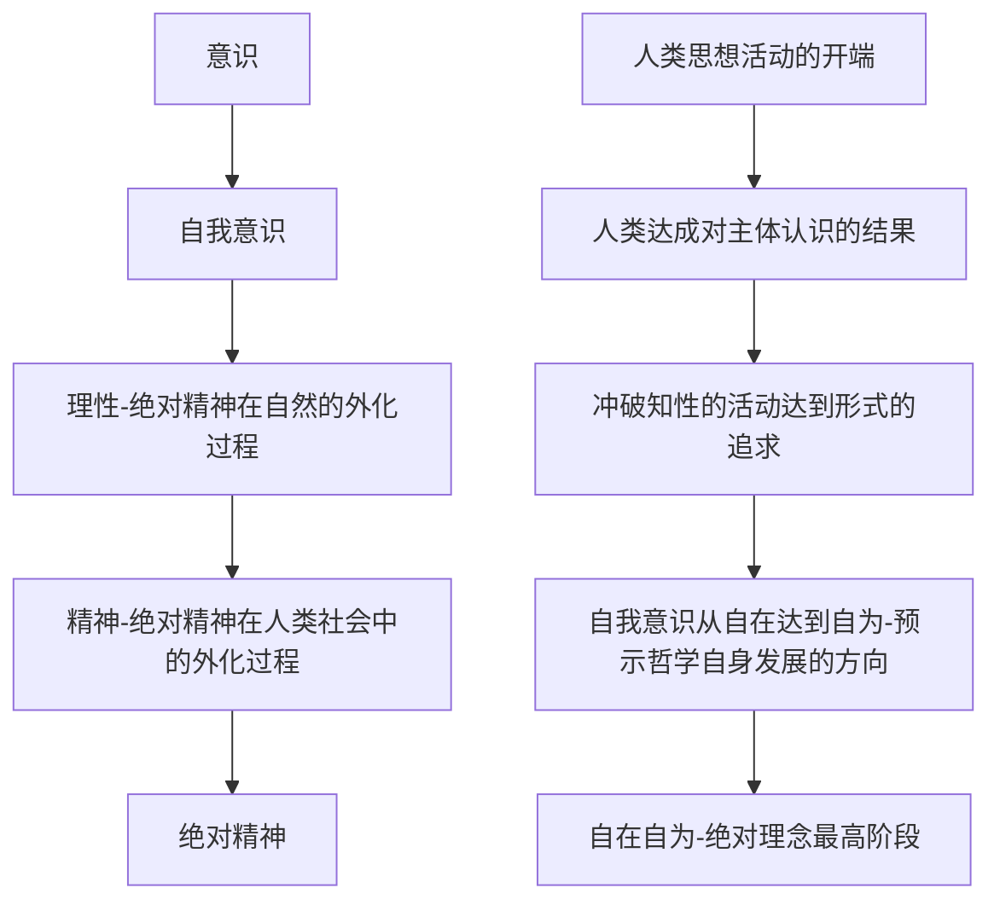

黑格尔哲学 【北京师范大学】江怡

哲学：启迪思想，帮助理解事物

18世纪~19世纪

”哲学就是时代之精华“

费西特（资产阶级的民主和自由），柏林大学第一任校长（创校校长）

谢林（宗教，上帝启示）

在两者之上，强调”精神自身的运动发展“，面对的是康德哲学的问题

黑格尔哲学把康德哲学作为起点

《精神现象学》37岁，使用一年完成

1807年，《精神现象学》正式出版，标志着黑格尔哲学体系的诞生

1817年，《哲学百科全书·小逻辑》

康德二元对立的哲学

> 感性与知性（包含理性）的对立
>
> 本质与现象的对立，物质体与表现的对立
>
> 自然与自由的对立

费西特，谢林

> 取消物质体，直接使用自我（意识）的概念
>
> 未解决根本问题：所有事物运动的发展（呈现的表象）背后一定有个原因和根据

黑格尔

> 休谟开始提出：
>
> cause / ground 追问原因，追问根据。根据不是从所看到的现象中寻找，表象无非是事物呈现出来的样态。样态要在别的地方不是它自身
>
> be-cause 要成为根据，就要给出这套根据的理由(Reason)
>
> 给出理由的过程就是推理(Reasoning)的过程
>
> 推理只能够停留在概念(Concept)的层次上，所有的推理活动都是和概念相关的。

哲学的所有工作的起点是逻辑学(Logic)，逻辑学是对概念的推理。

哲学就是概念自身推理，认证，演化的过程

不用物质体来解释表象的存在，只需要概念自身的演化过程，揭示事物变化发生的根据

在逻辑的基础上重建形而上学(Metaphysics)

所有形而上学都是关于人的理性活动范围的讨论

形而上学把人类的精神

(绝对精神 absolute, 客观 objective，理念 idea, 思想 thought)

作为所有意识活动发展的最终动力

黑格尔哲学的核心：哲学的任务就是对思想的思想(thought of thought)

个体的，社会的，绝对的 认识活动

主观的，客观的，绝对的 精神

> 人类精神发展的基本路线
>
> 精神本身的探险过程

把哲学的理解从对知识的爱，到一种真正的知识

科学是通过知性获得理性的知识

> 因为知性一般说来即是思维，即是纯粹的自我，而知性的东西则是已知的东西和科学与非科学的意识共有的东西，非科学的人通过它就能直接进入科学。
>
> 知性到理性的过程，就是人的意识活动到社会存在的过程

所有知识是由普遍概念(Universal 共相，与 Particular 殊相相对)构成的

客观唯心主义，对思想的普遍性和绝对性的认识的基础上

手段与目标。 类似 形式与内容

扬弃：概念需要抛开对象，对概念本身所形成的各种限制。

马克思：把 绝对精神 解读为 客观规律

> 黑格尔把**认识**看作是一个由**知识**与**对象**之间的**差别**和**矛盾推动**的发展过程

任何一个新的知识的产生，都是基于一个新的对象的意识活动的结果

知识在塑造对象，并且改造对象

>自在的世界/自为的世界（比自在更加抽象）
>
>in itself / for itself
>
>实体性要求/为了意识活动本身形成的对象

康德的形式主义观点，停留在表象。

- 表象性思维

  物质的思维，偶然的思维，完全沉浸在了材料里面，很难从物质里面摆脱出来，独立存在。

- 概念性思维（辩证思维，从运动，发展，联系的角度来看待概念是如何演变的）

  形式推理脱离了内容为自由，超出自由而骄傲。真正值得骄傲的是努力放弃这种自由，而不要成为任意调动内容的原则。

黑格尔哲学体系

- 逻辑学（内化）

  哲学导言，哲学基础

  “逻辑学是研究纯粹理念，即研究以抽象思维要素存在的理念的科学。”《哲学全书·逻辑学》，即《小逻辑》

  ​	存在论，本质论，概念论

  应该在 logos 层次上理解

  对内容的理解来把握形式，是对内容（规律）的要求

  康德的先天认知形式，是通过对对象的把握而显现出来的（如：有味觉才能在吃东西时感受到东西的味道）。认识之前就具备的，即先天能力

  亚里士多德的逻辑理解为形式逻辑（种+数差）

  ​	人是有理性的。XX是人。所以XX是有理性的。（即使XX并没有实质存在）

- 自然哲学（外化）

- 精神哲学（外化）

马克思揭示黑格尔哲学的内在矛盾：辩证法最终为成为唯心主义哲学体系的掘墓人

## 本体论逻辑学同认识论的统一

### 实体即主体

来源：亚里士多德

实体(ousia,being，本体)，一种属性，不是具体的对象

可以作为句中的主语

substance is the name of being

主体(subject)

客观性。自身存在不依于人的断定

能动性。

> 单纯的实体还只是潜在的因素，当它展开自身而外化为世界时，也仍然不是真正的现实，只有当实体展开为世界并且扬弃一切差别重建自身的同一性的时候，它才是真正的现实，而这个重建自身同一性的工作就是通过人类精神对于绝对的认识活动来实现的。

认识的活动不过是精神本身外化为自然的过程

绝对只是表达人类认识活动的一个阶段

只有绝对精神才能揭示人类认识事物的全部过程,一定是否定之否定的过程

辩证过程，是一个循环

> 最古老的问题：“我是谁？”。
>
> 设问同一性(identity)，通过差异展开了解，最后回到同一。

客观性是指思想所把握的事物本身

(客观)思想(thought)四个特点：

- 思想是能动的普遍性。普遍性(general)规定客观性(objective)
- 思想是对事物的“反思”。反思：把思想本身作为对象来进行思想的方式，即思想的思想。
- 思想本身可以超越一切对象
- 思想是通过辩证发展形成的观念

思维活动(thinking)  content/thought

being 与 thinking 相对

存在的可能被思维，被思维的一定存在。思维与存在的统一。
能思维不一定能认识。

> 所谓“存在”也不是指自然或事物，而是最普遍最抽象的共相，亦即事物的本质。

> 本体论：思维与存在的同一性指的是事物与其自身的概念（概念是思维的产物）相一致
>
> 认识论：思维 与存在的同一性指的是我们的思想能够把握存在于事物之中的本质

思维规定了存在（唯心）。马克思与之颠倒

### 合理性与现实性的关系

> 凡是合乎理性的东西都是现实的，凡是现实的东西都是合乎理性的。

> 理性不仅仅是主观的理想性，而且是事物的本质，而事物归根结底要符合自己的本质，所以合乎理性的东西一定要成为现实。
>
> 另一方面，并不是随便什么东西都可以被称为现实，只有真正合理的东西才能被称为现实，因而一切现实的东西当然就是合理的。

纯粹合理的东西：

- 符合对事物本质(nature of thing)的理解
- 符合绝对精神(absolute spirit)发展演变的理解

强调合理的应当是现实，即应然 > 实然

没有应然的要求就是或然的

### 黑格尔的辩证逻辑

理论的，哲学范畴，非逻辑学范畴

运动，发展，联系

- 概念的
- 能动的
- 客观的

作为理论的辩证法。哲学观念，人类概念发展的规律

作为方法的辩证法。思维方法

黑格尔对这两者没有区分。

马克思本身更偏向于方法的辩证法。

用形成概念的方式来讨论概念的内容

> 真正的科学方法亦即辩证法的本性，“一方面是方法与内容不分，另一方面是由它自己来规定自己的节奏”，这两个方面可以看作是其辩证法的基本特征。

在对待否定性的态度上，黑格尔区别于任何一位近代哲学家，其辩证法的核心就是对于否定性的辩证的理解。

不需要设立一个对立面的自我否定。

当作出任何肯定时，本身就存在否定的因素。

在西文中，“扬弃”这个概念本身就富于辩证性：“它既意谓保存、保持，又意谓停止、终结”。

扬弃、辩证的否定包含两个环节

- 否定
- 在否定中对有价值的东西的保留

于是事物便向更高阶段的过渡

辩证的否定就是扬弃，扬弃的过程就是否定之否定。

左翼：发扬辩证法，摒弃唯心主义

右翼：诋毁辩证法