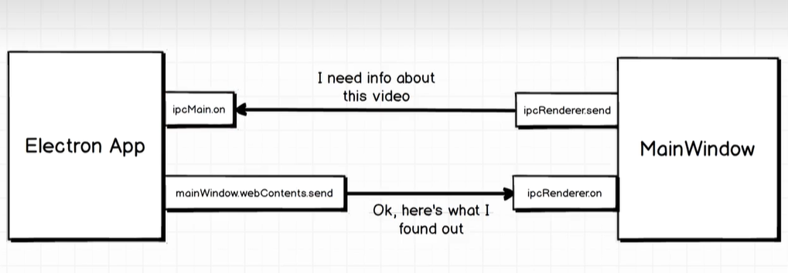

## electron

## 打包绿色免安装包
``` bat
npm install --save-dev electron-packager
npx electron-packager . egret_ui_editor --platform win32 --arch x64
```

## ipc(inter process communication)

```js
// 使用 preload.js
webPreferences: {
    preload: join(__dirname, "preload.js"),
}

const { ipcRenderer, contextBridge } = require("electron");

function sendToMain(channel, ...args) {
    ipcRenderer.send(channel, ...args);
}
// 导出 sendToMain 给 web 使用
contextBridge.exposeInMainWorld("sendToMain", sendToMain);
```