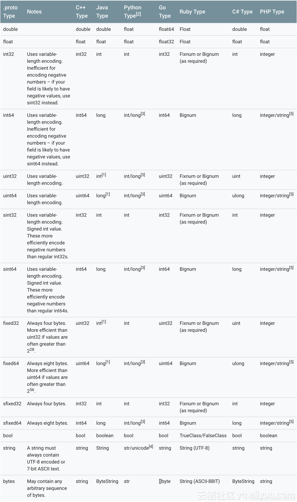

## javascript&typescript

## eslint 忽略部分
```js
// 忽略复杂度
/* eslint-disable complexity */
```

## npm install 出错
``` sh
# 报错内容 Cannot read property 'pickAlgorithm' of null

# 执行缓存清理，再重新尝试安装
npm cache clear --force
```

## express 解决跨域问题
``` js
////// 方案一
app.use(require('cors')())

////// 方案二
app.all('*', function(req, res, next) {
    res.header("Access-Control-Allow-Origin", "*"); // 允许的域名
    res.header("Access-Control-Allow-Headers", "X-Requested-With"); 
    res.header("Access-Control-Allow-Methods", "PUT,POST,GET,DELETE,OPTIONS"); // 允许的方式
    res.header("X-Powerd-By", "3.2.1");
    res.header("Content-Type", "application/json;charset=utf-8");
    next();
});

```

## Base64 <=> ArrayBuffer
``` javascript
function base64ToUint8Array(base64String) {
　　　　const padding = '='.repeat((4 - base64String.length % 4) % 4);
       const base64 = (base64String + padding)
                    .replace(/\-/g, '+')
                    .replace(/_/g, '/');

       const rawData = window.atob(base64);
       const outputArray = new Uint8Array(rawData.length);

       for (let i = 0; i < rawData.length; ++i) {
            outputArray[i] = rawData.charCodeAt(i);
       }
       return outputArray;
}

function arrayBufferToBase64(buffer) {
         var binary = '';
         var bytes = new Uint8Array(buffer);
         var len = bytes.byteLength;
         for (var i = 0; i < len; i++) {
               binary += String.fromCharCode(bytes[i]);
         }
         return window.btoa(binary);
}
```
## 代码报错时，会中断当前的调用堆栈(callstack)，比如事件派发器(EventDispatcher)无法完整派发
## 编辑 yarn config
``` bash
# 查看一下当前源
yarn config get registry
# 切换为淘宝源
yarn config set registry https://registry.npm.taobao.org
# 或者切换为自带的
yarn config set registry https://registry.yarnpkg.com
```
## 编辑 npm config
``` bash
npm config delete registry
npm config delete disturl
# 或者 找到淘宝那两行,删除
npm config edit

# 原npm地址
npm config set registry http://registry.npmjs.org 
```
## 临时使用 registry
```sh
npm --registry https://registry.npm.taobao.org install express
```
## 生成nodejs可执行文件
``` shell
# 安装指定版本的nodejs 推荐版本，根据 nexe 有编译发行的版本 https://github.com/nexe/nexe/releases?after=v3.3.4
npm i nexe -g
# 生成可执行文件
nexe --resource "./node_modules/**/*" main.js
```

## 使用 pkg 生成 nodejs 可执行文件
```sh
npm i -g pkg
# 打包过程中需要下载包，速度太慢，可以提前下载好放到指定目录，并且修改成命令行中的文件名，如 fetched-v16.16.0-win-x64
# 下载地址：https://github.com/vercel/pkg-fetch/releases
# 指定目录：~\.pkg-cache
pkg . -t node16-win-x64 --out-path=dist/
```
> 当前支持到 [nodejs 14.15.3](https://oss.npmmirror.com/dist/node/v14.15.3/node-v14.15.3-x64.msi)
## 版本号比较
``` javascript
function compareVersion(verA, verB) {
    let versA = verA.split(".");
    let versB = verB.split(".");
    for (let i = 0, len = Math.max(versA.length, versB.length); i < len; ++i) {
        let ret = parseInt(versA[i] || 0) - parseInt(versB[i] || 0);
        if (ret) {
            return ret;
        }
    }
    return 0;
}
```
## 匹配未被引号包围的空格
``` javascript
/ +(?=(?:(?:[^"]*"){2})*[^"]*$)/
```
## 格式化字符串
``` javascript
/**
 * 格式化带管道符的字符串
 * @param {*} value 原始字符串
 * @param {*} args 可供格式化的数据
 * @param {*} funcMap 函数字典
 * @returns 
 */
function format(value, args, funcMap) {
    return value.replace(/\{([\S\s]+?)\}/g, function(s, i) {
        if (i.indexOf("|") == -1) {
            return (args && args[i] == null) ? s : args[i];
        }
        /**
         * 按管道符分割
         * @type {string[]}
         */
        let pipevalues = i.split(/\|(?=(?:(?:[^"]*"){2})*[^"]*$)/); //.map(v => v.trim());
        let fstvalue = pipevalues[0];
        let ret;
        if (args && args[fstvalue] != null) {
            ret = pipevalues.slice(1).reduce((prev,curr)=>{
                /**
                 * 按空格分割
                 * @type {string[]}
                 */
                let argvalues = curr.split(/ +(?=(?:(?:[^"]*"){2})*[^"]*$)/); //.filter(v => v.trim());
                let funcName = argvalues[0];
                if (funcMap && funcMap[funcName]) {
                    argvalues = argvalues.slice(1).map(v=>JSON.parse(v));
                    argvalues.splice(0, 0, prev);
                    return funcMap[funcName].apply(funcMap, argvalues);
                }
                return prev;
            }
            , args[fstvalue]);
        } else {
            ret = s;
        }
        return ret;
    });
}

let funcMap = {
    "+": function(value) {
        let ret = value;
        for (let i = 1, len = arguments.length; i < len; ++i) {
            ret += arguments[i];
        }
        return ret;
    },
    "*": function(value) {
        let ret = value;
        for (let i = 1, len = arguments.length; i < len; ++i) {
            ret *= arguments[i];
        }
        return ret;
    },
    "-": function(value) {
        let ret = value;
        for (let i = 1, len = arguments.length; i < len; ++i) {
            ret -= arguments[i];
        }
        return ret;
    },
    "/": function(value) {
        let ret = value;
        for (let i = 1, len = arguments.length; i < len; ++i) {
            ret /= arguments[i];
        }
        return ret;
    },
    "==": function(value, target, yes = "", no = "") {
        return value == target ? yes : no;
    },
    ">=": function(value, target, yes = "", no = "") {
        return value >= target ? yes : no;
    },
    "<=": function(value, target, yes = "", no = "") {
        return value <= target ? yes : no;
    },
    ">": function(value, target, yes = "", no = "") {
        return value > target ? yes : no;
    },
    "<": function(value, target, yes = "", no = "") {
        return value < target ? yes : no;
    },
    "!=": function(value, target, yes = "", no = "") {
        return value != target ? yes : no;
    },
    "%": function(value, target) {
        return value % target;
    },
    "**": function(value, target) {
        return value ** target;
    },
    "sqrt": function(value) {
        return Math.sqrt(value);
    },
    "fixed": function(value, fractionDigits, digital) {
        if (digital) {
            return +value.toFixed(fractionDigits);
        } else {
            return value.toFixed(fractionDigits);
        }
    },
    "precision": function(value, precision, digital) {
        if (digital) {
            return +value.toPrecision(precision);
        } else {
            return value.toPrecision(precision);
        }
    },
    "abs": function(value) {
        return Math.abs(value);
    },
    "hex": function(value) {
        return value.toString(16);
    },
    "bin": function(value) {
        return value.toString(2);
    },
    "str": function(value, radix) {
        return value.toString(radix);
    },
    "fill": function(value, max, char, right) {
        max = max || 6;
        char = char || "0";
        let ret = value.toString();
        while (ret.length < max) {
            if (right) {
                ret += char;
            } else {
                ret = char + ret;
            }
        }
        return ret;
    },
    "include": function(value, target, yes = "", no = "") {
        return target.indexOf(value) >= 0 ? yes : no;
    },
    "exclude": function(value, target, yes = "", no = "") {
        return target.indexOf(value) == -1 ? yes : no;
    },
};
```
## 覆盖现有函数定义
``` javascript
(function overrideTag(tag, callback) {
    console.log(`overrideTag ${tag}`);
    if (!tag) {
        return;
    }
    let tags = tag.split('.');
    let bak = '.backup.tsubasa';
    let globalTarget;
    if (typeof window !== "undefined") {
        globalTarget = window;
    } else if (typeof global !== "undefined") {
        globalTarget = global;
    }
    let src_parent = globalTarget;
    for (let i = 0, len = tags.length - 1; i < len; ++i) {
        src_parent = src_parent[tags[i]];
    }
    let src_tag = tags[tags.length - 1];
    // 备份
    globalTarget[tag + bak] = globalTarget[tag + bak] || src_parent[src_tag];
    src_parent[src_tag] = function() {
        return callback(tag, globalTarget[tag + bak], this, arguments, src_parent);
    };
})(
    '',
    function(tag, original, thisArg, args, tagParent) {
        // console.log.apply(console, Array.prototype.slice.apply(args).concat(tag));
        // 默认行为
        return original.apply(thisArg, args);
    }
)
```
``` javascript
(function overrideTagGetSet(tag) {
    console.log(`overrideTagGetSet ${tag}`);
    if (!tag) {
        return;
    }
    let tags = tag.split('.');
    let bak = '.backup.tsubasa';
    let globalTarget;
    if (typeof window !== "undefined") {
        globalTarget = window;
    } else if (typeof global !== "undefined") {
        globalTarget = global;
    }
    let src_parent = globalTarget;
    for (let i = 0, len = tags.length - 1; i < len; ++i) {
        src_parent = src_parent[tags[i]];
    }
    let src_tag = tags[tags.length - 1];
    // 备份
    let value = src_parent[src_tag];
    Object.defineProperty(src_parent, src_tag, {
        configurable: true,
        get: function() {
            console.log(`Get ${tag}`);
            return value;
        },
        set: function(v) {
            console.log(`Get ${tag} ${v}`);
            v = value;
        },
    });
})(
    ''
)
```
## 忽略新的特性
``` typescript
// @ts-ignore TS2611
```
## 优化JSON显示
``` js
/**
 * JSON字符串化
 * @param {Array|Object} value 对象
 * @param {number} space 空格数，可选。默认值：2
 * @param {string[]?} sortKeys 键排序数据，可选。默认值：null
 */
function stringify(value, space, sortKeys) {
    let result = "";
    space = space === undefined ? 2 : space;
    let depth = arguments[3] === undefined ? 0 : arguments[3];

    /** key: value 是否换行 */
    let wrapKV = false;
    /** 对象属性 是否换行 */
    let wrapAtt = false;
    /** 数组元素 是否换行 */
    let wrapArr = false;
    wrapKV = wrapAtt = wrapArr = space > 0;

    /** 是否可以显示在同一行 */
    let canSameLine = false;
    if (value instanceof Array) {
        canSameLine = value.every(v => typeof v !== "object");
        if (canSameLine) {
            wrapKV = false;
            wrapArr = false;
        }
    } else if (typeof value === "object") {
        canSameLine = true;
        for (let k in value) {
            if (value.hasOwnProperty(k)) {
                if (typeof value[k] === "object") {
                    canSameLine = false;
                    break;
                }
            }
        }
        if (canSameLine) {
            wrapAtt = false;
            wrapKV = false;
        }
    }
    let space1 = "";
    let n = (depth + 1) * space;;
    while (--n >= 0) {
        space1 += " ";
    }
    let space2 = space1.substr(space);

    if (value instanceof Array) {
        result += "[";
        if (wrapKV) {
            result += "\n";
        }
        ++depth;
        if (!wrapArr && wrapKV) {
            result += space1;
        }
        result += value.map(v => {
            return `${wrapArr ? space1 : ""}${stringify(v, space, sortKeys, depth)}`;
        }).join(!wrapArr ? ", " : ",\n");
    } else if (typeof value === "object") {
        result += "{";
        if (wrapKV) {
            result += "\n";
        }
        ++depth;
        let keys = Object.keys(value);
        keys = keys.filter(v => value.hasOwnProperty(v));
        if (sortKeys instanceof Array) {
            let num = sortKeys.length * 2;
            keys.sort((keyA, keyB) => {
                let idxA = sortKeys.indexOf(keyA);
                let idxB = sortKeys.indexOf(keyB);
                idxA = (idxA + num) % num;
                idxB = (idxB + num) % num;
                return idxA - idxB;
            });
        }
        if (!wrapAtt && wrapKV) {
            result += space1;
        }
        result += keys.map(v => {
            return `${wrapAtt ? space1 : ""}"${v}": ${stringify(value[v], space, sortKeys, depth)}`;
        }).join(!wrapAtt ? ", " : ",\n");
    } else if (typeof value === "number" || typeof value === "boolean") {
        result += value;
    } else if (typeof value === "string") {
        result += `"${escapeString(value)}"`;
    }
    if (value instanceof Array) {
        if (wrapKV) {
            result += "\n";
            result += space2;
        }
        result += "]";
    } else if (typeof value === "object") {
        if (wrapKV) {
            result += "\n";
            result += space2;
        }
        result += "}";
    }
    return result;
}

function escapeString(str) {
    return str
        .replace(/\\/g, '\\\\')
        .replace(/\"/g, '\\\"')
        // .replace(/\//g, '\\/')
        // *注: [\b] 是匹配backspace, \b 是匹配边界
        .replace(/[\b]/g, '\\b')
        .replace(/\f/g, '\\f')
        .replace(/\n/g, '\\n')
        .replace(/\r/g, '\\r')
        .replace(/\t/g, '\\t');
};
```
##  格式化
``` js
/** 格式化数值相关 */
function formatByValues(values, fmt, prefix) {
  prefix = prefix || "0000";
  return fmt.replace(/(.)\1{0,}/g, function(matchString, index, self) {
      var key = matchString[0];
      if (key && values.hasOwnProperty(key)) {
          var value = values[key];
          var valueStr = value.toString();
          if (matchString.length == 1) {
              return valueStr;
          } else {
              return (prefix + valueStr).substr(valueStr.length + prefix.length - matchString.length);
          }
      } else {
          return matchString;
      }
  });
}
/**
 * 格式化日期
 * @param {Date} date 
 * @param {string} fmt 
 */
function formatDate(date, fmt) {
    if (fmt == null) {
        fmt = 'YYYY-MM-DD hh:mm:ss SSS';
    }

    var values = {
        "Y": date.getFullYear(),
        "M": date.getMonth() + 1,
        "D": date.getDate(),
        "h": date.getHours(),
        "m": date.getMinutes(),
        "s": date.getSeconds(),
        "S": date.getMilliseconds(),
    };
    return formatByValues(values, fmt);
}

/**
 * 格式化时间戳(毫秒)
 * @param {number} millisec 毫秒
 * @param {string} fmt 
 */
function formatTimestampMillisec(millisec, fmt) {
    /**
     * @type {Date}
     */
    let date = this['__formatDateInMillisec__date'] = this['__formatDateInMillisec__date'] || new Date();
    date.setTime(millisec);
    return formatDate(date);
}

/**
 * 格式化时间戳(秒)
 * @param {number} sec 秒
 * @param {string} fmt 
 */
function formatTimestampSec(sec, fmt) {
    return formatTimestampMillisec(sec * 1000, fmt);
}

/**
 * 格式化时间（秒）
 * @param {number} time 
 * @param {string} fmt 
 */
function formatTimeInSec(time, fmt) {
    if (fmt == null) {
        fmt = 'hh:mm:ss';
    }

    var hours = Math.floor(time / 3600),
        minutes = Math.floor(time / 60) % 60, 
        seconds = Math.floor(time % 60);
    var values = {
        "h": hours,
        "m": minutes,
        "s": seconds,
    };
    return formatByValues(values, fmt);
}

/**
 * 格式化时间（毫秒）
 * @param {number} time 
 * @param {string} fmt 
 */
function formatTimeInMillisec(time, fmt) {
    if (fmt == null) {
        fmt = 'hh:mm:ss SSS';
    }

    var hours = Math.floor(time / 3600000),
        minutes = Math.floor(time / 60000) % 60, 
        seconds = Math.floor(time / 1000) % 60;
        millisec = time % 1000;
    var values = {
        "h": hours,
        "m": minutes,
        "s": seconds,
        "S": millisec,
    };
    return formatByValues(values, fmt);
}
```
##  错误统计示例
``` js
var logTS = Date.now();
var logT = 0;
var errorC = {};
var hgCheckLogT = (function (desc) {
    if (errorC[desc]) {
        return false;
    }
    if (logT + 1 > 60) {
        if (Date.now() - logTS < 3600000) {
            return false;
        }
        else {
            logTS = Date.now();
            logT = 1;
        }
    }
    else {
        ++logT;
    }
    errorC[desc] = true;
    return true;
});
var HGError = (function (e) {
    var desc = gGameInfo.chn + " " + gGameInfo.ver + " ";
    if (!e.filename) {
        desc += "index Obj " + e + " msg: " + e.message + " stack: " + (e.error ? e.error.stack : "null");
        for (var key in e) {
            var val = e[key];
            if (key != "timeStamp" && (typeof val != "function")) {
                if (desc) {
                    desc += " ";
                }
                if (key == "srcElement" && val["src"]) {
                    desc += key + ": " + val + "(" + encodeURIComponent(val["src"]) + ")";
                }
                else {
                    desc += key + ": " + encodeURIComponent(val);
                }
            }
        }
    }
    else {
        desc += "index filename: " + encodeURIComponent(e.filename) + " msg: " + e.message + " stack: " + (e.error ? e.error.stack : "null");
    }
    if (!hgCheckLogT(desc)) {
        return;
    }
    hgHttpPost("https://webxcx.hotgamehl.com/log/log.php", "data=" + desc + "&flag=dldlIndex", null);
});
var erralert = 0;
window.onerror = function (msg, url, line, column, detail) {
    if (gGameInfo.chn) {
        if (erralert++ < 5 && detail)
            alert("出错了，请把此信息截图给开发者\n" + msg + "\n" + detail.stack);
    }
};
window.addEventListener('error', (function (e) {
    if (!e)
        return;
    if (gGameInfo.chn) {
        HGError(e);
    }
    else {
        alert(e && e.message);
    }
    e.preventDefault();
}), true);
```
##  vbs使用参数启动node服务器
``` bash
set ws = createobject("wscript.shell")
ws.Run "node E:\\tsubasa\\node_http_server\\app.js E:\\projects\\DLDL_SVN", 0
```
> Array.prototype.sort 在不同环境（如 Safari, Chrome 等）下的实现方式不同，执行过程中有可能会对原始数组进行修改，因此排序结束前，不应该去访问或者修改原始数组。
>
> ##  typescript编译
``` bash
tsc -b .\tsconfigDebug1.json
tsc -w
```
##  正则表达式之名称捕获
``` js
"tsubasa-v100".replace(/(?<name>^.+)-(?<version>v.+$)/g, function (...a) {
    console.log(a)
});
(6) ["tsubasa-v100", "tsubasa", "v100", 0, "tsubasa-v100", {…}]
    0: "tsubasa-v100"
    1: "tsubasa"
    2: "v100"
    3: 0 // 此处为匹配的位置
    4: "tsubasa-v100"
   5: {name: "tsubasa", version: "v100"}
length: 6
__proto__: Array(0)
```
##  Typescript 文件监听 watch 版本
> 高级的版本，会提示错误
```
lib.es2015.promise.d.ts:129:21 - error TS2304: Cannot find name 'Iterable'.
```
> 解决方案一：
也可以在`tsconfig.json`的`compilerOptions`的`lib`中添加：
`"es2015.iterable"`

> 解决方案二:
安装旧版本`typescript`
``` bash
npm install -g typescript@3.4.3
```
##  敏感词管理器
[SensitiveWordMgr.ts](../assets/attachments/SensitiveWordMgr.ts)

##  修改npm源
``` bash
npm config set registry https://registry.npm.taobao.org
```
##  修改yarn镜像地址
``` bash
yarn config set registry https://registry.npm.taobao.org -g
```
##  类定义接口
``` ts
interface IAnyClass<T> {
    new (...args: any[]): T;
}

// 使用举例：
/**
 *
 * @constructor
 */
New<T>(cls: IAnyClass<T>): T;

// 实例化 1
function Ins<T>(cls: {new (...args: any[]): T;}): T {
    return new cls();
}
// 实例化 2
function Ins<T>(cls: IAnyClass<T>): T {
    return new cls();
}
```
##  Native调用（decodeURIComponent）
[NativeBridgeProxy.js](../assets/attachments/NativeBridgeProxy.js)


## protocol buffer 相关
- 下载 `protoc` https://github.com/protocolbuffers/protobuf/releases
- 新建一个空项目，安装 `npm i ts-proto`
### 在Windows中使用
``` bash
# 生成 包含完整类定义的 typescript 代码
protoc --plugin=protoc-gen-ts_proto=.\\node_modules\\.bin\\protoc-gen-ts_proto.cmd --ts_proto_out=. ./messages.proto
# 生成 仅包含接口的 typescript 代码
protoc --plugin=protoc-gen-ts_proto=.\\node_modules\\.bin\\protoc-gen-ts_proto.cmd --ts_proto_out=. --ts_proto_opt=outputEncodeMethods=false,outputJsonMethods=false,outputClientImpl=false ./messages.proto
```
> 协议文件`messages.proto`要放在工作空间内部，并且以相对路径的写法传递给命令行参数

## protocol buffer 2.x 和 3.x 区别
- 3.x 有默认值的设定（减少不必要的数据传输），如 数值类型默认值为 0，字符串类型默认值为 ""。

## protobuf long 的默认值类型问题
`protobuf 3.x`，引入`Long.js`以支持64位的数值类型，提供到的字段默认值为是`Long`结构类型而非原始类型`number`。可以修改`Long.js`:
``` javascript
Long.ZERO = 0;
Long.UZERO = 0;
```


## protobuf.js
``` javascript
// https://github.com/protobufjs/protobuf.js

/**
 * 版本 3.x.x ~ 5.x.x
 * 需要依赖 bytebuffer(包含long) 库
 */

// 加载解析协议内容
// protobuf-light.[.min]js 仅支持 json
dcodeIO.ProtoBuf.loadJson
dcodeIO.ProtoBuf.loadJsonFile
dcodeIO.ProtoBuf.loadProto
dcodeIO.ProtoBuf.loadProtoFile

// 查找指定协议类型
.lookup(...)

// 构建
.build(...)

// 编解码
.encode(...)
.decode(...)

/**
 * 版本 6.x.x ~
 * 需要可执行 eval/Function 的环境（小游戏环境无法使用）
 */

// 加载解析协议内容, 支持 proto/json
protobuf.parse(...)

// ...

...


```

## protobuf 数据类型

Protocol Buffer (Protobuf) supports a range of native scalar value types. The following table lists them all with their equivalent C# type:

| Protobuf type | Notes |
| ------------- | ----: |
| double        |       |
| float         |       |
| int32         |     1 |
| int64         |     1 |
| uint32        |       |
| uint64        |       |
| sint32        |     1 |
| sint64        |     1 |
| fixed32       |     2 |
| fixed64       |     2 |
| sfixed32      |     2 |
| sfixed64      |     2 |
| bool          |       |
| string        |     3 |
| bytes         |     4 |

#### Notes:
1. The standard encoding for int32 and int64 is inefficient when you're working with signed values. 
   If your field is likely to contain negative numbers, use sint32 or sint64 instead. These types map to the C# int and long types, respectively.
2. The fixed fields always use the same number of bytes no matter what the value is. This behavior makes serialization and deserialization faster for larger values.
3. Protobuf strings are UTF-8 (or 7-bit ASCII) encoded. The encoded length can't be greater than 2^32.
4. The Protobuf runtime provides a ByteString type that maps easily to and from C# byte[] arrays.

## 使用装饰器的hook执行埋点逻辑
``` ts
export function collectData(payload: Object) {
    return function (
        target: any,
        propertyName: string,
        descriptor: PropertyDescriptor
    ) {
        const oldValue = descriptor.value

        descriptor.value = function (data: any) {
            console.log(`触发埋点`, payload);
            return oldValue.apply(this, arguments);
        }
    }
}
```

## 使用 json-dup-key-validator 检查 json 中的重复 key

## encodeURI vs encodeURIComponent
1. 区别
    1. encodeURI()通常用于转码整个 URL，不会对URL 元字符以及语义字符进行转码。
    > URL元字符：分号（;），逗号（,），斜杠（/），问号（?），冒号（:），at（@），&，等号（=），加号（+），美元符号（$），井号（#）

    > 语义字符：a-z，A-Z，0-9，连词号（-），下划线（_），点（.），感叹号（!），波浪线（~），星号（*），单引号（'），圆括号（()）

    2. encodeURIComponent()通常只用于转码URL组成部分，如URL中?后的一串；会转码除了语义字符之外的所有字符，即元字符也会被转码
    > 注：若整个链接被encodeURIComponent()转码，则该链接无法被浏览器访问，需要解码之后才可以正常访问。

2. 使用场景
   对于无特殊参数的链接，都可以使用encodeURI()进行转码，那什么特殊情况需要用到encodeURIComponent()呢？通常是链接带着一些特殊参数的时候，就比如以下链接: `https://www.baidu.com/s?returnURL=http://www.test.com/`
   链接内包含一个回调地址，回调地址是另外一个URL，此时我们就需要使用encodeURIComponent()对回调地址进行转码，这样一来，URL中就不会出现多个http://，多个&这样的特殊字符；方便对回调地址进行处理；以上链接处理如下：
``` js
// 对URL中的回调链接进行转码
'https://www.baidu.com/s?returnURL=' +encodeURIComponent('http://www.test.com/')
//输出: 
"https://www.baidu.com/s?returnURL=http%3A%2F%2Fwww.test.com%2F"
```

## ~/.npmrc 配置
```sh
registry=https://registry.npmmirror.com/
electron_mirror=https://cdn.npmmirror.com/binaries/electron/
electron_builder_binaries_mirror=https://npmmirror.com/mirrors/electron-builder-binaries
```

## 为 ts/js 配置 eslint / prettier
## 使用VSCode插件ESLint命令：Create ESLint Configuration
```sh
# 安装依赖
npm i -D eslint eslint-plugin-prettier
```

创建 `.eslintrc.json` 文件
```json
{
    "env": {
        "commonjs": true, 
        "browser": true, 
        "es2021": true, 
        "node": true
    },
    "plugins": ["prettier"],
    "rules": {
        "prettier/prettier": "error",
        "no-undef": "error",
        "no-unused-expressions": "warn",
        "no-unused-labels": "warn",
        "no-unused-vars": "warn",
        "no-dupe-keys": "error"
    },
    "parserOptions": {
        "ecmaVersion": 2020,
        "ecmaFeatures": {
            "jsx": true
        },
        "sourceType": "module"
    }
}
// 需要安装 @babel/eslint-parser
{
    "env": {
        "commonjs": true, 
        "browser": true, 
        "es2021": true, 
        "node": true
    },
    "plugins": ["prettier"],
    "rules": {
        "prettier/prettier": "error",
        "no-undef": "error",
        "no-dupe-keys": "error"
    },
    "parser": "@babel/eslint-parser",
    "parserOptions": {
        "requireConfigFile": false,
        "babelOptions": {
            "parserOpts": {
                "plugins": ["jsx"]
            }
        },
        "sourceType": "module"
    }
}
// typescript 插件 
// npm i -D eslint eslint-plugin-prettier @typescript-eslint/parser
{
    "parser": "@typescript-eslint/parser",
    "parserOptions": {
        "sourceType": "script", // 设置为 "script" (默认) 或 "module"（如果你的代码是 ECMAScript 模块)。 
    }
}
```

创建 `.prettierrc` 文件
```js
{
    "printWidth": 160,
    "tabWidth": 4,
    "singleQuote": true,
    "endOfLine": "auto",
    "quoteProps": "preserve",
    "trailingComma": "all"
}
```
> 额外的可以配置 `.vscode/settings.json`。在保存时自动格式化
```json
{
    "eslint.enable": true,
    "eslint.format.enable": true,
    "[ts|js|jsx|tsx]": {
        "editor.formatOnSave": true,
        "editor.defaultFormatter": "dbaeumer.vscode-eslint"
    },
    "editor.codeActionsOnSave": {
        // "source.fixAll": true,
        // 仅对eslint生效
        "source.fixAll.eslint": true
    },
    "editor.detectIndentation": false,
    "editor.tabSize": 4,
    "editor.insertSpaces": true
}
```

## 添加全局声明
`index.d.ts`
```ts
declare global {
  function sendToMain(channel, ...args): void;
  function receiveFromMain(channel, listener): void;
}

export {}
```

## eslint 添加全局声明
```js
/* global sendToMain */
sendToMain('todo:add', document.querySelector('input').value);
```

## 使用 eslint 自动修复
```sh
.\node_modules\.bin\eslint . --fix
```

## 使用 eslint 对指定文件检查
```sh
.\node_modules\.bin\eslint src/**
```

## JNI ERROR (app bug): local reference table overflow (max=512)
白鹭原生包报错，可能由于一帧内发送过多消息导致。
发送消息需要创建很多 ArrayBuffer，导致此错误。

发送消息时，先将消息放入队列，然后等待一帧后发送，如果一帧内没有发送完，则等待下一帧再发送

## 队列
```ts
/**
 *
 * @param fn
 * @param limit 每次执行最大数量
 * @param trigger 触发函数
 * @returns 队列化后的函数 queued
 */
export function queue<T extends Function>(fn: T, limit: number, trigger: (callback: Function) => void): T {
    const argQueues: any[] = [];
    let context: any = null;
    let availableCount = limit;
    /** 等待触发中 */
    let isWaiting = false;
    /** 按队列执行 */
    function runQueue() {
        if (!argQueues.length) return;
        if (availableCount > 0) {
            const runNum = Math.min(availableCount, argQueues.length);
            const argsToRun = argQueues.splice(0, runNum);
            argsToRun.forEach((item) => {
                fn.apply(context, item);
            });
            availableCount -= runNum;
        }
        if (!isWaiting) {
            isWaiting = true;
            trigger(reset);
        }
    }
    function reset(): void {
        isWaiting = false;
        availableCount = limit;
        runQueue();
    }
    const queued: any = function (this: any) {
        const args = arguments;
        argQueues.push(args);
        context = this;
        runQueue();
    };
    return queued;
}

export function queueWithTimeout<T extends Function>(fn: T, limit: number, delay: number) {
    return queue(fn, limit, (callback) => {
        setTimeout(() => {
            callback();
        }, delay);
    });
}
```
```js
javascript: function queue(fn, limit, trigger, flushTrigger, toggleTrigger) {
    var argQueues = [];
    var context = null;
    var availableCount = limit;
    var isWaiting = false;
    var permitAll = false;

    function runQueue() {
        if (!argQueues.length) return;
        if (availableCount > 0 || permitAll) {
            var runNum = permitAll ? argQueues.length : Math.min(availableCount, argQueues.length);
            var argsToRun = argQueues.splice(0, runNum);
            argsToRun.forEach(function (item) {
                fn.apply(context, item);
            });
            if (!permitAll) {
                availableCount -= runNum;
            }
        }
        if (!isWaiting) {
            isWaiting = true;
            trigger(reset);
        }
    }

    function reset() {
        isWaiting = false;
        availableCount = limit;
        runQueue();
    }

    function toggle() {
        permitAll = !permitAll;
        runQueue();
    }
    function flush() {
        var argsToRun = argQueues.splice(0, argQueues.length);
        argsToRun.forEach(function (item) {
            fn.apply(context, item);
        });
    }
    var queued = function () {
        var args = arguments;
        argQueues.push(args);
        context = this;
        runQueue();
    };
    flushTrigger && flushTrigger(flush);
    toggleTrigger && toggleTrigger(toggle);
    Object.defineProperty(queued, "status", {
        get: function() {
            return {
                queuedCount: argQueues.length,
                limit: limit,
                availableCount: availableCount,
                isWaiting: isWaiting,
                permitAll: permitAll,
            }
        },
    });
    return queued;
}

function queueWithTimeout(fn, limit, delay) {
    return queue(fn, limit, function (callback) {
        hg.setTimeout(function () {
            callback();
        }, delay);
    });
}

function queueWithKeydown(fn, limit, onceKey, flushKey, toggleKey) {
    var onceCallbacks = [];
    var toggleCallback;
    var flushCallback;
    document.body.addEventListener("keydown", function (event) {
        if (event.key == onceKey) {
            const onceCallback = onceCallbacks.shift();
            onceCallback && onceCallback();
        }
        if (event.key == flushKey) {
            flushCallback && flushCallback();
        }
        if (event.key == toggleKey) {
            toggleCallback && toggleCallback();
        }
    });
    return queue(fn, limit, function (callback) {
            onceCallbacks.push(callback);
        },
        function (callback) {
            flushCallback = callback;
        },
        function (callback) {
            toggleCallback = callback;
        },
    )
}

function queueWithClick(fn, limit) {
    var onceCallbacks = [];
    document.body.addEventListener("click", function (event) {
        if (event.key == onceKey) {
            const onceCallback = onceCallbacks.shift();
            onceCallback && onceCallback();
        }
    });
    return queue(fn, limit, function (callback) {
        onceCallbacks.push(callback);
    });
}
```
##  Could not resolve dependency: npm ERR! peerOptional 解决方案
`npm install --legacy-peer-deps`

也可以修改全局配置 `npm config set legacy-peer-deps=true`，这个修改等同于在`~/.npmrc` 文件中添加 `legacy-peer-deps=true`。

## 精度相关运算
```js
/** 用于精度敏感的乘法运算 */
function multiply(...arg: number[]): number;
function multiply() {
    var result = 1;
    var totalDot = 0;
    for(let i = 0, len = arguments.length; i < len; i++) {
        var num = arguments[i];
        if (num < 0) {
            result *= -1;
            num *= -1;
        }
        var str = num.toString();
        var dotIdx = str.indexOf('.');
        if (dotIdx != -1) {
            totalDot += str.length - dotIdx - 1;
            str = (str.substring(0, dotIdx) + str.substring(dotIdx + 1)).replace(/^0+/, "");
        }
        result *= +str;
    }
    result /= Math.pow(10, totalDot);
    return result;
}

/** 用于精度敏感的加法运算 */
function add(...arg: number[]): number;
function add() {
    var result = 0;
    var totalDot = 0;
    for(let i = 0, len = arguments.length; i < len; i++) {
        var num = arguments[i];
        var isNegative = num < 0;
        if (isNegative) {
            num *= -1;
        }
        var num_str = num.toString();
        var dotIdx = num_str.indexOf('.');
        var dotLen = num_str.length - dotIdx - 1;
        if (dotLen > totalDot) {
            result *= Math.pow(10, dotLen - totalDot);
            totalDot = dotLen;
        }
        num_str = (num_str.substring(0, dotIdx) + num_str.substring(dotIdx + 1)).replace(/^0+/, "");
        num = +num_str * (isNegative ? -1 : 1);
        result += num;
    }
    result /= Math.pow(10, totalDot);
    return result;
}
```

## npm 发布包
```sh
# 登录
npm login --registry https://registry.npmjs.org
# 发布
npm publish --registry https://registry.npmjs.org
```

## 获取 npm 全局安装地址及缓存位置
打开电脑命令面板（windows + r，输入cmd），输入下面命令进行查询：

1. npm 全局安装地址
```sh
npm config get prefix
```

2. npm 缓存位置
```sh
npm config get cache
```

## 设置 npm 安装的地址及缓存位置

1. 设置npm安装的地址
```sh
npm config set prefix "D:\programfiles\nodejs\node_global"
```

2. npm缓存位置设置
```sh
npm config set cache "D:\programfiles\nodejs\node_cache"
```

## 字符串异步替换
```ts
/**
 * 使用给定的模式和替换函数对字符串进行异步替换。
 * @param value 要进行替换操作的原始字符串。
 * @param pattern 一个字符串或正则表达式，用于匹配需要替换的部分。
 * @param replacer 一个函数，接收匹配的子字符串作为参数，返回一个Promise，该Promise解析为替换后的字符串。
 * @returns 返回一个Promise，该Promise解析为替换操作完成后的字符串。
 */
async function replaceAsync(
  value: string,
  pattern: string | RegExp,
  replacer: (substring: string) => Promise<string>
): Promise<string> {
  let reg: RegExp;
  // 根据模式是字符串还是正则表达式创建正则表达式实例
  if (typeof pattern === "string") {
    // 对字符串模式进行转义，避免特殊字符影响
    reg = new RegExp(
      pattern.replace(/[\-\[\]\/\{\}\(\)\*\+\?\.\\\^\$\|]/g, "\\$&")
    );
  } else {
    // 如果是正则表达式，确保其具有全局标志
    if (!pattern.global) {
      throw new TypeError("RegExp must have global flag");
    }
    // 复制正则表达式实例，避免影响原始实例
    reg = new RegExp(pattern);
  }

  let result: string[] = []; // 存储替换过程中的分块字符串
  let lastIndex = 0; // 记录上一次匹配结束的位置

  // 不断查找匹配项并进行替换，直到没有匹配项为止
  while (true) {
    let match = reg.exec(value);
    if (!match) {
      break;
    }
    // 将匹配项之前的文本添加到结果中
    result.push(value.slice(lastIndex, match.index));
    // 使用替换函数异步替换匹配项，并添加到结果中
    result.push(await replacer(match[0]));
    lastIndex = match.index + match[0].length; // 更新上一次匹配结束的位置
  }
  // 将剩余的文本添加到结果中
  result.push(value.slice(lastIndex));
  // 将所有分块字符串连接成最终的结果
  return result.join("");
}
```

## 二分查找
```js
const BinarySearchMask = {
    NEARBY_NONE: 0,
    NEARBY_GREATER: 1,
    NEARBY_LESS: 2,
    DUPLICATE_PREFER_NONE: 0,
    DUPLICATE_PREFER_FIRST: 4,
    DUPLICATE_PREFER_LAST: 8,
};
function binarySearch(datas, compareFunc, mask = BinarySearchMask.NEARBY_NONE | BinarySearchMask.DUPLICATE_PREFER_NONE) {
    let left = 0;
    let right = datas.length - 1;
    while (left <= right) {
        let mid = Math.floor((left + right) / 2);
        let compareResult = compareFunc(datas[mid], mid);
        if (compareResult === 0) { // 完全匹配
            if (left === right) {
                return mid;
            }
            if (mask & BinarySearchMask.DUPLICATE_PREFER_FIRST) {
                if (right == mid) {
                    if (compareFunc(datas[left], left) === 0) {
                        return left;
                    }
                    return right;
                }
                right = mid;
            } else if (mask & BinarySearchMask.DUPLICATE_PREFER_LAST) {
                if (left == mid) {
                    if (compareFunc(datas[right], right) === 0) {
                        return right;
                    }
                    return left;
                }
                left = mid;
            } else {
                return mid;
            }
        } 
        else if (compareResult > 0) { // 偏大
            right = mid - 1;
        } 
        else { // 偏小
            left = mid + 1;
        }
    }
    if (mask & BinarySearchMask.NEARBY_GREATER) {
        return left < datas.length ? left : -1;
    } else if (mask & BinarySearchMask.NEARBY_LESS) {
        return right;
    }
    return -1
}
```

## 树状数组
```js
/** 生成树状数组 */
function GenerateBIT(arr) {
  var bit = new Array(arr.length);
  arr.forEach((val, index, arr) => {
    UpdateBIT(bit, index, val);
  });
  return bit;
}

/** 更新树状数组 */
function UpdateBIT(bit, index, offset) {
  var target = index + 1;
  let width;
  do {
    bit[target - 1] = (bit[target - 1] || 0) + offset;
    width = -target & target;
    target += width;
  } while (target <= bit.length);
}

/** 获取树状数组区间和 */
function GetSumByBIT(bit, beg, end) {
  if (beg >= end) return 0;
  return getPrevSumByBIT(bit, end) - getPrevSumByBIT(bit, beg);
}

/** 获取树状数组前缀和 */
function getPrevSumByBIT(bit, size) {
  let sum = 0;
  var target = size;
  var width = -size & size;
  var val = bit[size - 1];
  while(target > 0) {
    sum += val;
    target -= width;
    val = bit[target - 1];
    width = -target & target;
  }
  return sum;
}
```