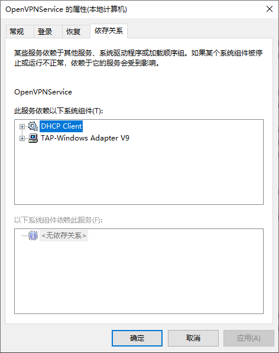
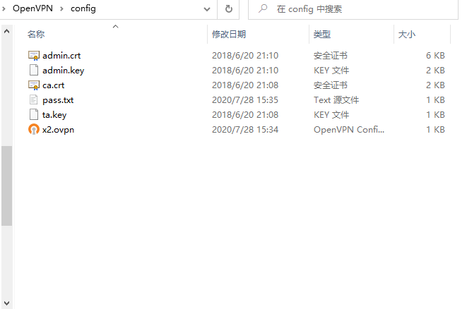

## openvpn

## 记住帐号密码自动连接
在配置文件 `*.ovpn` 添加
``` bash
auth-user-pass <包含帐号密码的文件>
# 如：
auth-user-pass credential.txt
```
`credential.txt` 中第一行为帐号，第二行为密码

## 开机自启动并且连接
### 方案一 使用Windows服务
安装OpenVPN时会基于`C:\Program Files\OpenVPN\bin\openvpnserv2.exe`安装服务`OpenVPNService`

> 配置的相关文件要放在 `config` 目录一层

> 本地机器测试成功`openvpn 2.3.18 x86_64-w64-mingw32`，205开发机上测试失败，可能是之前安装的版本互相冲突导致

### 方案二 使用快捷方式
- 快捷方式的**目标**修改为`"C:\Program Files\OpenVPN\bin\openvpn-gui.exe" --connect x2.ovpn`。其中 `x2.ovpn` 是实际要连接的配置文件
- 把快捷方式放在自启动目录`shell:startup`