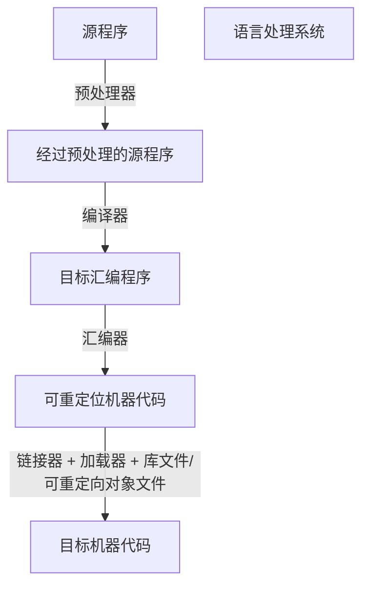
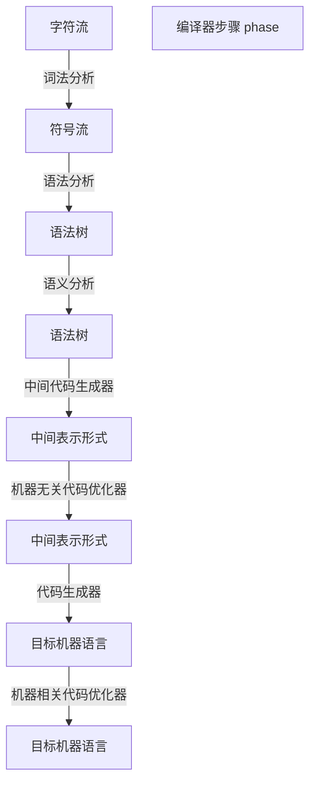
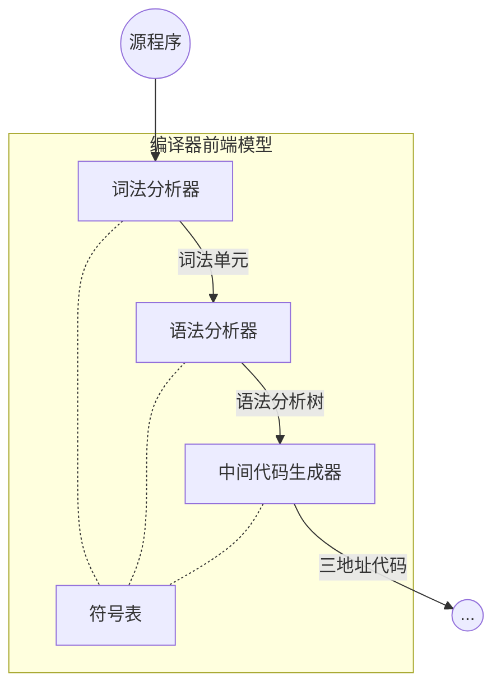
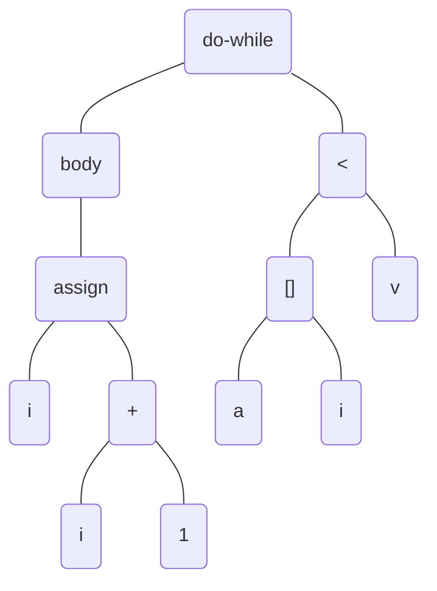
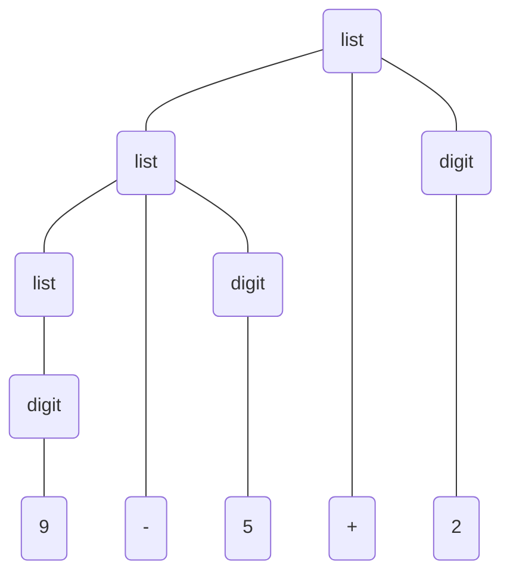

# 第1章 引论
将程序设计语言翻译成一种能被计算机执行的形式叫作编译(compile),
完成编译工作的软件系统称之为编译器(compiler)

## 1.1 语言处理器

## 1.2 一个编译器的结构
- 分析(analysis), 前端(front end)
创建符号表(symbol table) 和 中间表示，传送给后端使用
- 综合(synthesis), 后端(back end)

### 1.2.1 词法分析
lexical analysis, 扫描, scanning
词素(lexeme) 映射到 词法单元(token) `<token_name, attribute-value>`
例如在赋值语句 `position = initial + rate * 60` 中
`position` 词素，被映射成词法单元`<id, 1>`
赋值符号`=`词素，被映射成词法单元`<=>`
...
得到词法单元序列:
`<id,1><=><id,2><+><id,3><*><40>`
后续学习后，实际为：
`<id,1><=><id,2><+><id,3><*><number,4>`
分隔词素的空格会被词法分析器忽略掉
### 1.2.2 语法分析
syntax analysis, 解析, parsing
使用由词法分析器生成的各个词法单元的第一个分量来创建树形的中间表示。
该中间表示给出了词法分析产生的词法单元流的语法结构。
常用表示方法为语法树(syntax tree)
### 1.2.3 语义分析
semantic analyzer
使用语法树和符号表中的信息来检查源程序是否和语言定义的语义一致。
同时收集类型信息，存放在语法树或符号表中，在随后的中间代码生成过程中使用
- 类型检查 type checking
- 自动类型转换 coercion
### 1.2.4 中间代码生成
三地址代码 three-address code 中间表示形式
由类似于汇编语言的指令组成，每个指定具有三个运算分量。每个运动分量都像一个寄存器
### 1.2.5 代码优化
机器无关的代码优化，试图改进中间代码，以便生成更好的目标代码。
“更好”：更快，更短，能耗更低
### 1.2.6 代码生成
中间表示形式映射到目标语言
代码生成的一个至关重要的方面：合理分配寄存器以存放变量的值

使用寄存器R1和R2，代码 `position = initial + rate * 60` 可翻译成如下机器代码：
``` S
# F 表示处理的是浮点数
# 把地址id3的内容加载到寄存器R2中
LDF R2, id3
# 与浮点常数60.0相乘
# #号表示60.0应该作为一个立即数处理
MULF R2, R2, #60.0
# id2移动到寄存器R1中
LDF R1, id2
# R1 + R2 值存在 R1
ADDF R1, R1, R2
# R1中的值存放到 id1
STD id1, R1
```
### 1.2.7 符号表管理
编译器的重要功能之一：记录源程序中使用的变量名，收集变量名的各种属性有关的信息
符号表数据结构为每个变量名创建一个记录条目。记录的字段就是名字的各个属性
### 1.2.8 将多个步骤组合成趟
在一个特定的实现中，多个步骤的活动可以被组合成趟(pass)。
一个前端和不同的后端可以结合建立针对不同目标机的编译器
### 1.2.9 编译器构造工具
常用的编译器构造
- 语法分析器的生成器：可以根据一个程序设计语言的语法描述自动生成语法分析器
- 扫描器的生成器：可以根据一个语言的语法单元的正则表达式描述生成词法分析器
- 语法制导的翻译引擎：可以生成一组用于遍历分析树并生成中间代码的例程
- 代码生成器的生成器：...
- 数据流分析引擎: ...
- 编译器构造工具集：提供了可用于构造编译器的不同阶段的例程的完整集合
## 1.3 程序计算语言的发展历程
第一台电子计算机出现在20世纪40年代（1946年2月14日）
低层运算：数据位置移动，2个寄存器值相加，比较2个值...
### 1.3.1 走向高级程序设计语言
更加友好的语言：20世纪50年代，助记汇编语言
高级程序设计语言
- 用于科学计算的Fortran语言
- 用于商业数据处理的Cobol语言
- 用于符号计算的Lisp语言
代分类
- 第一代语言 机器语言
- 第二代语言 汇编语言
- 第三代语言 Fortran,Cobol,Lisp,C,C++,C#及Java这样的高级程序设计语言
- 第四代语言 为特定应用设计的语言，如用于生成报告的NOMAD,用于数据库查询的SQL和用于文本排版的Postscript
- 第五代语言 基于逻辑和约束的语言，如Prolog和OPS5
范式(paradim)分类
- 强制式(imperative)语言，程序中指明如何完成一个计算任务，如：C,C++,C#和Java...
- 声明式(declarative)语言，指明要进行哪些计算，如：ML,Haskell函数式语言和Prolog约束逻辑语言
冯·诺伊曼语言(von Neumann language)，以冯·诺伊曼计算机体系结构为计算模型的程序设计语言。Fortan,C
面向对象语言(object-oriented language)，指支持面向对象编程的语言。面向对象编程是指用一组相互作用的对象组成程序的编程风格。Simula 67, Smalltalk,C++,C#,Java,Ruby
脚本语言(scripting language)是具有高层级运算符的解释型语言。Awk,Javascript,Perl,PHP,Python,Ruby,Tcl
### 1.3.2 对编译器的影响
计算机系统的性能非常依赖于编译技术
编译器本身是一个大程序
## 1.4 构建一个编译器的相关科学
如何使用抽象方法来解决问题：
接受一个问题，写出抓住了问题的关键特性的数学抽象表示，并用数学技术来解决它。
问题的表达必须根植于对计算机程序特性的深入理解，而解决方法必须使用经验来验证和精华。
### 1.4.1 编译器设计和实现中的建模
对编译器的研究主要是有关如何设计正确的数学模型和选择正确的算法的研究
考虑对通用性及功能的要求与简单性及有效性之间的平衡
### 1.4.2 代码优化的科学
如果想使得编译器产生经过良好优化的代码，图、矩阵和线性规划之类的模型是必不可少的
在编译器设计中，最重要的技能之一是明确描述出真正要解决的问题的能力
编译器优化必须满足下面的设计目标：
- 必须是正确的，不能改变被编译程序的含义
- 必须能够改善很多程序的性能
- 所需的时间必须保持在合理的范围内
- 所需要的工程方面的工作必须是可管理的
对正确性的强调是无论如何不会过分的
学习如何构造一个编译器的同时，学习解决复杂和开放性问题的一般方法学
## 1.5 编译技术的应用
编译器设计并不只是关于编译器的
### 1.5.1 高级程序设计语言的实现
| 语言类型 | 编程难度 | 运行效率 | 移植性/维护性 |
| -------- | -------- | -------- | ------------- |
| 高级     | 低       | 低       | 高            |
| 低级     | 高       | 高       | 低            |
> C语言中的关键字 register(用于寄存器分配) 是编译器技术和语言发展互动的一个较早的例子。

寄存器分配是一个很低层次的问题，最优选择很大程度上取决于一个机器的体系结构的特点，写在程序中反而有可能损害性能。
通用的程序设计语言，都支持用户定义的聚合类型（如数组、结构），高级控制流（如循环，过程调用），直接翻译成机器代码很低效。
数据流优化
对程序的数据流进行分析，并消除这些构造之间的冗余
> 面向对象概念，1967 Simula 中引入，主要思想：
- 数据抽象
- 特性的继承
使得程序更加模块化和易于维护
> Java有很多特征可以使编程变得更容易
- 类型安全，一个对象不能被当作另一个无关类型的对象来使用
- 检查数组访问运算，保证在数组的界限之内
- 没有指针，也不允许指针运算
- 内建的垃圾收集机制来自动释放不再使用的变量所占用的内存
> 为了降低由于引用这些特征导致的运行时开销，开发了相应的编译优化技术
- 消除不必要的下标范围检查
- 过程之外不可访问的对象分配在栈里而不是堆里
- 高效的算法进行垃圾收集
### 1.5.2 针对计算机体系结构的优化
几乎所有的高性能系统都利用了两种技术
- 并行 parallelism
- 内存层次结构 memory hierarchy

一个处理器通常有少量的几百个字节的寄存器
几层包含了几K到几兆字节的高速缓存
包含了几兆到几G字节的物理寄存器
最后还包括多个几G字节的外部存储器.
层次结构中相邻层次间的存取速度会有两到三个数量级上的差异
> 通常情况下，数量级指一系列 10 的幂，即相邻两个数量级之间的比为 10。例如说两数相差三个数量级，其实就是说一个数比另一个大 1000 倍
### 1.5.3 新计算机体系结构的设计
RISC
> 编译器影响计算机体系结构设计的最有名例子之一
> Reduced Instruction-Set Computer, 精简指令集计算机,基于RISC概念的大部分通用处理器结构:PowerPC,SPARC,MIPS,Alpha和PA-RISC
> 在RISC之前为CISC, Complex Instruction-Set Computer,复杂指令集计算机,包含了复杂的内存寻址模式来支持对数据结构的访问,包含过程调用指令来保存寄存器和向栈中传递参数, 如: x86指令集

专用体系结构
> 体系结构概念:数据流机器,向量机,VLIW(非常长指令字)机器,SIMD(单指令,多数据)处理器阵列,心动阵列(systolic array),共享内存的多处理器,分布式内存的多处理器
### 1.5.4 程序翻译
- 二进制翻译
> 一个机器上运行原本为另一个指令集编译的程序
> 1994年,Apple Macintosh中的处理器从Motorola MC680440变为PowerPC时,使用二进制翻译来支持PowerPC处理器运行遗留下来的MC68040代码.
- 硬件合成
> 不仅大部分软件是用高级语言描述的,连大部分硬件设计也是使用高级硬件描述语言描述的.如Verilog和VHDL(Very high-speed integrated circuit Hardware Description Language, 甚高速集成电路硬件描述语言)
> 硬件设计通常在寄存器传输层(Register Transfer Level, RTL)上描述.变量代表寄存器,表达式代表组合逻辑
> 硬件合成工具执行翻译工作:
> RTL描述 -> 门电路 -> 晶体管,最后生成一个物理布局
- 数据查询解释器
除了描述软件和硬件:
查询语言(特别是SQL,Structured Query Language,结构化查询语言),用来搜索数据库.数据库查询由包含了关系和布尔运算符的断言组成,可被解释,也可以编译为代码
- 编译后模拟
> 模拟用来理解一个现象或者验证一个设计
> 可能很昂贵,耗时.
> 编译后模拟运行比基于解释器的方法快几个数量级
### 1.5.5 软件生产率工具
程序,人类迄今为止生产出的最复杂的工程制品,要使得能够完全正常运行,每个细节都必须是正确的.
结果是程序中的错误很是猖獗,测试是对系统中的错误进行定位的主要技术
通过数据流分析技术静态地(在程序运行前)定位错误
找到程序的所有错误是不可判定问题.数据流分析方法可以找出所有潜在的错误,并且发出警告,但如果大部分是误报(misinformation)那就无法利用了.
错误探测器可以是不健全的,这与编译器优化有着显著不同,优化器必须是保守的,在任何情况下不能改变程序的语义.
> 基于编译器代码优化而开发的技术的基础,建立使用程序分析技术来提高软件生产效率的一些途径
- 类型检查
- 边界检查
- 内存管理工具
垃圾收集机制是在效率和易编程及软件可靠性之间进行折衷处理的另一个极好的例子.自动的内存管理消除了所有的内存管理错误(如:内存泄漏)
## 1.6 程序设计语言基础
### 1.6.1 静态和动态的区别
编译器能够对一个程序做出哪些判定
> 语言使用的策略(决定某个问题的时机)
- 静态策略 static policy
  支持编译器静态决定某个问题,或者说这个问题可以在编译时刻(compile time)决定
- 动态策略 dynamic policy
  只允许在运行程序的时候做出决定,或者被认为需要在运行时刻(run time)做出决定
> 声明的作用域(scope)
- 静态作用域 static scope / 词法作用域 lexical scope
  仅通过阅读程序就可以决定一个声明的作用域
- 动态作用域 dynamic scope
  程序运行时,同一个对某变量的使用会指向他的几个声明中的某一个
### 1.6.2 环境与状态
- 环境 environment
  从名字到存储位置的映射.变量就是指内存位置(C语言中的术语"左值")
- 状态 state
  从内存位置到它们的值的映射.以C语言的术语来说,即状态把左值映射为它们的相应右值
> 环境的改变需要遵守语言的作用域规则

环境和状态映射是动态的,但也有一些例外
- 名字到位置的静态绑定和动态绑定.大部分是动态的,某些声明(如全局变量)可以在编译器生成目标代码时一劳永逸地分配一个存储位置(实际可能是一个虚拟位置,但可以假设是在分配物理内存位置)
- 从位置到值的静态绑定和动态绑定.大部分是动态的,被声明的常量是一个例外
### 1.6.3 静态作用域和块结构
块(block)是声明和语句的一个组合 C使用括号{和}来界定一个块
> 标识符,名字,变量
- 标识符(identifier)
  一个字符串,通常由字母和数字组成,用来指向(标记)一个实体,如数据对象,过程,类或者类型
  所有标识符都是名字,但并不是所有名字都是标识符
- 名字(name)
  名字可以是一个表达式,如 x.y 表示 x 所指的一个结构中的字段 y
  x 和 y 都是标识符,而 x.y 是一个名字,这样的复合名字为 受限名字(qualified name)
- 变量(variable)
  指向存储中的某个特定位置. 同一个标识符被多次声明是很常见的, 每一个这样的声明引入一个新的变量. 即使每个标识符只被声明一次, 一个递归过程中的局部标识符将在不同的时刻指向不同的存储位置
> 过程,函数和方法
- 过程
  讨论一个可以被调用的子程序,统称为过程,不返回任何值
- 函数
  明确讨论某个语言(如:C语言),只有函数
- 方法
  讨论如Java,C++,只有方法,总是与特定的类相关联
### 1.6.4 显式访问控制
private, protected, public
### 1.6.5 动态作用域
> 对一个名字`x`的使用指向的是最近被调用但还没有终止且声明了`x`的过程中的这个声明
- C预处理器中的宏扩展
``` c
#define a (x+1)
int x = 2;
void b() { int x = 1; printf("%d\n", a);}
```
动态作用域解析对多态过程是必不可少的
所谓多态过程是指对于同一个名字根据参数类型具有一个以上的定义的过程
### 1.6.6 参数传递机制
实在参数(在调用过程时使用的参数)是如何与形式参数(在过程定义中使用的参数)关联起来
- 值调用 call-by-value
- 引用调用 call-by-reference
  当形式参数是一个大型的对象,数组或者结构时,由于值调用需要拷贝的代价很高,因此引用调用几乎是必不可少的
- 名调用
被早期的程序设计语言Algol 60 使用, 类似形式参数是一个代表了实在参数的宏, 被调用过程的局部名字需要进行重命名
### 1.6.7 别名 alias
如果编译器要优化一个程序,就要理解别名现象以及产生这一现象的机制
## 1.8
GNU编译器集合 gcc (GNU Compiler Collection) 是 C, C++, Fortran, Java 和 其他语言的开源编译器的流行源头
Phoenix是一个编译器构造工具包,它提供了一个集成的框架,用于建立编译器的程序分析,代码生成和代码优化步骤
# 第2章 一个简单的语法制导翻译器
将被翻译的代码片断(将中缀(infix)算术表达式转换为后缀(suffix)表达式)
``` java
int i; int j; float[100] a; float v; float x;
while (true) {
  do i = i + 1; while ( a[i] < v );
  do j = j - 1; while ( a[j] > v );
  if ( i >= j ) break;
  x = a[i]; a[i] = a[j]; a[j] = x;
}
```
## 2.1 引言
编译器在分析阶段把一个源程序划分成各个组成部分,并生成源程序的内部表示形式(中间代码)
编译器合成阶段将这个中间代码翻译成目标程序
分析阶段的工作是围绕着待编译语言的"语法"展开的
> 语法(syntax) 描述了语言的程序的正确形式
> 语义(semantics) 则定义了程序的含义,即每个程序在运行时做什么事情

上下文无关方法或者BNF(Backus-Naur范式, 巴科斯诺尔范式)的方法来描述语法
"三地址" 指令序列
```
1: i = i + 1
2: t1 = a [ i ]
3: if t1 < v goto 1
4: j = j - 1
5: t2 = a [ j ]
6: if t2 > v goto 4
7: if False i > j goto 9
8: goto 14
9: x = a [ i ]
10: t3 = a [ j ]
11: a [ j ] = t3
12: a [ j ] = x
13: goto 1
14:
```
使用现有的语义表示方法来描述一个语言的语义的难度远远大于描述语言的语法的难度
将结合非形式化描述和启发性的示例来描述语言的语义

一种面向文法的编译技术,即语法制导翻译(syntax-directed translation)技术

> 词法分析器使得翻译器可以处理由多个字符组成的构造,如标识符
> 标识符由多个字符组成,但是在语法分析阶段被当作一个单元进行处理,的单元称作词法单元(token)

生成中间代码的形式
- 抽象语法树(abstract syntax tree)
  简称语法树(syntax tree), 表示源程序的层次化语法结构

> "三地址" 指令最多只执行一个运算,通常是计算,比较或者分支跳转运算
## 2.2 语法定义
文法自然地描述了大多数程序设计语言构造的层次化语法结构
如 Java 中的 if-else 语句通常具有如下形式

```if (expression) statement else statement```
> 关键字 if, 左括号, 表达式, 右括号, 一个语句, 关键字 else 和 另一个语句连接而成

```stmt->if( expr)stmt else stmt```
> 箭头(->)可读作"可以具有如下形式". 这样的规则称为产生式(production)
> 关键字if和括号这样的词法元素称为终结符号(terminal)
> 像 expr 和 stmt 这样的变量表示终结符号的序列,称为非终结符号(nonterminal)
### 2.2.1 文法定义
上下文无关文法(context-free grammar)由四个元素组成
1. 一个终结符号集合,也称为"词法单元". 终结符号是该文法所定义的语言的基本符号的集合
2. 一个非终结符号集合,也称为"语法变量". 每个非终结符号表示一个终结符号串的集合
3. 一个产生式集合,每一个产生式包括一个称为产生式头或左部的非终结符号,一个箭头,和一个称为产生式体或右部的由终结符号及非终结符号组成的序列
4. 指定一个非终结符号为开始符号
> 文法产生式
``` bash
list -> list + digit
list -> list - digit
list -> digit
# 以非终结符号list为头部的三个产生式可等价组合为
list -> list + digit | list - digit | digit
digit -> 0 | 1 | 2 | 3 | 4 | 5 | 6 | 7 | 8 | 9
```
> 该文法的终结符号包括:
```
+ - 0 1 2 3 4 5 6 7 8 9
```
### 2.2.2 推导
函数调用
```
call -> id ( optparams )
optparams -> params | €
params -> params, param | param
```
此处 param 的产生式没有给出, 后续会涉及用于描述不同的语言构造(表达式,语句等)的产生式

语法分析(parsing), 接受一个终结符号串作为输入,找出从文法的开始符号推导出这个串的办法, 否则报告该终结符号串中包含语法错误
### 2.2.3 语法分析树
parsing tree

一棵语法分析树的叶子结点(leaf)从左向右构成了树的结果(yield),也就是从这棵语法分析树的根结点上的非终结符号推导得到(或者说生成)的符号串
> 一个文法的语言的另一个定义是指任何能够由某棵语法分析树生成的符号串的集合. 为一个给定的终结符号串构建一棵语法分析树的过程称为对该符号串进行语法分析
### 2.2.4 二义性
left/right-associative
> 左结合运算符: 加,减,乘,除
> 右结合运算符: 指数, 赋值, +=, -=

右结合运算符,如 a = b = c => a=(b=c),可用文法表示:
```
right -> letter = right | letter
letter -> a | b ... | z
```
### 2.2.6 运算符的优先级
表达式 `9 + 5 * 2`,存在二义性: `(9 + 5) * 2` 或 `9 + (5 * 2)`
> 两个运算符的结合性规则只能作用于同一运算符的多次出现,因此无法解决这个二义性, 为此需要给出一些规则来定义运算符之间的相对优先关系关系
> 算术表达式的文法可以根据表示运算符结合性和优先级的表格来构建
> 左结合: + -
> 右结合: * /
> 创建2个非终结符号`expr`和`term`,分别对应于这两个优先级层级,并使用另一个非终结符号`factor`来生成表达式中的基本单元
``` bash
# 表达式的基本单元是数位和带括号的表达式
factor -> digit | (expr)
# 最高优先级的二目运算符, 都为左结合
term -> term * factor
    | term / factor
    | factor
# 加减运算
expr -> expr + term
    | expr - term
    | term
```
最终得到的文法是:
```
expr -> expr + term | expr - term | term
term -> term * factor | term / factor | factor
factor -> digit | (expr)
```
> 表达式文法的推广
> 我们可以将因子(`factor`)理解成不能被任何运算符分开的表达式。“不能分开”的意思是说当在任意因子的任意一边旋转一个运算符，都不会导致这个因子的任何部分分离出来成为这个运算符的运算分量。因子本身作为一个整体可以成为该运算符的一个运算分量
> 非因子的项(`term`)是一个可能被高优先级的运算符`*`和`/`分开，但不能被低优先级运算符分开的表达式。非因子非项的表达式可能被任何一个运算符分开
> 这种思想推广到具有任意`n`层优先级的情况，需要`n+1`个非终结符号。通常非终结符号的产生式体只能是单个运算分量或括号括起来的表达式
> 每个优先级都有一个非终结符，表示能被该优先级或更高优先级的运算符分开的表达式。
> 这个非终结符的产生式有一些产生式体表示了该优先级的运算符的应用；另有一个产生式体只包含了代表更高一导优先级的非终结符号
#### 文法解释（练习）
``` bash
S->0S1|01 
#        01
#       0011
#      ......
# 000...0011...111
S->+SS|-SS|a
# a
# +aa
# -aa
# ++aa+aa
# +-+aa+aa-+aa+aa
S->S(S)S|€
#             ()
#          ()(())()
# ()(())()(()(())())()(())()
S->aSbS|bSaS|€
# a b 
# b a 
# a a b b a b 
# b a b a a b
# a b a b b a
# b b a a b a
S->a|S+S|SS|S*|(S)
# a
# a+a
# aa
# a*
# (a)
# aa+aa
# a+aa+a
# a+a*
```
``` bash
# 后缀方式表示的算术表达式
S->+S|+a
# 由逗号分隔开的左结合的标识符列表
S->S,a|a
# 由逗号分隔开的右结合的标识符列表
S->a,S|a
# 由整数、标识符、四个二目运算符+、-、*、/构成的算术表达式
expr -> expr + term | expr - term | term
term -> term * factor | term / factor | factor
factor -> digit | id
id -> a | b | c ... z
# 在上面的基本上添加单目运算 + 和 -
expr -> expr + term | expr - term | term
term -> term * factor | term / factor | factor
factor -> digit | id | +factor | -factor
id -> a | b | c ... z
```
- 证明：下面文法生成的所有二进制串都能被3整除(对语法分析树的结点数目使用数学归纳法, mathematical induction)
``` bash
num -> 11 | 1001 | num0 | num num
```
- 罗马数字
``` bash
num -> Ⅹ num | factor
factor ->Ⅰ|Ⅱ|Ⅲ|Ⅳ|Ⅴ|Ⅵ|Ⅶ|Ⅷ|Ⅸ|Ⅹ
```
## 2.3 语法制导翻译
语法制导翻译是通过向一个文法的产生式附加一些(语义)规则或程序片段而得到的。
``` bash
expr -> expr_1 + term
# 伪代码
# 翻译 expr_1; 翻译 term; 处理 +;
```
与语法制导翻译相关的概念
- 属性(attribute)，表示与某个程序构造相关的任意的量。可以是多种多样的，如：表达式的数据类型、生成的代码中的指令数目或为某个构造生成的代码中的第一条指令的位置等...
- 翻译方案(translation scheme)，将程序片段附加到一个文法的各个产生式上的表示法。
### 2.3.1 后缀表示 postfix notation
表示式E的后缀表示的定义可归纳为：
- `E`为变量或为常量，则E的后缀表示是`E`本身
- `E`为`E1 op E2`的表达式，其中`op`是一个二目运算符，那么`E`的后缀表示是`E1'E2'op`，其中`E1'`和`E2'`分别是`E1`和`E2`的后缀表示
- `E`为`(E1)`的被括号括起来的表达式，则`E`的后缀表示就是`E1`的后缀表示
> `(9-5)+2`的后缀表示是`95-2+`,`9-(5+2)`的后缀表示是`952+-`
> 运算符的位置和和它的运算分量个数(arity)使得后缀表达式只有一种解码方式，所以在后缀表示中不需要括号。
### 2.3.2 综合属性
将量和程序构造关联起来（比如把数值及类型和表达式相关联起来）的想法可以基于文法来表示。我们将属性和文法的非终结符号及终结符号相关联, 然后给文法的各个产生式附加上语义规则. 对于语法分析树的一个结点, 如果它和它的子结点之间的关系符合某个产生式, 那么该产生式对应的规则就描述了如何计算这个结点上的属性.
> 语法制导定义(syntax-directed definition)
- 把每个文法符号和一个属性集合相关联
- 把每个产生式和一组语义规则(semantic rule)相关联, 这些规则用于计算与该产生式中符号相关联的属性值

假设语法分析树的一个结点`N`的标号为文法符号`X`. 我们用`X.a`表示该结点上`X`的属性`a`的值. 如果一棵语法分析树的各个结点上标记了相应的属性值, 那么这棵语法分析树就称为注释(annotated)语法分析树(简称注释分析树)

如果某个属性在语法分析树结点`N`上的值是由`N`的子结点以及`N`本身的属性值确定的,那么这个属性就称为综合属性(synthesized attribute). 
综合属性具有一个很好的性质: 只需要对语法分析树进行一次自底向上的遍历, 就可以计算出属性的值
另外的有继承属性, 结点上的值是由该结点本身, 父结点以及兄弟结点上的属性值决定的
### 2.3.3 简单语法制导定义
具有以下性质的语法制导定义称为 简单(simple) 语法制导定义:
要得到代表产生式头部的非终结符号的翻译结果的字符串,只需要将产生式体中各非终结符号的翻译结果按钮它们在非终结符号中的出现顺序连接起来,并在其中穿插一些附加的串即可
``` bash
# 产生式
expr->expr1+term
# 语义规则
expr.t=expr1.t||term.t||'+'
```
### 2.3.4 树的遍历
树的遍历将用于描述属性的求值过程, 以及描述一个翻译方案中的各个代码片段的执行过程. 一个树的遍历(traversal)从根结点开始, 并按照某个顺序访问树的各个结点
深度优先（depth-first），遍历从根结点开始，递归地按照任意顺序访问各个结点的子结点，并不一定要按照从左向右的遍历. 之所以称之为深度优先, 是因为这种遍历总是尽可能地访问一个结点的尚未被访问的子结点, 因此它总是尽可能快地访问离根结点最远的结点(即最深的结点)
``` bash
procedure visit(node N) {
  for (从左到右遍历N的每个结点C) {
    visit(C);
  }
  按照结点N上的语言规则求值 
}
```
语法制导定义没有规定一棵语法分析树中的各个属性值的求值顺序. 只要一个顺序能够保证计算属性`a`的值时,`a`所依赖的其他属性都其他属性都已经计算完毕,这个就是可以的. 
> 综合属性可以在自底向上遍历的时候计算, 一般来说, 当既有综合属性又有继承属性时, 关于求值顺序的问题就变得相当复杂
### 2.3.5 翻译方案
> 上面的语法制导定义将字符串作为属性值附加在语法分析树的结点上,从而得到翻译结果
> 另外一种不需要操作字符串的方法,通过程序片段,逐步生成相同的翻译结果

前序遍历和后序遍历是深度优先遍历的两种重要的特例, 都是从左到右递归地访问每个结点的子结点
- 前序遍历(preorder traversal), 动作在我们第一次访问一个结点时被执行
- 后序遍历(postorder traversal), 动作在我们最后离开一个结点前被执行(上面提到的过程`visit`就是一个后序遍历的例子)

语法制导翻译方案是一种在方法产生式中附加一些程序片段来描述翻译结果的表示方法, 与语法制导定义相似,只是显示指定了语义规则的计算顺序

被嵌入到产生式体中的程序片段称为语义动作(semantic action). 一个语义动作用花括号括起来,并写入产生式的体中,它的执行位置也由此指定
``` bash
rest -> + term { print(`+`) } rest1
```
非终结符号rest代表"一个表达式中除第一项之外的一切"


假设我们对整棵树进行从左到右的深度优先遍历,并在我们访问它的叶子结点时执行每个打印语句,那么产生式体中内嵌的语义动作将把这样的表达式翻译为相应的后缀表示形式.

```bash
expr -> expr1 + term {print('+')}
expr -> expr1 - term {print('-')}
expr -> term
term -> 0            {print('0')}
...
term -> 9            {print('9')}
```

> 实现一个翻译方案时,必须保证各个语义动作按照它们在语法分析树的后序遍历中的顺序执行. 这个实现不一定要真的构造出一棵语法分析树(通常也不会这么做),只要能够确保语义动作的执行过程等同于我们真的构建了语法分析树并在后序遍历中执行这些动作时的情形.

## 2.4 语法分析

语法分析是决定如何使用一个方法生成一个终结符号串的过程. 原则上语法分析器必须能够构造出语法分析树, 否则将无法保证翻译的正确性

大多数语法分析方法都可以归入以下两类:自顶向下(top-down)方法和自底向上(bottom-up)方法. 这两个术语指的是语法分析树结点的构造顺序

- 自顶向下的方法较容易地手工构造出高效的语法分析器
- 自底向上的方法以处理更多种方法和翻译方案, 直接从方法生成语法分析器的软件工具学学使用自底向上的方法

### 2.4.1 自顶向下分析方法

在自顶向下地构造一棵语法分析树时,从标号为开始非终结stmt的根结点开始,反复执行下面两个步骤:

1. 在标号为非终结符号`A`的结点`N`上,选择`A`的一个产生式,并为产生式体中的各个符号构造出`N`的子结点
2. 寻找下一个结点来构造子树,通常选择的是语法分析树最左边的尚未扩展的非终结符


输入中当前被扫描的终结符号通常称为向前看(lookahead)符号


一般来说,为一个非终结符号选择产生式是一个"尝试并犯错"的过程. 先选择一个产生式, 并在这个产生式不合适时进行回溯, 再尝试另一个产生式. 一个产生式"不合适"指使用了该产生式之后,无法构造得到一棵与当前输入串相匹配的语法分析树

### 2.4.2 预测分析法

递归下降分析法(recursive-descent parsing)是一种自顶向下的语法分析方法,使用一组递归过程来处理输入. 

文法的每个非终结符都有一个相关联的过程. 递归下降分析法的一种简单形式,称为预测分析法(predictive  parsing)

```java
// 预测分析器伪代码
void stmt() {
    switch (lookahead) {
        case expr:
            match(expr); match(';');
            break;
        case if:
            match(if); match('(');match(expr);match(')');stmt();
            break;
        case for:
            match(for);match('(');
            optexpr();match(';')optexpr();match(';');optexpr();
            match(')');stmt();
            break;
        case other:
            match(other);break;
        default:
            report("syntax error");
    }
}
void optexpr() {
    if (lookahead == expr) match(expr);
}
void match(terminal t) {
    if (lookahead == t) lookahead = nextTerminal;
    else report("syntax error");
}
```

预测分析需要知道哪些符号可能成为一个产生式体所生成串的第一个符号. 更精确地说,令`a`是一个文法符号(终结符号或非终结符号)串. 将 `FIRST(a)`定义为可以由`a`生成的一个或多个终结符号串的第一个符号的集合. 如果`a`就是`€`或者可以生成`€`,那么`€`也在`FIRST(a)`中

```
FIRST(stmt) = {expr, if, for, other}
FIRST(expr ;) = { expr }
```

### 2.4.3 何时使用`€`产生式

 预测分析器在没有其他产生式可用时,将`€`产生式作为默认选择使用. 

### 2.4.4 设计一个预测分析器

一个预测分析器(predictive parsing)程序由各个非终结符对应的过程组成. 对应于非终结符`A`的过程完成以下两项任务:

- 检查向前看符号,决定使用`A`的哪个产生式. 如果一个产生式的体为`a`(非空串)且向前看符号在`FIRST(a)`中,那么就选择这个产生式. 对于任何向前看符号, 如果两个非空的产生式体之间存在冲突,我们就不能对这种文法使用预测语法分析. 另外,如果`A`有`€`产生式,那么只有当向前看符号不在`A`的其他产生式体的`FIRST`集合中时,才会使用
- 模拟被选中产生式的体

### 2.4.5 左递归

递归下降语法分析器有可能进入无限循环. 当出现如下所示的"左递归(left recursive)"产生式时,分析器就会出现无限循环:

```bash
expr -> expr + term
```

通过改写有问题的产生式就可以消除左递归, 考虑有2个产生式

```
expr -> expr + term | term
```

## 2.5 简单表达式的翻译器

语法制导翻译方案学学作为翻译器的规约, 翻译方案定义了将要执行的翻译过程


图中的翻译方案的文法是左递归的, 预测语法分析器不能处理左递归的文法

一方面, 我们需要一个能够支持规约的文法; 另一方面, 我们又需要一个明显不同的能够支持语法分析过程的文法

解决的文法是首先使用易于翻译的文法, 然后再小心地对这个文法进行转换(消除左递归), 使之能够支持语法分析

### 2.5.1 抽象语法和具体语法

抽象语法树也简称语法树(syntax tree), 在某种程度上和语法分析树相似. 但是在抽象语法树中, 内部结点代表的是程序构造; 而在语法分析树中, 内部结点代表的是非终结符号

语法分析树常被称为具体语法树(concrete syntax tree),相应的文法称为该语言的具体语法(concrete syntax)

### 2.5.2 调整翻译方案

```
A -> Aa | Ab | r
```

产生式转换成

```
A -> rR
R -> aR | bR | €
```


左递归消除的工作必须小心进行, 以确保消除后的结果保持语义动作的顺序

### 2.5.3 非终结符号的过程


### 2.5.4 翻译器的简化


把过程`rest`展开到过程`expr`中, 在翻译具有多个优先级的表达式时,这样的简化处理可以减少需要使用的过程数目

- 某些递归调用可以被替换为迭代. 如果一个过程体中执行的最后一条语句是对该过程的递归调用, 那么这个调用就称为是尾递归的(tail recursive). 对于没有参数的过程, 一个尾递归调用可以被替换为跳转到过程开头的语句
- `rest`过程的尾递归调用被替换为迭代过程, 那么对`rest`的调用仅仅出现在过程`expr`中. 因此, 将过程`expr`中对`rest`的调用替换为`rest`的过程体,就可以将这两个函数合二为一

### 2.5.5 完整的程序

```java
import java.io.*;

class Parser {
    static int lookahead;

    public Parser() throws IOException {
        read();
    }

    void expr() throws IOException {
        term();
        while (true) {
            if (lookahead == '+') {
                match('+'); term(); System.out.write('+');
            }
            else if (lookahead == '-') {
                match('-'); term(); System.out.write('-');
            }
            else return;
        }
    }

    void term() throws IOException {
        if (Character.isDigit((char)lookahead)) {
            System.out.write((char)lookahead); match(lookahead);
        }
        else throw new Error("syntax error");
    }

    void match(int t) throws IOException {
        if (lookahead == t) {
            read();
        }
        else throw new Error("syntax error");
    }

    void read() throws IOException {
        lookahead = System.in.read();
//        要过滤掉回车
        System.in.read();
    }
}

public class Postfix {
    public static void main(String[] args) throws IOException {
        Parser parse = new Parser();
        parse.expr(); System.out.write('\n');
    }
}
```

## 2.6 词法分析

一个词法分析器从输入中读取字符, 并将它们组成"词法单元对象". 除了用于语法分析的终结符号之外, 一个词法单元对象还包含一些附加信息, 这些信息以属性值的形式出现. 一个词法单元就是一个带有附加信息的终结符号

构成一个词法单元的输入字符序列称为词素(lexeme), 词法分析器使得语法分析器不需要考虑词法单元的词素表示方式

### 2.6.1 剔除空白和注释

大部分语言允许语法单元之间出现任意数量的空白. 在语法分析过程中同样会忽略源程序中的注释, 因此这些注释也可以当前作空白处理

词法分析器消除了空白, 语法分析器就不必要考虑它们


在错误消息中加入行号和上下文有助于定位错误

### 2.6.2 预读

在决定向语法分析器返回哪个词法单元之前, 词法分析器可能需要预先读入一些字符

> C或Java的词法分析器在遇到字符`>`之后必须预先读入一个字符. 如下一个字符为`=`, 那么`>`就是字符序列`>=`的一部分, 这个序列代表"大于等于"运算符的词法单元的词素

一个通用的预先读取输入的文法是使用输入缓冲区. 词法分析器可以从缓冲区中读取一个字符, 也可以放回缓冲区. 而且使用缓冲区也更有效率, 因为一次读取一块字符比每次读取单个字符更加高效. 可以用一个指针来跟踪已被分析的输入部分, 向缓冲区放回一个字符可以通过回移指针来实现

词法分析器只在必要时才进行预读. 不需要预读的情况下,预读变量`peek`值为空白符

### 2.6.3 常量

在一个表达式的文法中, 任何允许出现数位的地方地应该允许出现任意的整型常量. 将字符组成整数并计算它的数值的工作通常由词法分析器完成, 因此在语法分析和翻译过程中可以将数字当作一个单元进行处理

`31+28+59` 被转换成词法单元序列`<num, 31><+><num,28><+><num,59>`. 在这里,终结符号`+`没有属性


伪代码读取一个整数中的数位, 并用变量`v`累计得到这个整数的值

### 2.6.4 识别关键字和标识符

使用`for,do,if`这样的固定字符串作为标点符号, 或者用于标识某种构造. 这些字符串称为关键字(keyword)

字符串还可以作为标识符, 来为变量, 数组, 函数等命名. 为了简化语法分析器, 语言的文法通常把标识符当作符号进行处理. 只有当一个字符串不是关键字时, 它才能组成一个标识符

本节中词法分析器使用一个表来保存字符串, 从而解决两个问题

- 单一表示. 编译器后面的步骤可以只使用指向表中字符串的指针或引用, 操作引用要比操作字符串本身更加高效
- 保留字. 在初始化时在字符串表中加入保留的字符串以及它们对应的词法单元. 当词法分析器读到一个可以组成标识符的字符串或词素时, 它首先检查这个字符串表中是否有这个词素. 是则返回表中的词法单元, 否则返回带有终结符号`id`的词法单元


### 2.6.5 词法分析器


类`Token`有一个`tag`字段, 用于做出语法分析决定. 子类`Num`增加了一个用于存放整数值的字段`Value`; 子类`Word`增加了一个字段`lexeme`, 用于保存关键字和标识符的词素

## 2.7 符号表

符号表(symbol table)是一种供编译器用于保存有关源程序构造的各种信息的数据结构. 这些信息在编译器的分析阶段被逐步收集并放入符号表, 在综合阶段用于生成目标代码

符号表的每个条目中包含与一个标识符相关的信息, 如它的字符串(或词素), 它的类型, 它的存储位置和其他相关信息. 通常需要支持同一标识符在一个程序中的多重声明

一个声明的作用域是指该声明起作用的那一部分程序. 我们将为每个作用域建立一个单独的符号表来实现作用域

通常只有语法分析器才能够决定是使用之前已创建的符号表条目, 还是为这个标识符创建一个新条目

```java
// 例子程序
{ int x; char y; { bool y; x; y;} x; y; }
// 目标程序
{ { x: int; y: bool } x: int; y: char;}
```

### 2.7.1 为每个作用域设置一个符号表

作用域(scope)本身是指一个或多个声明起作用的程序部分

块的符号表的实现可以利用作用域的最近嵌套规则. 嵌套的结构可应用的符号表形式一个栈. 栈的顶部是当前块的符号表, 栈中这个表的下方是包含这个块的各个块的符号表. 因此, 符号表可以按照类似于栈的方式来分配和释放

语句块的最近嵌套(most-closely)规则: 一个标识符`x`在最近的`x`声明的作用域中. 从`x`出现的块开始, 从内向外检查各个块时找到的第一个对`x`的声明

因为会有多个语句块嵌套在同一外围语句块中, 所以将这些符号表链接起来就可以形成一个树形结构

### 2.7.2 符号表的使用

从效果看, 一个符号表的作用是将信息从声明的地方传递到实际使用的地方. 当分析标识符`x`的声明时, 一个语义动作将有关`x`的信息"放入"符号表中. 然后, 一个像`factor -> id`这样的产生式的相关语义动作从符号表中"取出"这个标识符的信息


## 2.8 生成中间代码

编译器的前端构造出源程序的中间表示, 而后端根据这个中间表示生成目标程序

### 2.8.1 两种中间表示形式

- 树形结构, 包括语法分析树和(抽象)语法树
- 线性表示形式, 特别是"三地址代码"

在语法分析过程中, 将创建抽象语法树的结点来表示有意义的程序构造. 随着分析的进行, 信息以与结点相关的属性的形式被添加到这些结点上. 选择哪些属性要依据待完成的翻译来决定

三地址代码是一个由基本程序步骤(如将两个值相加)组成的序列. 与树形结构不一样, 它没有层次化的结构. 如果想对代码做出显著的优化, 就需要这种表示形式.  可以把组成程序的很长的三地址语句序列分解为"基本块". 所谓基本块就是一个总是逐个顺序执行的语句序列, 执行时不会出现分支跳转

除了创建一个中间表示之外, 编译器前端还会检查源程序是否遵循源语言的语法和语义规则, 这种检查称为静态检查(static check), "静态" 一般是指"由编译器完成", 与静态对应的"动态"指的是"当程序运行时"

编译器在分析过程中只会保存将用于语义检查或其他目的的结点及其属性, 同时也保存了用于语法分析的数据结构, 而不会保存整棵抽象语法树

### 2.8.2 语法树的构造


翻译方案为一个有代表性但却很简单的由表达式和语句组成的语言构造出一棵语法树. 这个翻译方案中的所有非终结符都有一个属性`n`, 即语法树的一个结点. 这些结点被实现为类`Node`的对象


### 2.8.3 静态检查

- 语法检查. 语法要求比文法中的要求更多. 如: 任何作用域内同一个标识符最多只能声明一次, 一个`break`语句必须处于一个循环或`switch`语句之内. 这些约束都是语法要求, 但是它们并没有包括在用于语法分析的文法
- 类型检查.  一种语言的类型规则确保一个运算符或函数被应用到类型和数量都正确的运算分量上

类型不同的情况下

- 自动类型转换(coercion)
- 重载 overloading

### 2.8.4 三地址代码

一旦抽象语法树构造完成, 就可以计算树中各结点的属性值并执行各结点中的代码片段, 进行进一步的分析和综合

- 三地址指令

```bash
# 如下指令组成的序列
x = y op z
# 数组有两种变体指令
x[y] = z
x = y[z]
# 控制程序流
ifFalse x goto L
ifTrue x goto L
goto L
```

- 语句的翻译


- 表达式的翻译

  

  

- 改进表达式的代码
  - 减少指令的数目. 如:对于指令`t = i + 1; i = t;` 如果`t`没有再被使用, 可以合并为`i = i + 1`
  - 充分考虑上下文的情况, 在最初生成指令时就减少生成的指令

# 第3章 词法分析

自动生成一个词法分析器: 向一个词法分析器生成工具(lexical-analyzer generator)描述出词素的模式, 然后将这些模式编译为具有词法分析器功能的代码

正则表达式是一种可以很诠地描述词素模式的方法. 正则表达式首先转换为不确定有穷自动机, 然后再转换为确定有穷自动机

## 3.1 词法分析器的作用

通常, 交互是由语法分析器调用词法分析器来实现. `getNextToken`所指示的调用使得词法分析器从它的输入中不断读取字符, 直到它识别出下一个词素为止. 词法分析器根据这个词素生成下一个词法单元阈返回给语法分析器


词法分析器在编译器中负责读取源程序, 因此还会完成一些识别词素之外的其他任务

- 过滤掉源程序中的注释和空白(空格, 换行符, 制表符以及在输入中用于分隔词法单元的其他字符)
- 将编译器生成的错误消息与源程序的位置联系起来

词法分析器可以分成两个级联(cascade)的处理阶段

- 扫描阶段主要负责完成一些不需要生成词法单元的简单处理, 比如删除注释和将多个连续的空白字符压缩成一个字符
- 词法分析阶段是较为复杂的部分, 处理扫描阶段的输出并生成词法单元

### 3.1.1 词法分析及语法分析

把编译过程的分析部分划分为词法分析和语法分析阶段的原因:

- 简化编译器的设计. 将词法分析和语法分析分离通常使我们至少可以简化其中的一项任务
- 提高编译器的效率
- 增强编译器的可移植性

### 3.1.2 词法单元, 模式和词素

- 词法单元, 由一个词法单元名和一个可选的属性值组成. 词法单元名是一个表示某种词法单位的抽象符号, 如一个特定的关键字, 或者代表一个标识符的输入字符序列. 词法单元名字是由语法分析器处理的输入符号. 
- 模式, 描述了一个词法单元的词素可能具有的形式. 当词法单元是一个关键字时, 它的模式就是组成这个关键字的字符序列. 对于标识符和其他词法单元, 模式是一个更加复杂的结构, 它可以和很多符号串匹配
- 词素, 是源程序中的一个字符序列, 和某个词法单元的模式匹配, 并被词法分析器识别为该词法单元的一个实例


很多程序设计语言中, 大部分或所有的词法单元

- 每个关键字有一个词法单元. 一个关键字的模式就是该关键字本身
- 表示运算符的词法单元. 可以表示单个运算符, 也可以像`comparison`表示一类运算符
- 一个表示所有标识符的词法单元
- 一个或多个表示常量的词法单元, 如数字和字面值字符串
- 每一个符号有一个词法单元, 如左右括号, 逗号和分号

###  3.1.3 词法单元的属性

如果有多个词素可以与一个模式匹配, 那么词法分析器必须向编译器的后续阶段提供有关被匹配词素的附加信息. 在很多情况下, 词法分析器不仅向语法分析器返回一个词法单元名字, 还会返回一个描述该词法单元的词素的属性值. 词法单元的名字将影响语法分析过程中的决定, 而这个属性值则会影响语法分析之后对这个词法单元的翻译


### 3.1.4 词法错误

如果没有其他组件的帮助, 词法分析很难发现源代码中的错误

假设出现所有词法单元的模式都无法和剩余输入的某个前缀相匹配的情况, 此时词法分析器就不能继续处理输入. 当出现这种情况时, 最简单的错误恢复策略是"恐慌模式"恢复. 从剩余的输入中不断删除字符, 直到词法分析器能够在剩余输入的开头发现一个正确的词法单元为止

可能采取的其他错误恢复动作:

- 从剩余的输入中删除一个字符
- 向剩余的输入中插入一个遗漏的字符
- 用一个字符替换另一个字符
- 交换两个相邻的字符

## 3.2 输入缓冲

### 3.2.1 缓冲区对

由于在编译一个大型源程序时需要处理大量的字符, 处理这些字符需要很多的时间, 因此开发了一些特殊的缓冲技术来减少用于处理单个字符的时间开销. 一种重要的机制就是利用两个交替计入的缓冲区


每个缓冲区的容量都是`N`个字符, 通常是一个磁盘块的大小, 如4096字节(4M). 使用系统读取命令一次将`N`个字符读入到缓冲区中, 而不是每计入一个字符调用一次系统读取命令. 若输入不足`N`个, 会有一个特殊字符`eof`来标记源文件的结束, 这个特殊字符不同于任何可能出现在源程序中的字符

程序为输入维护了两个指针

- lexemeBegin, 指向当前词素的开始处. 当前正试图确定这个词素的结尾
- forward, 一直向前扫描, 直到发现某个模式被匹配为止

只要我们从不需要实际的词素向前看很远, 以至于这个词素的长度加上我们向前看的距离大于`N`, 就决不会在识别这个词素之前覆盖掉这个尚在缓冲区中的词素

### 3.2.2 哨兵标记

上面的方案, 每读入一个字符, 需要做两次测试

- 检查是否到达缓冲区的末尾
- 确定计入的字符是什么(可能是一个多路分支选择语句)

扩展每个缓冲区, 使它们在末尾包含一个"哨兵"(sentinel)字符, 就可以把缓冲区末端的测试和对当前字符的测试合二为一. 这个哨兵字符必须是一个不会在源程序中出现的特殊字符, 一个自然的选择就是字符`eof`


只有确实处于缓冲区末尾或输入末尾时, 才需要进行更多的测试

## 3.3 词法单元的规约

正则表达式是一种用来描述词素模式的重要表示方法. 虽然不能表达出所有可能的模式, 但可以高效地描述在处理词法单元时要用到的模式类型

> 为了避免长字符串引起的问题, 我们可以把它们看作不同组成部分的连接, 每个组成部分对应于该字符串的一行. 

### 3.3.1 串和语言

字母表(alphabet)是一个有限的符号集合.  符号的典型例子包括字母, 数位,和标点符号

> 在实践中, 可以用一个以字符为下标的地址数组来存放对应于各个`case`的指令地址, 并根据此数组中找到的目标地址一次完成跳转

语言(language)是某个给定字母表上一个任意的可数的串集合

### 3.3.2 语言上的运算


### 3.3.3 正则表达式

使用正则表达式来描述对应于`C`语言标识符的语言

```
letter_(letter_|digit_)*
```


### 3.3.4 正则定义

C语言的标识符的正则定义


(整型或浮点型)无符号数


### 3.3.5 正则表达式的扩展

简化写法


## 3.4 词法单元的识别


### 3.4.1 状态转换图

作为构造词法分析器的一个中间步骤, 首先将模式转换成具有特定风格的流图, 称为"状态转换图"

state transition diagram


- 某些状态称为接受状态或最终状态. 这些状态表明已经找到了一个词素, 虽然实际的词素可能阈不包括`lexmeBegin`指针和`forward`指针之间的所有字符. 我们用双层圈来表示一个接受状态, 并且如果该状态要执行一个动作的话 ------ 通常是向语法分析器返回一个词法单元和相关属性值------我们将把这个动作附加到该接受状态上
- 如果需要将`forward`回退一个位置(即相应的词素并不包含那个在最后一步使我们到达接受状态的符号), 那么我们将在该接受状态的附近加上一个`*`.  如果需要回退多个位置, 就为接受状态附加相应数目的`*`

### 3.4.2 保留字和标识符的识别


### 3.4.3 完成我们的例子


### 3.4.4 基于状态转换图的词法分析器体系结构

有几种方法可以根据一组状态转换图构造出一个词法分析器. 不管整体的策略是什么, 每个状态总是对应于一段代码. 可以想象有一个变量`state`保存了一个状态转换图的当前状态的编号.  有一个`switch`语句根据`state`的值将我们转到对应于各个可能状态的相应代码段, 我们可以在那里找到该状态需要执行的动作. 一个状态的代码本身常常也是一个`switch`语句或多路分支语句. 这个语句读入并检查下一个输入字符, 由此确定下一个状态


如果下一个输入字符不是某个比较运算符的首字符, `getRelop()`就会调用函数`fail()`. 函数`fail()`的具体操作依赖于词法分析器的全局错误恢复策略. 它应该将`forward`指针重置为`lexemeBegin`的值, 使得我们可以使用另一个状态转换图从尚未处理的输入部分的真实开始位置开始识别. 然后, 它还需要将变量`state`的值改为另一个状态转换图的初始状态,  该转换图将另一个词法单元

由于状态8带有一个`*`号, 必须将输入指针回退一个位置(也就是把`c`放回输入流). 该任务由函数`retract()`完成. 因为状态8代表了对词素`>`的识别, 把返回对象中的第二个名为`attribute`的分量设置成`GT`, 即这个运算符的编码

几种将代码集成到整个词法分析器中的方法

- 让词法分析器顺序地尝试各个词法单元的状态转换图. 在每次调用`fail()`时, 重置`forward`指针并启动下一个状态转换图
- 并行地运行各个状态转换图, 将下一个输入字符提供给所有的状态转换图, 并使得每个状态转换图作出它应该执行的转换
- 所有状态转换图合并为一个图

## 3.5 词法分析器生成工具Lex

Lex编译器(Lex compiler), 核心部分将输入的模式转换成一个状态转换图, 并生成相应的实现代码

### 3.5.1 Lex的使用


用Lex语言写出一个输入文件(lex.1), 描述将要生成的词法器...

编译后的C程序(a.out), 通常是一个被语法分析器调用的子例程, 这个子例程返回一个整数值, 即可能出现的某个词法单元名的编码. 而词法单元的属性值, 不管它是一个数字编码, 还是一个指向符号表的指针, 或者什么都没有, 都保存在全局变量`yylval`(`yy`指的是语法分析器生成工具`yacc`, 它一般和Lex一起使用)中, 由词法分析器和语法分析器共享. 这么做可以同时返回一个词法单元名字和一个属性值

### 3.5.2 Lex程序的结构

一个Lex程序具有如下形式:

```
# 声明部分
%%
# 转换规则
%%
# 辅助函数
```

词法分析器只向语法分析器返回一个值, 即词法单元名. 但在需要时可以利用共享的整型变量`yylval`传递有关这个词素的附加信息


一对特殊符号`%{` `%}`,出现在括号内的所有内容都被直接复制到文件`lex.yy.c`中, 不会被当作正则定义处理. 一般将明示常量(manifest constants)的定义放置在该括号内, 并利用C语言的`#define`语句给每个明示常量赋予一个唯一的整数编码

像`if`这样的关键字既和`id`模式匹配, 也和之前的`if`模式匹配, 但是当最长匹配前缀和多个模式匹配时, Lex总是选择最先被列出的模式

`yytext`是一个指向词素开头的指针, 与`lexemeBegin`类似, `yyleng`存放刚找到的词素的长度

### 3.5.3 Lex中的冲突解决

- 总是选择最长的前缀
- 如果最长的可能前缀与多个模式匹配, 总是选择在Lex程序中先被列出的模式

### 3.5.4 向前看运算符

Lex自动地向前读入一个字符, 会读取到形成被选词素的全部字符之后的那个字符, 再回退输入, 使得只有词素本身从输入中被消耗掉. 但在某些时候, 我们希望仅当词素的后面跟随特定的其他字符时, 这个词素才能和某个特定的模式相匹配.  这种情况下, 我们可以在模式中用斜线来指明该模式中和词素实际匹配的部分的结尾, 斜线`/`之后的内容表示一个附加的模式, 只有附加模式和输入匹配之后, 才可以确定已经看到了要寻找的词法单元的词素, 但和第二个模式匹配的字符并不是这个词素的一部分

## 3.6 有穷自动机

Lex将输入程序转换成一个词法分析器的核心是称为有穷自动机(finite automata)的表示方法. 自动机的本质是与状态转换图类型的图, 但有几点不同

- 有穷自动机是识别器(recognizer), 只能对每个可能的输入串简单地回答"是"或"否"
- 有穷自动机分为两类
  - 不确定的有穷自动机(Nondeterministic Finite Automata, NFA)对其边上的标号没有任何限制. 一个符号标记离开同一状态的多条边, 并且空串也可以作为标号
  - 对于每个状态及自动机输入字母表的每个符号, 确定的有穷自动机(Deterministic Finite Automata, DFA)有且只有一条离开该状态, 以该符号为标号的边

确定的和不确定的有穷自动机能识别的语言的集合是相同的. 这些语言的集合正好是能够用正则表达式描述的语言的集合. 这个集合中的语言称为正则语言(regular language)

### 3.6.1 不确定的有穷自动机

组成部分

- 一个有穷的状态集合`S`
- 一个输入符号`∑`, 即输入字母表(input alphabet). 假设空串不是`∑`中的元素
- 一个转换函数(transition function), 为每个状态和`∑∪{∈}`中的每个符号都给出了相应的后继状态(next state)的集合
- `S`中的一个状态s<sub>0</sub>被指定为开始状态, 或者说初始状态
- S的一个子集F被指定为接受状态(或者说终止状态)的集合

NFA和DFA, 都可以表示为一张转换图(transition graph). 图中的结点是状态, 带有标号的边表示自动机的转换函数

- 同一个符号可以标记从同一状态出发到达多个目标状态的多条边
- 一条边的标号不仅可以是输入字母表中的符号, 也可以是空符号串


双圈表示该状态是接受状态

### 3.6.2 转换表

将一个NFA表示为一张转换表(transition table), 表的各行对应于状态, 各列对应于输入符号和空串. 对应于一个给定状态和给定输入的条目是将NFA的转换函数应用于这些参数后得到的值. 如果转换函数没有给出对应于某个状态-输入对的信息, 就把θ放入相应的表项中


- 优点: 能够很容易地确定和一个给定状态和一个输入符号相对应的转换
- 缺点: 如果输入字母表很大, 且大多数状态在大多数输入字符上没有转换的时候, 转换表需要占用大量空间

### 3.6.3 自动机中输入字符串的接受

一个NFA接受(accept)输入字符串x, 当且仅当对应的转换图中存在一条从开始状态到某个接受状态的路径, 使得该路径中各条边上的标号组成符号串x. 路径中的空串标号将被忽略, 因为空串不会影响到根据路径构建得到的符号串

可达接受状态 3


达非接受状态0


只要存在某条其标号序列为某符号串的路径能够从开始状态到达某个接受状态, NFA就接受这个符号串. 存在某些达到非接受状态的路径并不会影响这个结论

L(A)表示自动机A接受的语言(NFA定义或接受的Language)


`aaa`存在如下路径


字符串`aaa`被这个NFA接受, 路径中的空串标号在连接时"消失"了, 因此这条路径的标号是`aaa`

### 3.6.4 确定的有穷自动机

确定的有穷自动机(简称DFA)是不确定有穷自动机的一个特例

- 没有输入空串之上的转换动作
- 对每个状态`s`和每个输入符号`a`, 有且只有一条标号为`a`的边离开`s`

如果使用转换表来表示一个DFA, 那么表中的每个表项就是一个状态. 因此可以不使用花括号, 直接写出这个状态, 因为花括号只是用来说明表项的内容是一个集合

NFA抽象地表示了用来识别某个语言中的串的算法, 而相应的DFA则是一个简单具体的识别串的算法. 在构造词法分析器时, 真正实现或模拟的是DFA

每个正则表达式和每个DFA都可以被转变成为一个接受相同语言的DFA


函数`move(s, c)`给出了从状态`s`出发, 标号为`c`的边所到达的状态. 函数`nextchar`返回输入串`x`的下一个字符


## 3.7 从正则表达式到自动机

正则表达式非常适合描述词法分析器和其他模式处理软件, 然而软件的实现需要模拟DFA的执行或者模拟NFA的执行. 由于NFA对于一个输入符号可以选择不同的转换, 还可以执行输入空串上的转换, 甚至可以选择是对空串或是对真实输入符号执行转换, 因此对NFA的模拟不同对DFA的模拟直接. 我们需要将一个NFA转换为一个识别相同语言的DFA

### 3.7.1 从NFA到DFA的转换

子集构造法的基本思想是让构造得到的DFA的每个状态对应于NFA的一个状态集合. DFA在读入输入`a_1a_2...a_n`之后到达的状态对应于相应NFA从开始状态出发, 沿着以`a_1a_2...a_n`为标号的路径能够到达的状态的集合

DFA的状态数有可能是NFA状态数的指数, 这种情况下, 试图实现这个DFA时会遇到困难. 然而, 基于自动机的词法分析方法的处理能力部分源于如下事实: 对于一个真实的语言, 它的NFA和DFA的状态数量大致相同, 状态数量呈指数关系的情形尚未在实践中出现过

> 算法: 由NFA构造DFA的子集构造(subset construction)算法
>
> 输入: 一个NFA N
>
> 输出: 一个接受同样语言的DFA D
>
> 方法: 为D构造一个转换表Dtran. D的每个状态是一个NFA状态集合, 我们将构造Dtran, 使得D并行地模拟N在遇到一个给定输入串时可能执行的所有动作. s表示N的单个状态,  而T代表N的一个状态集


??????

### 3.7.2 NFA的模拟

